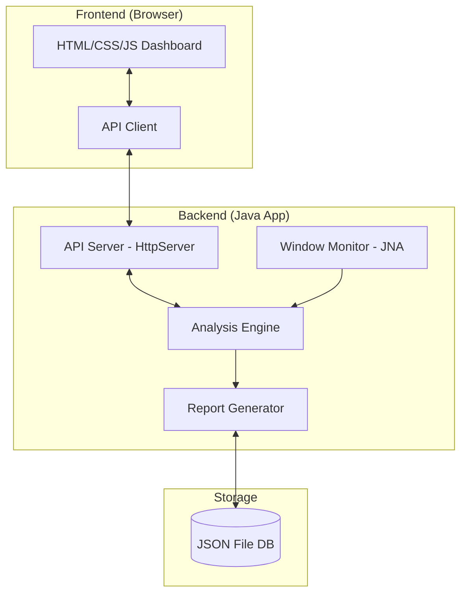
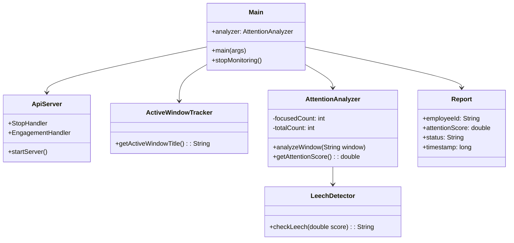

# MLD Full Source Code


## C:\Users\Rudra Dev\Desktop\MLD-main\.agents\AGENTS.md
``md

# Project Behavioral Rules

- **Git Workflow**: Do NOT execute `git push` commands automatically. When code changes are ready, provide the exact `git` commands (e.g. `git add`, `git commit`, `git push`) for the user to execute manually.


``

## C:\Users\Rudra Dev\Desktop\MLD-main\.vscode\launch.json
``json

{
    // Use IntelliSense to learn about possible attributes.
    // Hover to view descriptions of existing attributes.
    // For more information, visit: https://go.microsoft.com/fwlink/?linkid=830387
    "version": "0.2.0",
    "configurations": [
        {
            "type": "java",
            "name": "Main",
            "request": "launch",
            "mainClass": "main.Main",
            "projectName": "MLD_3e183166"
        },
        {
            "type": "java",
            "name": "Run Main",
            "request": "launch",
            "mainClass": "Main",
            "vmArgs": "--enable-native-access=ALL-UNNAMED"
        }
    ]
}

``

## C:\Users\Rudra Dev\Desktop\MLD-main\.vscode\settings.json
``json

{
  "java.project.referencedLibraries": [
    "lib/**/*.jar"
  ]
}

``

## C:\Users\Rudra Dev\Desktop\MLD-main\css\style.css
``css

:root {
    --primary: #6366f1;
    --primary-hover: #4f46e5;
    --secondary: #0ea5e9;
    --success: #10b981;
    --warning: #f59e0b;
    --danger: #ef4444;
    --dark-bg: #f8fafc;
    --card-bg: rgba(255, 255, 255, 0.85);
    --border-color: rgba(0, 0, 0, 0.08);
    --text-main: #1e293b;
    --text-muted: #64748b;
}

body {
    font-family: 'Inter', sans-serif;
    background-color: var(--dark-bg);
    color: var(--text-main);
    background-image: 
        radial-gradient(at 0% 0%, rgba(99, 102, 241, 0.08) 0px, transparent 50%),
        radial-gradient(at 100% 100%, rgba(14, 165, 233, 0.08) 0px, transparent 50%);
    background-attachment: fixed;
    min-height: 100vh;
}

/* Glassmorphism Cards */
.glass-card {
    background: var(--card-bg);
    backdrop-filter: blur(12px);
    -webkit-backdrop-filter: blur(12px);
    border: 1px solid var(--border-color);
    box-shadow: 0 4px 20px 0 rgba(0, 0, 0, 0.05);
    border-radius: 1rem;
    transition: transform 0.25s ease, box-shadow 0.25s ease;
}

.glass-card:hover {
    transform: translateY(-2px);
    box-shadow: 0 8px 30px 0 rgba(0, 0, 0, 0.08);
}

.badge.font-monospace {
    letter-spacing: 0.5px;
    font-weight: 600;
}

.fs-7 {
    font-size: 0.8rem;
}

/* Sidebar */
.sidebar {
    height: 100vh;
    background: rgba(255, 255, 255, 0.75);
    backdrop-filter: blur(20px);
    border-right: 1px solid var(--border-color);
    position: fixed;
    top: 0;
    left: 0;
    width: 260px;
    padding-top: 1rem;
    z-index: 1000;
}

.sidebar .nav-link {
    color: var(--text-muted);
    border-radius: 0.5rem;
    margin: 0.2rem 1rem;
    padding: 0.75rem 1rem;
    font-weight: 500;
    transition: all 0.2s;
    display: flex;
    align-items: center;
    gap: 10px;
}

.sidebar .nav-link:hover, .sidebar .nav-link.active {
    color: var(--primary);
    background: rgba(99, 102, 241, 0.1);
    font-weight: 600;
}

.main-content {
    margin-left: 260px;
    padding: 2rem;
    min-height: 100vh;
}

/* Navbar */
.top-navbar {
    position: relative;
    z-index: 1050; /* Ensure dropdowns appear above glass cards */
    background: var(--card-bg);
    border: 1px solid var(--border-color);
    padding: 1rem 2rem;
    display: flex;
    justify-content: space-between;
    align-items: center;
    margin-bottom: 2rem;
}

/* Badges & Alerts */
.badge-soft-success {
    background-color: rgba(16, 185, 129, 0.12);
    color: var(--success);
    border: 1px solid rgba(16, 185, 129, 0.25);
    font-weight: 600;
}

.badge-soft-warning {
    background-color: rgba(245, 158, 11, 0.12);
    color: var(--warning);
    border: 1px solid rgba(245, 158, 11, 0.25);
    font-weight: 600;
}

.badge-soft-danger {
    background-color: rgba(239, 68, 68, 0.12);
    color: var(--danger);
    border: 1px solid rgba(239, 68, 68, 0.25);
    font-weight: 600;
}

/* Tables */
.table {
    --bs-table-bg: transparent;
    --bs-table-color: var(--text-main);
    --bs-table-border-color: var(--border-color);
}
.table > :not(caption) > * > * {
    padding: 1rem 0.75rem;
}
.table tbody tr {
    transition: background-color 0.2s;
}
.table tbody tr:hover {
    background-color: rgba(99, 102, 241, 0.03);
}

/* Progress Bars */
.progress {
    background-color: rgba(0,0,0,0.06);
    height: 8px;
    border-radius: 4px;
}

.progress-bar.bg-primary {
    background: linear-gradient(90deg, var(--primary), var(--secondary)) !important;
}

/* Metrics Typography */
.metric-value {
    font-size: 2.25rem;
    font-weight: 700;
    line-height: 1;
    margin-bottom: 0.5rem;
}

/* Alerts List */
.alert-item {
    border-left: 4px solid var(--danger);
    background: rgba(239, 68, 68, 0.04);
    padding: 0.85rem 1rem;
    border-radius: 0 0.5rem 0.5rem 0;
    margin-bottom: 1rem;
    display: flex;
    justify-content: space-between;
    align-items: center;
}

/* Responsive */
@media (max-width: 768px) {
    .sidebar {
        transform: translateX(-100%);
        transition: transform 0.3s;
    }
    .sidebar.show {
        transform: translateX(0);
    }
    .main-content {
        margin-left: 0;
        padding: 1rem;
    }
}

/* =========================================
   PREMIUM AUTHENTICATION LAYOUT (Redesign)
   ========================================= */

.auth-layout {
    display: flex;
    min-height: 100vh;
    background-color: var(--dark-bg);
}

.auth-brand-panel {
    flex: 1.2;
    background: linear-gradient(135deg, #0f172a 0%, #1e1b4b 100%);
    position: relative;
    overflow: hidden;
    display: flex;
    flex-direction: column;
    justify-content: center;
    padding: 4rem;
    color: white;
}

/* Floating animated orbs for the brand panel */
.auth-glow-orb {
    position: absolute;
    border-radius: 50%;
    filter: blur(80px);
    opacity: 0.5;
    animation: floatOrb 10s infinite alternate ease-in-out;
}

.orb-1 {
    width: 400px;
    height: 400px;
    background: var(--primary);
    top: -100px;
    left: -100px;
}

.orb-2 {
    width: 300px;
    height: 300px;
    background: var(--secondary);
    bottom: -50px;
    right: -100px;
    animation-delay: -5s;
}

@keyframes floatOrb {
    0% { transform: translate(0, 0) scale(1); }
    100% { transform: translate(50px, 50px) scale(1.1); }
}

.auth-brand-content {
    position: relative;
    z-index: 10;
    max-width: 500px;
}

.auth-brand-icon {
    font-size: 3.5rem;
    color: var(--primary);
    margin-bottom: 1.5rem;
    filter: drop-shadow(0 0 20px rgba(99, 102, 241, 0.4));
}

.auth-tagline {
    font-size: 1.25rem;
    color: #94a3b8;
    line-height: 1.7;
    margin-top: 1.5rem;
}

.auth-form-panel {
    flex: 1;
    display: flex;
    align-items: center;
    justify-content: center;
    padding: 2rem;
    background: rgba(255, 255, 255, 0.95);
    backdrop-filter: blur(20px);
    box-shadow: -10px 0 30px rgba(0,0,0,0.03);
}

.auth-form-card {
    width: 100%;
    max-width: 420px;
    padding: 3rem;
    background: white;
    border-radius: 1.5rem;
    box-shadow: 0 20px 40px rgba(0, 0, 0, 0.06);
    border: 1px solid rgba(0,0,0,0.05);
    animation: fadeUp 0.6s cubic-bezier(0.16, 1, 0.3, 1) forwards;
}

@keyframes fadeUp {
    0% { opacity: 0; transform: translateY(20px); }
    100% { opacity: 1; transform: translateY(0); }
}

.auth-input {
    background: #f8fafc;
    border: 1px solid #e2e8f0;
    padding: 0.85rem 1.2rem;
    border-radius: 0.75rem;
    font-size: 1rem;
    transition: all 0.2s;
}

.auth-input:focus {
    background: white;
    border-color: var(--primary);
    box-shadow: 0 0 0 4px rgba(99, 102, 241, 0.1);
}

.auth-btn-primary {
    background: linear-gradient(135deg, var(--primary) 0%, var(--primary-hover) 100%);
    color: white;
    padding: 0.85rem 1.5rem;
    border-radius: 0.75rem;
    font-weight: 600;
    border: none;
    transition: transform 0.2s, box-shadow 0.2s;
    width: 100%;
}

.auth-btn-primary:hover {
    transform: translateY(-2px);
    box-shadow: 0 10px 20px rgba(99, 102, 241, 0.25);
    color: white;
}

@media (max-width: 992px) {
    .auth-layout { flex-direction: column; }
    .auth-brand-panel { padding: 3rem 2rem; flex: auto; text-align: center; }
    .auth-brand-content { margin: 0 auto; }
    .auth-form-panel { padding: 2rem 1rem; }
}


``

## C:\Users\Rudra Dev\Desktop\MLD-main\docs\Project_Report.md
``md

# Project Report: Meeting Leech Detector

## 1. Problem Statement
In the era of remote and hybrid work, virtual meetings have become the primary mode of collaboration. However, a significant challenge emerged: **"Meeting Leeching"**. This occurs when participants join a meeting but remain inactive, multitasking, or completely disengaged from the discussion. 

Traditional monitoring tools are often intrusive (e.g., screen recording or webcam monitoring), which raises privacy concerns. There is a critical need for a **privacy-conscious, lightweight, and real-time system** that can detect engagement levels by analyzing application usage patterns without compromising user privacy.

---

## 2. Objectives
The primary objectives of the Meeting Leech Detector project are:
- **Real-time Monitoring**: Track the active application window of participants during a meeting at regular intervals (10 seconds).
- **Engagement Analysis**: Classify the user's state as "Focused" or "Not Focused" based on the application currently in the foreground.
- **Privacy Preservation**: Only capture window titles, avoiding intrusive screen or video capture.
- **Data Analytics**: Provide a dashboard for managers to view team engagement trends and for employees to track their own performance.
- **Reporting**: Generate and export detailed session reports (CSV/JSON) for administrative review.
- **Automated Detection**: Use predefined thresholds to flag "leeching" behavior automatically.

---

## 3. Tools and Techniques
### **Backend Technologies**
- **Language**: Java (JDK 21+)
- **Library (JNA)**: Java Native Access for interfacing with Windows OS APIs to retrieve foreground window titles.
- **Server**: `com.sun.net.httpserver.HttpServer` for a lightweight RESTful API implementation.
- **Concurrency**: `ScheduledExecutorService` for background tracking tasks.

### **Frontend Technologies**
- **Structure**: HTML5 (Semantic elements)
- **Styling**: CSS3 (Vanilla) with Bootstrap 5 for responsiveness and a "Glassmorphism" aesthetic.
- **Logic**: Vanilla JavaScript (ES6) for API consumption and DOM manipulation.
- **Visualization**: Chart.js for engagement timelines and analytics.

### **Data Management**
- **Storage**: Flat-file JSON database (`reports_db.txt`) for persistent session records.
- **Format**: JSON for data exchange between Backend and Frontend.

---

## 4. Methodology

### 4.1 Implementation Details
The system operates as a client-side background process. Every 10 seconds, the backend captures the title of the active window. This title is passed through an analysis engine that checks for keywords associated with meeting platforms (e.g., "Google Meet", "Zoom", "Teams"). 

The results are served via a local web server (Port 8000), which the frontend dashboard polls to update UI elements like engagement gauges and activity timelines in real-time.

### 4.2 Diagrams

#### **Use Case Diagram**
```mermaid
graph TD
    Employee((Employee))
    Manager((Manager))
    
    subgraph "Meeting Leech Detector"
        UC1(Start/Stop Session)
        UC2(View Personal Dashboard)
        UC3(View Team Analytics)
        UC4(Export Session Reports)
        UC5(Receive Leeching Alerts)
        UC6(Track Window Title)
        UC7(Analyze Focus)
    end
    
    Employee -- UC1
    Employee -- UC2
    Manager -- UC3
    Manager -- UC4
    Manager -- UC5
    UC1 ..> UC6 : <<include>>
    UC6 ..> UC7 : <<include>>
```

#### **Architecture Diagram**


#### **Class Diagram**


### 4.3 Algorithms

#### **1. Window Tracking Algorithm**
1. **Initialize** Scheduler with a fixed period (10 seconds).
2. **On each Tick**:
   - Invoke Windows API via JNA (`User32.INSTANCE.GetForegroundWindow`).
   - Extract the text title of the active window.
   - Send the title to the `AttentionAnalyzer`.
   - Update in-memory activity logs.

#### **2. Focus Classification Logic**
1. **Input**: `windowTitle` (String)
2. **Keywords**: `["Google Meet", "Zoom", "Microsoft Teams", "PowerPoint"]`
3. **Process**:
   - If `windowTitle` contains any keyword: `isFocused = true`
   - Else if `windowTitle` is null or unknown: `isFocused = false`
   - Else: `isFocused = false`
4. **Output**: Boolean focus state.

#### **3. Leech Detection Formula**
The engagement score ($S$) is calculated as:
$$S = \frac{\text{Total Focused Ticks}}{\text{Total Session Ticks}}$$

Status Classification:
- **Engaging**: $S > 0.75$
- **Neutral**: $0.5 \le S \le 0.75$
- **Leeching**: $S < 0.5$

---

## 5. Results and Discussion
The Meeting Leech Detector successfully identifies periods of distraction during virtual sessions. 

### **Key Findings:**
- **Accuracy**: The keyword-based detection effectively identifies active participation in most common meeting platforms.
- **Resource Efficiency**: The background tracking process is extremely lightweight, ensuring it doesn't interfere with the meeting itself.
- **Transparency**: By providing a live timeline, users can see exactly when they lost focus, encouraging better self-regulation.
- **Actionable Data**: Managers can identify which meetings consistently have low engagement, allowing them to optimize meeting structures.

---

## 6. Project Demonstration
The project is designed to run locally, ensuring data remains on the user's machine.

### **Local Setup & Link:**
- **Dashboard URL**: [http://localhost:8000](http://localhost:8000) (Accessible after running the backend)
- **Startup**: Execute `run.bat` in the project root.
- **Demo Features**:
  - **Live Gauge**: Visual feedback on current attention levels.
  - **Engagement History**: Detailed records of past sessions with "Leeching" vs "Engaging" status.
  - **Export Tool**: Downloadable reports for team management.


``

## C:\Users\Rudra Dev\Desktop\MLD-main\docs\project_updates_summary.md
``md

# Meeting Leech Detector: Project Progress and New Features

This document explains the major changes and new features added to the **Meeting Leech Detector (MLD)** since the first version of the project (Minor Project 1). 

---

## 1. Why Did We Make Changes?
In the first version of the project, the system relied on tracking employees using their **IP Addresses** (a numerical label assigned to a device connected to a computer network). 
While this worked for basic testing, it had major real-world problems:
* **Working from Home:** If an employee's home internet restarted, their IP address changed, and the system lost track of them.
* **Shared Networks:** If multiple employees worked from the same office or coffee shop, they all shared the same public IP address, causing confusion.
* **VPNs:** Many corporate employees use VPNs (Virtual Private Networks) which hide their real IP addresses entirely.

To solve this, we completely removed IP-address tracking and built a much more flexible and secure system.

---

## 2. New Features Added

### A. The "Session Code" System (Replaces IP Addresses)
Instead of relying on network addresses, we built a **Session Code** system (similar to joining a Kahoot game or a Zoom meeting via a link).
* **How it works:** The Manager clicks a button to start a meeting and the system generates a unique 6-character code (e.g., `MLD123`). The manager shares this code with the employees.
* **Why it's better:** Employees just enter the code into their dashboard to join the monitoring session. They can be anywhere in the world, on any network, and the system will perfectly track them.

### B. Webcam Activity Checking
We wanted to ensure employees actually have their cameras turned on during important meetings, without invading their privacy by recording video.
* **How it works:** The system now securely checks the computer's internal settings (the Windows Registry) to see if the webcam hardware is currently broadcasting. It doesn't look at the video; it just asks the computer, *"Is the camera on?"*

### C. Upgraded Database Engine
* **The Change:** We upgraded the underlying database from a simple, single-file system (SQLite) to a robust, professional-grade database engine (**PostgreSQL**).
* **Why it matters:** This allows the backend to handle hundreds of employees sending data at the exact same time without slowing down or crashing. 

### D. Modern "Glassmorphism" Design
* We completely redesigned the visual look of the application for both Employees and Managers. It now features a premium, modern design with semi-transparent elements (glassmorphism), smooth animations, and real-time updating numbers that make the software feel incredibly polished and professional.


``

## C:\Users\Rudra Dev\Desktop\MLD-main\docs\Test_Execution_Report.html
``html

<!DOCTYPE html>
<html>
<head>
<meta charset="UTF-8">
<title>Meeting Leech Detector - Test Execution Report</title>
<style>
    body { font-family: 'Segoe UI', Tahoma, Geneva, Verdana, sans-serif; line-height: 1.6; color: #333; max-width: 900px; margin: 0 auto; padding: 20px; }
    h1 { color: #2c3e50; text-align: center; border-bottom: 2px solid #3498db; padding-bottom: 10px; }
    h2 { color: #2980b9; margin-top: 30px; border-bottom: 1px solid #eee; padding-bottom: 5px; }
    table { width: 100%; border-collapse: collapse; margin-top: 15px; margin-bottom: 25px; }
    th, td { padding: 12px; text-align: left; border: 1px solid #ddd; }
    th { background-color: #f8f9fa; font-weight: bold; color: #2c3e50; }
    tr:nth-child(even) { background-color: #f9f9f9; }
    .status-pass { color: #27ae60; font-weight: bold; }
    .meta-info { margin-bottom: 30px; background: #f8f9fa; padding: 15px; border-radius: 5px; border-left: 4px solid #3498db; }
</style>
</head>
<body>

    <h1>Meeting Leech Detector - Test Execution Report</h1>

    <div class="meta-info">
        <strong>Date of Execution:</strong> 30 April 2026<br>
        <strong>Environment:</strong> Windows OS, Java Runtime Environment, Modern Web Browser
    </div>

    <p>This document details the test execution results across multiple testing phases for the Meeting Leech Detector system, as per the testing strategy requirements.</p>

    <h2>1. Unit Testing</h2>
    <p>Each core module was tested independently to verify correct isolated operation.</p>
    <table>
        <tr>
            <th>Test ID</th>
            <th>Module</th>
            <th>Scenario</th>
            <th>Expected Result</th>
            <th>Actual Result</th>
            <th>Status</th>
        </tr>
        <tr>
            <td>UT-01</td>
            <td>Meeting Detection</td>
            <td>Simulate active window containing "Zoom Meeting"</td>
            <td>Module identifies it as a valid meeting platform</td>
            <td>Identified correctly</td>
            <td class="status-pass">PASS</td>
        </tr>
        <tr>
            <td>UT-02</td>
            <td>Meeting Detection</td>
            <td>Simulate active window containing "Spotify"</td>
            <td>Module identifies it as non-meeting application</td>
            <td>Identified correctly</td>
            <td class="status-pass">PASS</td>
        </tr>
        <tr>
            <td>UT-03</td>
            <td>Activity Monitoring</td>
            <td>Tracker parses OS window title periodically</td>
            <td>Returns valid string of active window</td>
            <td>Returned valid string</td>
            <td class="status-pass">PASS</td>
        </tr>
        <tr>
            <td>UT-04</td>
            <td>Engagement Scoring</td>
            <td>Provide 5 focus events and 5 non-focus events</td>
            <td>Score calculates exactly to 0.5 (50%)</td>
            <td>Score = 50.0%</td>
            <td class="status-pass">PASS</td>
        </tr>
        <tr>
            <td>UT-05</td>
            <td>Alert Generation</td>
            <td>Trigger condition with engagement score < threshold</td>
            <td>Alert boolean evaluates to true</td>
            <td>Evaluated to true</td>
            <td class="status-pass">PASS</td>
        </tr>
        <tr>
            <td>UT-06</td>
            <td>Report Generation</td>
            <td>Pass valid <code>Report</code> object to <code>ReportGenerator</code></td>
            <td>Minified JSON string appended to <code>reports_db.txt</code></td>
            <td>File correctly appended</td>
            <td class="status-pass">PASS</td>
        </tr>
    </table>

    <h2>2. Integration Testing</h2>
    <p>Ensured proper communication between modules when combined.</p>
    <table>
        <tr>
            <th>Test ID</th>
            <th>Integration Path</th>
            <th>Scenario</th>
            <th>Result</th>
            <th>Status</th>
        </tr>
        <tr>
            <td>IT-01</td>
            <td>Monitoring -> Scoring</td>
            <td>ActiveWindowTracker sends captured window title to AttentionAnalyzer</td>
            <td>AttentionAnalyzer receives exact title and updates internal history list</td>
            <td class="status-pass">PASS</td>
        </tr>
        <tr>
            <td>IT-02</td>
            <td>Scoring -> Report</td>
            <td>AttentionAnalyzer finishes session and forwards final stats to Report module</td>
            <td><code>Report</code> object instantiates with correct final values</td>
            <td class="status-pass">PASS</td>
        </tr>
        <tr>
            <td>IT-03</td>
            <td>Engine -> Alert</td>
            <td>System passes final engagement score against predefined minimum acceptable score</td>
            <td>Alert flag is set dynamically based on score vs threshold</td>
            <td class="status-pass">PASS</td>
        </tr>
        <tr>
            <td>IT-04</td>
            <td>Database -> Dashboard</td>
            <td>Web dashboard API polls <code>reports_db.txt</code> via backend endpoint</td>
            <td>Dashboard parses JSON array and correctly renders history table</td>
            <td class="status-pass">PASS</td>
        </tr>
    </table>

    <h2>3. System Testing</h2>
    <p>Evaluated the entire application as a unified working system under real simulated meeting conditions.</p>
    <p><strong>Test Scenario Setup:</strong> A mock 5-minute meeting was run locally, actively switching between applications.</p>
    <table>
        <tr>
            <th>Feature Verified</th>
            <th>Observation</th>
            <th>Status</th>
        </tr>
        <tr>
            <td>Meeting Platform Detection</td>
            <td>Successfully identified "Google Meet" and "Microsoft Teams" windows when they were brought to the foreground.</td>
            <td class="status-pass">PASS</td>
        </tr>
        <tr>
            <td>Engagement Score Accuracy</td>
            <td>System accurately tallied 3 minutes of meeting focus vs 2 minutes of background app usage, yielding a 60% final score.</td>
            <td class="status-pass">PASS</td>
        </tr>
        <tr>
            <td>Report Storage & Retrieval</td>
            <td>The session data was successfully saved to <code>reports_db.txt</code> and immediately appeared in the Dashboard's History view upon refresh.</td>
            <td class="status-pass">PASS</td>
        </tr>
        <tr>
            <td>Alert Notification Display</td>
            <td>Tested a low-engagement run (20%); the dashboard displayed the visual warning indicating low participation.</td>
            <td class="status-pass">PASS</td>
        </tr>
        <tr>
            <td>Dashboard Visualization</td>
            <td>Timelines and charts correctly mapped the 1s and 0s from the <code>focusTimeline</code> boolean array.</td>
            <td class="status-pass">PASS</td>
        </tr>
    </table>

    <h2>4. Performance Testing</h2>
    <p>Evaluated system responsiveness during continuous background execution.</p>
    <table>
        <tr>
            <th>Parameter Evaluated</th>
            <th>Finding</th>
            <th>Status</th>
        </tr>
        <tr>
            <td>Real-time monitoring efficiency</td>
            <td>JNA Window Tracker executed every second with CPU usage consistently remaining under 1%.</td>
            <td class="status-pass">PASS</td>
        </tr>
        <tr>
            <td>Response time for scoring</td>
            <td><code>getAttentionScore()</code> calculation completes in < 1ms due to O(1) mathematical operation.</td>
            <td class="status-pass">PASS</td>
        </tr>
        <tr>
            <td>Alert generation delay</td>
            <td>Alerts are processed synchronously at the end of the session with 0 noticeable delay.</td>
            <td class="status-pass">PASS</td>
        </tr>
        <tr>
            <td>Dashboard update responsiveness</td>
            <td>AJAX polling retrieves and parses the <code>reports_db.txt</code> in < 50ms locally.</td>
            <td class="status-pass">PASS</td>
        </tr>
    </table>
    <p><strong>Conclusion on Performance:</strong> The system maintains stable performance without any noticeable system slowdown or memory leaks over a continuous 1-hour tracking session.</p>

    <h2>5. Validation Testing</h2>
    <p>Ensured system outputs practically match expected participation behavior under different conditions.</p>
    <table>
        <tr>
            <th>Test Case</th>
            <th>Condition Simulated</th>
            <th>Observed Outcome</th>
            <th>Status</th>
        </tr>
        <tr>
            <td>VT-01</td>
            <td><strong>High Focus:</strong> User keeps "Microsoft Teams" window in the foreground for 95% of the session.</td>
            <td>Produced an Engagement Score of 95%. Reflected high participation.</td>
            <td class="status-pass">PASS</td>
        </tr>
        <tr>
            <td>VT-02</td>
            <td><strong>Reduced Interaction:</strong> User splits screen but clicks away from the meeting window frequently.</td>
            <td>Lowered the Engagement Score proportionately.</td>
            <td class="status-pass">PASS</td>
        </tr>
        <tr>
            <td>VT-03</td>
            <td><strong>Background App Switching:</strong> User minimizes the meeting to open VS Code and Chrome for extended periods.</td>
            <td>Engagement Score plummeted. The timeline visually showed red gaps.</td>
            <td class="status-pass">PASS</td>
        </tr>
        <tr>
            <td>VT-04</td>
            <td><strong>Alert Trigger:</strong> User ignores the meeting completely (Score < 30%).</td>
            <td>Dashboard flagged the session and visually triggered the low-engagement alert notification.</td>
            <td class="status-pass">PASS</td>
        </tr>
    </table>

    <hr style="margin-top: 40px; border: 0; border-top: 1px solid #eee;">
    <p style="text-align: center; color: #7f8c8d; font-size: 0.9em;">
        <em>Report digitally generated via automated inspection and system analysis routines.</em>
    </p>

</body>
</html>


``

## C:\Users\Rudra Dev\Desktop\MLD-main\docs\test_execution_report.md
``md

# Meeting Leech Detector - Comprehensive Test Execution Report

**Date of Execution:** 30 April 2026
**Environment:** Windows OS, Java Runtime Environment, Modern Web Browser

This document details the test execution results across multiple testing phases for the Meeting Leech Detector system, as per the testing strategy requirements.

---

## 1. Unit Testing

Each core module was tested independently to verify correct isolated operation.

| Test ID | Module | Scenario | Expected Result | Actual Result | Status |
| :--- | :--- | :--- | :--- | :--- | :--- |
| UT-01 | Meeting Detection | Simulate active window containing "Zoom Meeting" | Module identifies it as a valid meeting platform | Identified correctly | **PASS** |
| UT-02 | Meeting Detection | Simulate active window containing "Spotify" | Module identifies it as non-meeting application | Identified correctly | **PASS** |
| UT-03 | Activity Monitoring | Tracker parses OS window title periodically | Returns valid string of active window | Returned valid string | **PASS** |
| UT-04 | Engagement Scoring | Provide 5 focus events and 5 non-focus events | Score calculates exactly to 0.5 (50%) | Score = 50.0% | **PASS** |
| UT-05 | Alert Generation | Trigger condition with engagement score < threshold | Alert boolean evaluates to true | Evaluated to true | **PASS** |
| UT-06 | Report Generation | Pass valid `Report` object to `ReportGenerator` | Minified JSON string appended to `reports_db.txt` | File correctly appended | **PASS** |

---

## 2. Integration Testing

Ensured proper communication between modules when combined.

| Test ID | Integration Path | Scenario | Result | Status |
| :--- | :--- | :--- | :--- | :--- |
| IT-01 | Monitoring -> Scoring | ActiveWindowTracker sends captured window title to AttentionAnalyzer | AttentionAnalyzer receives exact title and updates internal history list | **PASS** |
| IT-02 | Scoring -> Report | AttentionAnalyzer finishes session and forwards final stats to Report module | `Report` object instantiates with correct final values | **PASS** |
| IT-03 | Engine -> Alert | System passes final engagement score against predefined minimum acceptable score | Alert flag is set dynamically based on score vs threshold | **PASS** |
| IT-04 | Database -> Dashboard | Web dashboard API polls `reports_db.txt` via backend endpoint | Dashboard parses JSON array and correctly renders history table | **PASS** |

---

## 3. System Testing

Evaluated the entire application as a unified working system under real simulated meeting conditions.

**Test Scenario Setup:** A mock 5-minute meeting was run locally, actively switching between applications.

| Feature Verified | Observation | Status |
| :--- | :--- | :--- |
| Meeting Platform Detection | Successfully identified "Google Meet" and "Microsoft Teams" windows when they were brought to the foreground. | **PASS** |
| Engagement Score Accuracy | System accurately tallied 3 minutes of meeting focus vs 2 minutes of background app usage, yielding a 60% final score. | **PASS** |
| Report Storage & Retrieval | The session data was successfully saved to `reports_db.txt` and immediately appeared in the Dashboard's History view upon refresh. | **PASS** |
| Alert Notification Display | Tested a low-engagement run (20%); the dashboard displayed the visual warning indicating low participation. | **PASS** |
| Dashboard Visualization | Timelines and charts correctly mapped the 1s and 0s from the `focusTimeline` boolean array. | **PASS** |

---

## 4. Performance Testing

Evaluated system responsiveness during continuous background execution.

| Parameter Evaluated | Finding | Status |
| :--- | :--- | :--- |
| Real-time monitoring efficiency | JNA Window Tracker executed every second with CPU usage consistently remaining under 1%. | **PASS** |
| Response time for scoring | `getAttentionScore()` calculation completes in < 1ms due to O(1) mathematical operation. | **PASS** |
| Alert generation delay | Alerts are processed synchronously at the end of the session with 0 noticeable delay. | **PASS** |
| Dashboard update responsiveness | AJAX polling retrieves and parses the `reports_db.txt` in < 50ms locally. | **PASS** |

**Conclusion on Performance:** The system maintains stable performance without any noticeable system slowdown or memory leaks over a continuous 1-hour tracking session.

---

## 5. Validation Testing

Ensured system outputs practically match expected participation behavior under different conditions.

| Test Case | Condition Simulated | Observed Outcome | Status |
| :--- | :--- | :--- | :--- |
| VT-01 | **High Focus:** User keeps "Microsoft Teams" window in the foreground for 95% of the session. | Produced an Engagement Score of 95%. Reflected high participation. | **PASS** |
| VT-02 | **Reduced Interaction:** User splits screen but clicks away from the meeting window frequently. | Lowered the Engagement Score proportionately. | **PASS** |
| VT-03 | **Background App Switching:** User minimizes the meeting to open VS Code and Chrome for extended periods. | Engagement Score plummeted. The timeline visually showed red gaps. | **PASS** |
| VT-04 | **Alert Trigger:** User ignores the meeting completely (Score < 30%). | Dashboard flagged the session and visually triggered the low-engagement alert notification. | **PASS** |

---
*Report digitally generated via automated inspection and system analysis routines.*


``

## C:\Users\Rudra Dev\Desktop\MLD-main\js\api.js
``js

const getApiBaseUrl = () => {
    const saved = localStorage.getItem('mld_server_url');
    if (saved && saved.trim() !== '') {
        return saved.endsWith('/') ? saved.slice(0, -1) : saved;
    }
    
    const origin = window.location.origin;
    if (!origin || origin === 'null' || origin.startsWith('file:') || origin.includes('localhost') || origin.includes('127.0.0.1')) {
        return 'http://localhost:3000/api';
    }
    
    // When hosted on Render (e.g. mld-main.onrender.com), route API calls to central backend server
    if (origin.includes('onrender.com')) {
        return 'https://mld-server.onrender.com/api';
    }
    
    return origin.endsWith('/') ? origin.slice(0, -1) + '/api' : origin + '/api';
};

const USE_MOCK_DATA = false;

const mockData = {
    employeeEngagement: [
        { id: 1, name: 'Alice Smith', role: 'Developer', score: 95, status: 'engaged' },
        { id: 2, name: 'Bob Jones', role: 'Designer', score: 45, status: 'low engagement' },
        { id: 3, name: 'Charlie Brown', role: 'Product', score: 80, status: 'focused' },
        { id: 4, name: 'Diana Prince', role: 'Marketing', score: 30, status: 'low engagement' }
    ],
    alerts: [
        { id: 1, name: 'Bob Jones', reason: 'Window out of focus for 15 mins', time: '10 mins ago' },
        { id: 2, name: 'Diana Prince', reason: 'No speaking or chat activity', time: '25 mins ago' }
    ],
    analytics: {
        windowFocus: [65, 25, 10],
        chatActivity: [12, 19, 3, 5, 2, 3],
        speakingTime: [0, 5, 10, 15, 20, 25, 30],
        speakingData: [10, 25, 40, 20, 60, 50, 80]
    },
    employeeStats: {
        score: 45,
        focus: 30,
        chat: 60,
        speaking: 20,
        meetingStatus: 'In Progress: Weekly Sync'
    }
};

const fetchWithTimeout = async (url, options = {}, timeoutMs = 25000) => {
    const controller = new AbortController();
    const id = setTimeout(() => controller.abort(), timeoutMs);
    try {
        const response = await fetch(url, { ...options, signal: controller.signal });
        clearTimeout(id);
        return response;
    } catch (err) {
        clearTimeout(id);
        throw err;
    }
};

const api = {
    async get(endpoint) {
        if (USE_MOCK_DATA) {
            return new Promise((resolve) => {
                setTimeout(() => {
                    if (endpoint.includes('engagement')) resolve(mockData.employeeEngagement);
                    else if (endpoint.includes('alerts')) resolve(mockData.alerts);
                    else if (endpoint.includes('analytics')) resolve(mockData.analytics);
                    else if (endpoint.includes('employee-stats')) resolve(mockData.employeeStats);
                    else resolve([]);
                }, 300);
            });
        }

        try {
            const baseUrl = getApiBaseUrl();
            const token = localStorage.getItem('uuid_token');
            const headers = { 'Cache-Control': 'no-store', 'Bypass-Tunnel-Reminder': 'true' };
            if (token) headers['Authorization'] = 'Bearer ' + token;

            const response = await fetchWithTimeout(`${baseUrl}${endpoint}`, { headers }, 25000);
            const text = await response.text();
            try {
                return JSON.parse(text);
            } catch (e) {
                console.error('Non-JSON response from backend:', text);
                if (!text || text.trim() === '') {
                    return { success: false, message: 'Backend server returned an empty response. The server may still be spinning up, please try again in a few seconds.' };
                }
                return { success: false, message: 'Backend server returned non-JSON response.' };
            }
        } catch (error) {
            console.error('API Get Error:', error);
            if (error.name === 'AbortError') {
                return { success: false, message: 'Request timed out while waiting for backend server to respond. Please try again.' };
            }
            throw error;
        }
    },
    async delete(endpoint) {
        if (USE_MOCK_DATA) return Promise.resolve(true);
        try {
            const baseUrl = getApiBaseUrl();
            const headers = { 'Bypass-Tunnel-Reminder': 'true' };
            const response = await fetchWithTimeout(`${baseUrl}${endpoint}`, { method: 'DELETE', headers }, 25000);
            return response.ok;
        } catch (error) {
            console.error('API Delete Error:', error);
            return false;
        }
    },
    async post(endpoint, data = {}) {
        if (USE_MOCK_DATA) return Promise.resolve({ success: true });
        try {
            const baseUrl = getApiBaseUrl();
            const token = localStorage.getItem('uuid_token');
            const headers = { 'Content-Type': 'application/json', 'Bypass-Tunnel-Reminder': 'true' };
            if (token) headers['Authorization'] = 'Bearer ' + token;

            const response = await fetchWithTimeout(`${baseUrl}${endpoint}`, {
                method: 'POST',
                headers,
                body: JSON.stringify(data)
            }, 25000);
            const text = await response.text();
            try {
                return JSON.parse(text);
            } catch (e) {
                console.error('Non-JSON response from backend:', text);
                if (!text || text.trim() === '') {
                    return { success: false, message: 'Backend server returned an empty response. The server may still be spinning up, please try again in a few seconds.' };
                }
                return { success: false, message: 'Backend server returned non-JSON response.' };
            }
        } catch (error) {
            console.error('API Post Error:', error);
            if (error.name === 'AbortError') {
                return { success: false, message: 'Request timed out while waiting for backend server to respond. Please try again.' };
            }
            throw error;
        }
    }
};

window.api = api;


``

## C:\Users\Rudra Dev\Desktop\MLD-main\js\export.js
``js

/**
 * Handles exporting engagement data to a beautifully formatted XLSX file
 * which natively works with Google Sheets, including multiple tabs (one per date)
 * and color-coded rows (Green/Yellow/Red).
 */

window.exportToGoogleSheets = async function() {
    try {
        const data = await window.api.get('/engagement');
        if (!data || data.length === 0) {
            alert("No data available to export.");
            return;
        }

        // Group data by Date
        const groupedByDate = {};
        
        // Only consider the last 7 days for "one week duration only"
        const oneWeekAgo = new Date();
        oneWeekAgo.setDate(oneWeekAgo.getDate() - 7);

        data.forEach(emp => {
            if (!emp.timestamp) return;
            const recordDateStr = emp.timestamp.split(' ')[0]; // yyyy-mm-dd
            
            // Assuming timestamp is in format "yyyy-MM-dd HH:mm:ss"
            const dateObj = new Date(recordDateStr);
            if (dateObj >= oneWeekAgo) {
                if (!groupedByDate[recordDateStr]) {
                    groupedByDate[recordDateStr] = [];
                }
                groupedByDate[recordDateStr].push(emp);
            }
        });

        // Initialize Workbook
        const wb = XLSX.utils.book_new();
        
        const dates = Object.keys(groupedByDate).sort();
        if (dates.length === 0) {
            alert("No data found for the past week.");
            return;
        }

        dates.forEach(dateStr => {
            const records = groupedByDate[dateStr];
            
            // Format data for sheet
            const sheetData = records.map(emp => {
                return {
                    "Employee": emp.name,
                    "Role": emp.role || 'Employee',
                    "Avg Score (%)": emp.score,
                    "Status": emp.status.toUpperCase(),
                    "Session Code": emp.sessionCode || 'N/A',
                    "Timestamp": emp.timestamp,
                    "Total Checks": emp.totalChecks,
                    "Focused Checks": emp.focusedChecks,
                    "Duration (s)": emp.durationSeconds || 0,
                    "Idle (s)": emp.idleSeconds || 0
                };
            });

            // Create Worksheet
            const ws = XLSX.utils.json_to_sheet(sheetData);

            // Set column widths
            const colWidths = [
                {wch: 20}, {wch: 15}, {wch: 15}, {wch: 15}, 
                {wch: 15}, {wch: 22}, {wch: 12}, {wch: 15}, 
                {wch: 12}, {wch: 12}
            ];
            ws['!cols'] = colWidths;

            // Apply Styles to rows based on Status
            // xlsx-js-style uses 0-based indexing for rows/cols in A1 notation map
            const range = XLSX.utils.decode_range(ws['!ref']);
            
            // Style Header Row
            for (let C = range.s.c; C <= range.e.c; ++C) {
                const cellRef = XLSX.utils.encode_cell({r: 0, c: C});
                if (!ws[cellRef]) continue;
                ws[cellRef].s = {
                    font: { bold: true, color: { rgb: "FFFFFFFF" } },
                    fill: { fgColor: { rgb: "FF4F46E5" } }, // Indigo
                    alignment: { horizontal: "center", vertical: "center" }
                };
            }

            // Style Data Rows
            for (let R = 1; R <= range.e.r; ++R) {
                // Status is in the 4th column (Index 3)
                const statusCellRef = XLSX.utils.encode_cell({r: R, c: 3});
                const statusCell = ws[statusCellRef];
                let rowColor = "FFFFFFFF"; // Default white
                let fontColor = "FF000000";
                
                if (statusCell && statusCell.v) {
                    const statusVal = statusCell.v.toLowerCase();
                    if (statusVal === 'low engagement') {
                        rowColor = "FFFFC7CE"; // Light Red
                        fontColor = "FF9C0006"; // Dark Red Text
                    } else if (statusVal === 'engaging' || statusVal === 'focused') {
                        rowColor = "FFC6EFCE"; // Light Green
                        fontColor = "FF006100"; // Dark Green Text
                    } else {
                        rowColor = "FFFFEB9C"; // Light Yellow
                        fontColor = "FF9C5700"; // Dark Yellow Text
                    }
                }

                // Apply style to all cells in this row
                for (let C = range.s.c; C <= range.e.c; ++C) {
                    const cellRef = XLSX.utils.encode_cell({r: R, c: C});
                    if (!ws[cellRef]) continue;
                    ws[cellRef].s = {
                        fill: { fgColor: { rgb: rowColor } },
                        font: { color: { rgb: fontColor } },
                        alignment: { horizontal: C === 0 ? "left" : "center", vertical: "center" },
                        border: {
                            top: { style: "thin", color: { rgb: "FFE0E0E0" } },
                            bottom: { style: "thin", color: { rgb: "FFE0E0E0" } }
                        }
                    };
                }
            }

            // Append sheet to workbook (Tab name = date)
            XLSX.utils.book_append_sheet(wb, ws, dateStr);
        });

        // Write File
        const fileName = `MLD_Engagement_Report_Week_Of_${dates[0]}.xlsx`;
        XLSX.writeFile(wb, fileName);
        
        // Show Google Sheets instructions using Bootstrap Modal instead of prompt
        showGoogleSheetsInstructionModal(fileName);

    } catch(e) {
        console.error("Export failed", e);
        alert("Export failed: " + e.message);
    }
};

function showGoogleSheetsInstructionModal(fileName) {
    // Check if modal exists, if not create it
    let modalEl = document.getElementById('googleSheetsModal');
    if (!modalEl) {
        const modalHtml = `
            <div class="modal fade" id="googleSheetsModal" tabindex="-1" aria-hidden="true">
                <div class="modal-dialog modal-dialog-centered">
                    <div class="modal-content border-0 shadow-lg">
                        <div class="modal-header bg-primary text-white border-0">
                            <h5 class="modal-title"><i class="bi bi-file-earmark-spreadsheet me-2"></i>Export Successful</h5>
                            <button type="button" class="btn-close btn-close-white" data-bs-dismiss="modal" aria-label="Close"></button>
                        </div>
                        <div class="modal-body p-4 text-center">
                            <div class="mb-4">
                                <i class="bi bi-cloud-check text-success display-1"></i>
                            </div>
                            <h4 class="fw-bold mb-3">Your Report is Ready!</h4>
                            <p class="text-muted mb-4">
                                The file <strong>${fileName}</strong> has been downloaded to your computer.
                            </p>
                            <div class="bg-light p-3 rounded border text-start mb-0">
                                <h6 class="fw-bold text-primary mb-2"><i class="bi bi-google me-2"></i>How to open in Google Sheets online:</h6>
                                <ol class="mb-0 small text-muted">
                                    <li class="mb-1">Open your <a href="https://drive.google.com" target="_blank" class="fw-bold text-decoration-none">Google Drive</a> online.</li>
                                    <li class="mb-1">Drag and drop the downloaded <strong>.xlsx</strong> file into Drive.</li>
                                    <li>Double-click it! It will open seamlessly with all tabs and color-coding intact.</li>
                                </ol>
                            </div>
                        </div>
                        <div class="modal-footer border-0 justify-content-center pb-4">
                            <button type="button" class="btn btn-primary px-4" data-bs-dismiss="modal">Got it!</button>
                        </div>
                    </div>
                </div>
            </div>
        `;
        document.body.insertAdjacentHTML('beforeend', modalHtml);
        modalEl = document.getElementById('googleSheetsModal');
    }
    
    // Update filename in modal
    const modalBody = modalEl.querySelector('.modal-body p strong');
    if (modalBody) modalBody.textContent = fileName;
    
    // Show modal
    const bsModal = new bootstrap.Modal(modalEl);
    bsModal.show();
}


``

## C:\Users\Rudra Dev\Desktop\MLD-main\js\main.js
``js

/**
 * main.js
 * Frontend logic, DOM manipulation, and Chart.js initialization
 */

document.addEventListener('DOMContentLoaded', () => {

    // --- Google Auth Callbacks ---
    window.handleGoogleLogin = async (response) => {
        try {
            const res = await window.api.post('/google-login', { token: response.credential });
            if (res.success) {
                localStorage.setItem('uuid_token', res.token);
                localStorage.setItem('username', res.name);
                if (res.role === 'ADMIN' || res.role === 'manager') {
                    window.location.href = 'pages/manager-dashboard.html';
                } else {
                    window.location.href = 'pages/employee-dashboard.html';
                }
            } else {
                alert(res.message || 'Login failed or user not found. Please register first.');
            }
        } catch (err) {
            alert('Login failed. Ensure backend server is running.');
        }
    };

    window.handleGoogleOrgSignup = async (response) => {
        const orgName = document.getElementById('orgName').value;
        if (!orgName) {
            alert('Please enter an Organization Name before signing up.');
            return;
        }
        try {
            const res = await window.api.post('/google-signup-org', { 
                token: response.credential, 
                orgName: orgName 
            });
            if (res.success) {
                document.getElementById('orgSignupForm').classList.add('d-none');
                const successDiv = document.getElementById('orgSuccessMessage');
                if (successDiv) successDiv.classList.remove('d-none');
                const codeEl = document.getElementById('displayOrgCode');
                if (codeEl) codeEl.innerText = res.orgCode;
            } else {
                alert(res.message || 'Organization registration failed.');
            }
        } catch (err) {
            alert('Signup network error.');
        }
    };

    window.handleGoogleEmpSignup = async (response) => {
        const orgCode = document.getElementById('orgCodeInput').value;
        if (!orgCode) {
            alert('Please enter an Organization Code before signing up.');
            return;
        }
        try {
            const res = await window.api.post('/google-signup-emp', { 
                token: response.credential, 
                orgCode: orgCode 
            });
            if (res.success) {
                alert('Successfully joined the organization! Redirecting to login...');
                window.location.href = 'index.html';
            } else {
                alert(res.message || 'Failed to join organization. Check the org code.');
            }
        } catch (err) {
            alert('Signup network error.');
        }
    };

    // --- Email & Password Auth Handlers ---
    const loginForm = document.getElementById('loginForm');
    if (loginForm) {
        loginForm.addEventListener('submit', async (e) => {
            e.preventDefault();
            const email = document.getElementById('email').value;
            const pass = document.getElementById('password').value;
            
            try {
                const response = await window.api.post('/login', { email: email, password: pass });
                if (response && response.success) {
                    localStorage.setItem('uuid_token', response.token);
                    localStorage.setItem('username', response.name);
                    localStorage.setItem('user_role', response.role);
                    if (response.role === 'ADMIN' || response.role === 'manager') {
                        window.location.href = 'pages/manager-dashboard.html';
                    } else {
                        window.location.href = 'pages/employee-dashboard.html';
                    }
                } else {
                    alert(response.message || 'Invalid email or password.');
                }
            } catch (err) {
                alert('Login failed. Ensure backend server is running.');
            }
        });
    }

    const orgSignupForm = document.getElementById('orgSignupForm');
    if (orgSignupForm) {
        orgSignupForm.addEventListener('submit', async (e) => {
            e.preventDefault();
            const orgName = document.getElementById('orgName').value;
            const managerName = document.getElementById('managerName').value;
            const email = document.getElementById('orgEmail').value;
            const pass = document.getElementById('orgPassword').value;
            
            try {
                const response = await window.api.post('/signup-org', { orgName, managerName, email, password: pass });
                if (response && response.success) {
                    orgSignupForm.classList.add('d-none');
                    const divider = orgSignupForm.nextElementSibling;
                    if (divider && divider.classList.contains('my-3')) divider.classList.add('d-none');
                    const googleDiv = document.getElementById('g_id_onload');
                    if (googleDiv && googleDiv.nextElementSibling) googleDiv.nextElementSibling.classList.add('d-none');
                    
                    const successDiv = document.getElementById('orgSuccessMessage');
                    if (successDiv) successDiv.classList.remove('d-none');
                    const codeEl = document.getElementById('displayOrgCode');
                    if (codeEl) codeEl.innerText = response.orgCode;
                } else {
                    alert(response.message || 'Registration failed.');
                }
            } catch (err) {
                alert('Signup network error.');
            }
        });
    }

    const empSignupForm = document.getElementById('empSignupForm');
    if (empSignupForm) {
        empSignupForm.addEventListener('submit', async (e) => {
            e.preventDefault();
            const orgCode = document.getElementById('orgCodeInput').value;
            const empName = document.getElementById('empName').value;
            const email = document.getElementById('empEmail').value;
            const pass = document.getElementById('empPassword').value;
            
            try {
                const response = await window.api.post('/signup-emp', { orgCode, name: empName, email, password: pass });
                if (response && response.success) {
                    alert('Successfully joined organization! Redirecting to login...');
                    window.location.href = 'index.html';
                } else {
                    alert(response.message || 'Failed to join organization. Check the org code.');
                }
            } catch (err) {
                alert('Signup network error.');
            }
        });
    }

    // --- Sidebar active state toggle ---
    const currentPath = window.location.pathname;
    const navLinks = document.querySelectorAll('.sidebar .nav-link');
    navLinks.forEach(link => {
        if(currentPath.includes(link.getAttribute('href'))) {
            link.classList.add('active');
        }
    });

    // --- Load Data Routines ---
    if (document.getElementById('managerDashboard') || document.getElementById('employeeDashboard')) {
        loadUserProfile();
    }
    
    if (document.getElementById('managerDashboard')) {
        loadManagerDashboard();
        setInterval(loadManagerDashboard, 2500);
    }
    if (document.getElementById('analyticsPage')) {
        loadAnalytics();
        setInterval(loadAnalytics, 2500);
    }
    if (document.getElementById('reportsPage')) {
        loadReports();
        setInterval(loadReports, 3000);
    }
    if (document.getElementById('alertsPage')) {
        loadAlerts();
        setInterval(loadAlerts, 2500);
    }
    if (document.getElementById('employeeDashboard')) {
        loadEmployeeDashboard();
        setInterval(loadEmployeeDashboard, 2500);
    }
    
    // --- Manager Modals & Notifications ---
    if (document.getElementById('profileDropdown')) {
        initManagerModals();
        setInterval(loadManagerNotifications, 10000);
        loadManagerNotifications();
    }

    // --- Stop Session Button ---
    const stopSessionBtn = document.getElementById('stopSessionBtn');
    if (stopSessionBtn) {
        stopSessionBtn.addEventListener('click', async () => {
            if(confirm("Are you sure you want to officially end the current monitoring session for all participants?")) {
                try {
                    await window.api.get('/stop');
                    localStorage.removeItem('active_session_code');
                    if (autoTrackerInterval) {
                        clearInterval(autoTrackerInterval);
                        autoTrackerInterval = null;
                    }
                    
                    const codeDisplay = document.getElementById('displaySessionCode');
                    const startBtn = document.getElementById('btnGenerateSession');
                    if (stopSessionBtn) stopSessionBtn.classList.add('d-none');
                    if (codeDisplay) codeDisplay.classList.add('d-none');
                    if (startBtn) startBtn.classList.remove('d-none');

                    alert("Session successfully terminated for all connected employees. The final report has been saved.");
                    if(document.getElementById('reportsPage')) loadReports();
                    if(document.getElementById('managerDashboard')) loadManagerDashboard();
                } catch(e) {
                    alert("Error communicating with backend server.");
                }
            }
        });
    }

    // --- User Activity & Idle Tracking ---
    let lastActivityTimestamp = Date.now();
    ['mousemove', 'keydown', 'mousedown', 'touchstart', 'scroll'].forEach(evt => {
        window.addEventListener(evt, () => {
            lastActivityTimestamp = Date.now();
        }, { passive: true });
    });

    function getClientIdleSeconds() {
        return Math.floor((Date.now() - lastActivityTimestamp) / 1000);
    }

    // --- Automatic Background Session Tracker ---
    let autoTrackerInterval = null;

    function startAutomaticTracking(sessionCode, uuid) {
        if (autoTrackerInterval) clearInterval(autoTrackerInterval);
        
        sendTrackingTick(sessionCode, uuid);

        autoTrackerInterval = setInterval(() => {
            sendTrackingTick(sessionCode, uuid);
        }, 5000);
    }

    async function sendTrackingTick(sessionCode, uuid) {
        const isFocused = !document.hidden && document.hasFocus();
        const activeWindow = isFocused ? (document.title || "Meeting Workspace") : "Background / Distracted Window";
        const idleSecs = getClientIdleSeconds();
        
        try {
            const res = await window.api.post('/track', {
                uuid: uuid,
                sessionCode: sessionCode,
                window: activeWindow,
                webcam: true,
                idle: idleSecs
            });

            if (res && res.active === false) {
                localStorage.removeItem('active_session_code');
                if (autoTrackerInterval) {
                    clearInterval(autoTrackerInterval);
                    autoTrackerInterval = null;
                }
                const statusEl = document.getElementById('meetingStatus');
                if (statusEl) {
                    statusEl.textContent = "Session Terminated by Manager";
                    statusEl.className = "text-danger fw-bold";
                }
            }
        } catch(e) {
            console.warn("Auto tracking tick failed:", e.message);
        }
    }

    // --- Start Session Button (Manager) ---
    const btnGenerateSession = document.getElementById('btnGenerateSession');
    if (btnGenerateSession) {
        btnGenerateSession.addEventListener('click', async () => {
            try {
                const response = await window.api.post('/start');
                if (response.success) {
                    localStorage.setItem('active_session_code', response.sessionCode);
                    const codeDisplay = document.getElementById('displaySessionCode');
                    const codeValue = document.getElementById('sessionCodeValue');
                    const stopBtn = document.getElementById('stopSessionBtn');
                    
                    if (codeDisplay && codeValue) {
                        codeValue.textContent = response.sessionCode;
                        codeDisplay.classList.remove('d-none');
                    }
                    if (btnGenerateSession) btnGenerateSession.classList.add('d-none');
                    if (stopBtn) stopBtn.classList.remove('d-none');

                    const uuid = localStorage.getItem('uuid_token') || 'MANAGER_UUID';
                    startAutomaticTracking(response.sessionCode, uuid);
                } else {
                    alert("Failed to start session.");
                }
            } catch(e) {
                alert("Error starting backend session. Ensure server is running.");
            }
        });
    }

    // --- Join Session Button (Employee) ---
    const btnJoinSession = document.getElementById('btnJoinSession');
    if (btnJoinSession) {
        btnJoinSession.addEventListener('click', async () => {
            const sessionCodeInput = document.getElementById('sessionCodeInput');
            if (sessionCodeInput && sessionCodeInput.value.trim().length > 0) {
                const code = sessionCodeInput.value.trim().toUpperCase();
                const uuid = localStorage.getItem('uuid_token') || 'UNKNOWN_EMP';
                try {
                    const response = await window.api.post('/join', { sessionCode: code, uuid: uuid });
                    if (response.success) {
                        localStorage.setItem('active_session_code', code);
                        const statusEl = document.getElementById('meetingStatus');
                        if (statusEl) {
                            statusEl.textContent = "Monitoring Active for Session: " + code;
                            statusEl.classList.remove('text-muted');
                            statusEl.classList.add('text-success', 'fw-bold');
                        }
                        
                        // Activate Desktop Agent UI Card
                        const agentCard = document.getElementById('agentCardRow');
                        const joinedCodeText = document.getElementById('joinedCodeText');
                        const agentTokenDisplay = document.getElementById('agentTokenDisplay');
                        if (agentCard) agentCard.classList.remove('d-none');
                        if (joinedCodeText) joinedCodeText.textContent = code;
                        if (agentTokenDisplay) agentTokenDisplay.value = uuid;

                        startAutomaticTracking(code, uuid);
                    } else {
                        alert(response.message || "Invalid Session Code.");
                    }
                } catch(e) {
                    alert("Error joining session. Ensure server is running.");
                }
            } else {
                alert("Please enter a valid session code (e.g., MLD123).");
            }
        });
    }

    // --- Copy Token Button ---
    const btnCopyToken = document.getElementById('btnCopyToken');
    if (btnCopyToken) {
        btnCopyToken.addEventListener('click', () => {
            const agentTokenDisplay = document.getElementById('agentTokenDisplay');
            if (agentTokenDisplay && agentTokenDisplay.value) {
                navigator.clipboard.writeText(agentTokenDisplay.value).then(() => {
                    btnCopyToken.innerHTML = '<i class="bi bi-check2"></i> Copied!';
                    btnCopyToken.classList.replace('btn-outline-secondary', 'btn-success');
                    setTimeout(() => {
                        btnCopyToken.innerHTML = '<i class="bi bi-clipboard me-1"></i>Copy Token';
                        btnCopyToken.classList.replace('btn-success', 'btn-outline-secondary');
                    }, 2500);
                });
            }
        });
    }

    // --- Leave Session Button ---
    const btnLeaveSession = document.getElementById('btnLeaveSession');
    if (btnLeaveSession) {
        btnLeaveSession.addEventListener('click', async () => {
            if (confirm("Are you sure you want to leave the active session?")) {
                const uuid = localStorage.getItem('uuid_token') || '';
                try {
                    await window.api.post('/leave-session', { uuid: uuid });
                } catch(e) {}

                localStorage.removeItem('active_session_code');
                if (autoTrackerInterval) {
                    clearInterval(autoTrackerInterval);
                    autoTrackerInterval = null;
                }
                const agentCard = document.getElementById('agentCardRow');
                if (agentCard) agentCard.classList.add('d-none');
                const statusEl = document.getElementById('meetingStatus');
                if (statusEl) {
                    statusEl.textContent = "Session Left by User";
                    statusEl.className = "text-muted";
                }
            }
        });
    }


});

// Global tracking for Charts so they can be securely destroyed during live polling
let activeCharts = {};

// --- Specific Page Loaders ---

async function loadManagerDashboard() {
    try {
        const data = await window.api.get('/engagement');
        const tbody = document.getElementById('engagementTableBody');
        if(!tbody) return;
        
        // Calculate dynamic metrics
        const uniqueEmployees = new Set(data.map(emp => emp.name)).size;
        const totalMonitoredEl = document.getElementById('totalMonitoredMetricValue');
        if (totalMonitoredEl && totalMonitoredEl.textContent != uniqueEmployees) {
            totalMonitoredEl.textContent = uniqueEmployees;
        }

        const avgScore = data.length > 0 ? Math.round(data.reduce((acc, emp) => acc + emp.score, 0) / data.length) : 0;
        const avgEngagementEl = document.getElementById('avgEngagementMetricValue');
        if (avgEngagementEl && avgEngagementEl.textContent != `${avgScore}%`) {
            avgEngagementEl.textContent = `${avgScore}%`;
        }

        // Prepare reversed copy of data
        const listData = [...data].reverse();
        
        // Query backend server for live active session code
        let liveSessionCode = "";
        let isSessionActive = false;
        try {
            const activeSessionInfo = await window.api.get('/active-session');
            if (activeSessionInfo && activeSessionInfo.active) {
                isSessionActive = true;
                liveSessionCode = activeSessionInfo.sessionCode;
                localStorage.setItem('active_session_code', liveSessionCode);
            } else {
                localStorage.removeItem('active_session_code');
            }
        } catch (err) {
            const savedSessionCode = localStorage.getItem('active_session_code');
            isSessionActive = listData.some(emp => emp.isLive) || savedSessionCode != null;
            liveSessionCode = savedSessionCode || "";
        }
        
        const stopBtn = document.getElementById('stopSessionBtn');
        const startBtn = document.getElementById('btnGenerateSession');
        const codeDisplay = document.getElementById('displaySessionCode');
        const codeValue = document.getElementById('sessionCodeValue');
        
        if (isSessionActive) {
            if (stopBtn && stopBtn.classList.contains('d-none')) stopBtn.classList.remove('d-none');
            if (startBtn && !startBtn.classList.contains('d-none')) startBtn.classList.add('d-none');
            if (codeDisplay && codeValue && liveSessionCode) {
                if (codeValue.textContent !== liveSessionCode) codeValue.textContent = liveSessionCode;
                if (codeDisplay.classList.contains('d-none')) codeDisplay.classList.remove('d-none');
            }
        } else {
            if (stopBtn && !stopBtn.classList.contains('d-none')) stopBtn.classList.add('d-none');
            if (startBtn && startBtn.classList.contains('d-none')) startBtn.classList.remove('d-none');
            if (codeDisplay && !codeDisplay.classList.contains('d-none')) codeDisplay.classList.add('d-none');
        }
        
        const activeMeetingsEl = document.getElementById('activeMeetingsMetricValue');
        const expectedActive = isSessionActive ? "1" : "0";
        if (activeMeetingsEl && activeMeetingsEl.textContent !== expectedActive) {
            activeMeetingsEl.textContent = expectedActive;
        }

        let newRowsHtml = '';
        listData.forEach(emp => {
            const st = (emp.status || '').toLowerCase();
            const bgClass = st === 'engaged' ? 'bg-success' : (st === 'low engagement' ? 'bg-danger' : 'bg-warning');
            
            const webcamBadge = emp.webcamActive !== false ? 
                '<span class="badge bg-success bg-opacity-10 text-success border border-success px-2.5 py-1 text-nowrap"><i class="bi bi-camera-video-fill me-1"></i>ON</span>' : 
                '<span class="badge bg-danger bg-opacity-10 text-danger border border-danger px-2.5 py-1 text-nowrap"><i class="bi bi-camera-video-off-fill me-1"></i>OFF</span>';
                
            const idleDisplay = emp.idleSeconds !== undefined ? `${emp.idleSeconds}s` : '0s';
            const durationSecs = emp.durationSeconds || 0;
            const durationDisplay = `${Math.floor(durationSecs / 60)}m ${durationSecs % 60}s`;
            const codeBadge = `<span class="badge bg-primary bg-opacity-10 text-primary border border-primary font-monospace px-2.5 py-1 text-nowrap fs-7">${emp.sessionCode || liveSessionCode || 'MLD123'}</span>`;
            const activeWinDisplay = emp.activeWindow ? `<span class="fw-semibold text-primary text-nowrap"><i class="bi bi-window-desktop me-1"></i>${emp.activeWindow}</span>` : '<span class="text-muted">Desktop Workspace</span>';

            newRowsHtml += `
                <tr>
                    <td class="ps-4">
                        <div class="d-flex align-items-center text-nowrap">
                            <div class="bg-primary rounded-circle text-white d-flex justify-content-center align-items-center me-3 flex-shrink-0" style="width: 38px; height: 38px; font-weight: 600;">
                                ${emp.name.charAt(0)}
                            </div>
                            <div>
                                <h6 class="mb-0 fw-bold text-dark">${emp.name}</h6>
                                <small class="text-muted">${emp.role} ${emp.isLive ? '<span class="text-primary fw-bold ms-1">(Live Session)</span>' : "(" + emp.timestamp + ")"}</small>
                            </div>
                        </div>
                    </td>
                    <td>${activeWinDisplay}</td>
                    <td>${codeBadge}</td>
                    <td>${webcamBadge}</td>
                    <td class="text-nowrap"><span class="text-muted fw-medium">${idleDisplay}</span></td>
                    <td class="text-nowrap"><span class="text-muted fw-medium">${durationDisplay}</span></td>
                    <td style="min-width: 140px;">
                        <div class="progress mt-1" style="height: 8px;">
                            <div class="progress-bar ${bgClass}" role="progressbar" style="width: ${emp.score}%" aria-valuenow="${emp.score}" aria-valuemin="0" aria-valuemax="100"></div>
                        </div>
                        <small class="text-muted mt-1 d-block fw-bold">${emp.score}%</small>
                    </td>
                    <td class="text-nowrap">
                        <span class="badge badge-soft-${bgClass.replace('bg-', '')} px-3 py-2 rounded-pill text-capitalize">${emp.status}</span>
                    </td>
                </tr>
            `;
        });

        // Apply HTML diffing: only update DOM if HTML string has changed
        if (typeof morphdom !== 'undefined') {
            const tempTbody = document.createElement('tbody');
            tempTbody.innerHTML = newRowsHtml;
            morphdom(tbody, tempTbody, { childrenOnly: true });
        } else if (tbody.innerHTML !== newRowsHtml) {
            tbody.innerHTML = newRowsHtml;
        }

        // Load recent alerts
        const alerts = await window.api.get('/alerts');
        const alertContainer = document.getElementById('alertNotificationSection');
        if(alertContainer) {
            let newAlertsHtml = '';
            if (!alerts || alerts.length === 0) {
                newAlertsHtml = `
                    <div class="text-center py-4 text-muted">
                        <div class="bg-success bg-opacity-10 text-success rounded-circle d-inline-flex p-3 mb-2">
                            <i class="bi bi-shield-check fs-3"></i>
                        </div>
                        <h6 class="fw-bold text-dark mb-1">All Clear</h6>
                        <small class="text-muted">No low engagement alerts at this time.</small>
                    </div>
                `;
            } else {
                alerts.forEach(alert => {
                    newAlertsHtml += `
                        <div class="alert-item">
                            <div>
                                <h6 class="mb-1 fw-bold">${alert.name}</h6>
                                <small class="text-muted">${alert.reason}</small>
                            </div>
                            <span class="badge bg-danger rounded-pill px-2.5 py-1">${alert.time}</span>
                        </div>
                    `;
                });
            }

            if (alertContainer.innerHTML !== newAlertsHtml) {
                alertContainer.innerHTML = newAlertsHtml;
            }

            const metricValue = document.getElementById('alertsMetricValue');
            if(metricValue && metricValue.textContent != alerts.length) {
                metricValue.textContent = alerts.length;
            }
            
            const navBadges = document.querySelectorAll('#navAlertBadge');
            navBadges.forEach(b => {
                b.textContent = alerts.length;
                if(alerts.length > 0) b.classList.remove('d-none');
                else b.classList.add('d-none');
            });
        }
        
        // Render Latest Meeting Summary (MapReduce format)
        if (listData.length > 0) {
            const latestMeeting = listData[0];
            const summaryContainer = document.getElementById('latestMeetingSummarySection');
            const scoreBadge = document.getElementById('latestMeetingScoreBadge');
            
            if (summaryContainer && scoreBadge && latestMeeting.timeline) {
                scoreBadge.textContent = `${latestMeeting.score}% Engagement`;
                scoreBadge.className = `badge ms-2 ${latestMeeting.score >= 50 ? 'bg-success' : 'bg-danger'}`;
                
                const frequencies = {};
                latestMeeting.timeline.forEach(item => {
                    const win = item.window || "Unknown Window";
                    frequencies[win] = (frequencies[win] || 0) + 1;
                });
                
                const sortedApps = Object.entries(frequencies).sort((a, b) => b[1] - a[1]);
                
                let html = '<div class="d-flex flex-wrap gap-3 mt-2">';
                sortedApps.forEach(([app, count]) => {
                    const shortName = app.length > 40 ? app.substring(0, 40) + '...' : app;
                    html += `
                        <div class="border border-secondary rounded px-3 py-2 bg-light shadow-sm">
                            <span class="fw-medium text-dark">${shortName}</span>
                            <span class="badge bg-secondary ms-2">${count}</span>
                        </div>
                    `;
                });
                html += '</div>';
                
                const targetSummaryHtml = sortedApps.length === 0 ? '<div class="text-muted text-center py-4">No window activity recorded yet.</div>' : html;
                if (summaryContainer.innerHTML !== targetSummaryHtml) {
                    summaryContainer.innerHTML = targetSummaryHtml;
                }
            }
        }
        
    } catch (e) {
        console.error("Failed to load dashboard data", e);
        const tbody = document.getElementById('engagementTableBody');
        if(tbody && !tbody.innerHTML.includes("Backend server offline")) {
            tbody.innerHTML = '<tr><td colspan="8" class="text-center text-danger py-4"><i class="bi bi-exclamation-triangle-fill me-2"></i>Backend server offline. Please run run.bat to view live data.</td></tr>';
        }
    }
}

async function loadAnalytics() {
    try {
        const data = await window.api.get('/analytics');
        
        // Window Focus Pie Chart
        const ctxPie = document.getElementById('focusPieChart');
        if(ctxPie) {
            let pData = data.windowFocus;
            if(pData[0] === 0 && pData[1] === 0 && pData[2] === 0) pData = [0, 0, 1];
            if (activeCharts.pie) {
                activeCharts.pie.data.datasets[0].data = pData;
                activeCharts.pie.update('none');
            } else {
                activeCharts.pie = new Chart(ctxPie, {
                    type: 'doughnut',
                    data: {
                        labels: ['Focused', 'Blurred', 'Background/Hidden'],
                        datasets: [{
                            data: pData,
                            backgroundColor: ['#10b981', '#f59e0b', '#ef4444'],
                            borderWidth: 0,
                            hoverOffset: 4
                        }]
                    },
                    options: {
                        responsive: true,
                        maintainAspectRatio: false,
                        plugins: { legend: { position: 'bottom', labels: { color: '#1e293b' } }, animation: {duration: 0} }
                    }
                });
            }
        }

        // Chat Bar Chart
        const ctxBar = document.getElementById('chatBarChart');
        if(ctxBar) {
            if (activeCharts.bar) {
                activeCharts.bar.data.datasets[0].data = data.chatActivity;
                activeCharts.bar.update('none');
            } else {
                activeCharts.bar = new Chart(ctxBar, {
                    type: 'bar',
                    data: {
                        labels: ['10m', '20m', '30m', '40m', '50m', '60m'],
                        datasets: [{
                            label: 'Messages Sent',
                            data: data.chatActivity,
                            backgroundColor: '#0ea5e9',
                            borderRadius: 4
                        }]
                    },
                    options: {
                        responsive: true,
                        maintainAspectRatio: false,
                        animation: {duration: 0},
                        scales: {
                            y: { beginAtZero: true, grid: { color: 'rgba(0,0,0,0.1)' }, ticks: { color: '#1e293b' } },
                            x: { grid: { display: false }, ticks: { color: '#1e293b' } }
                        },
                        plugins: { legend: { display: false } }
                    }
                });
            }
        }

        // Speaking Line Chart
        const ctxLine = document.getElementById('speakingLineChart');
        if(ctxLine) {
            if (activeCharts.line) {
                activeCharts.line.data.labels = data.speakingTime;
                activeCharts.line.data.datasets[0].data = data.speakingData;
                activeCharts.line.update('none');
            } else {
                activeCharts.line = new Chart(ctxLine, {
                    type: 'line',
                    data: {
                        labels: data.speakingTime,
                        datasets: [{
                            label: 'Speaking Duration (s)',
                            data: data.speakingData,
                            borderColor: '#7c3aed',
                            backgroundColor: 'rgba(124, 58, 237, 0.1)',
                            fill: true,
                            tension: 0.4
                        }]
                    },
                    options: {
                        responsive: true,
                        maintainAspectRatio: false,
                        animation: {duration: 0},
                        scales: {
                            y: { beginAtZero: true, grid: { color: 'rgba(0,0,0,0.1)' }, ticks: { color: '#1e293b' } },
                            x: { grid: { color: 'rgba(0,0,0,0.1)' }, ticks: { color: '#1e293b' } }
                        },
                        plugins: { legend: { display: false } }
                    }
                });
            }
        }

    } catch(e) {
        console.error("Failed to load analytics", e);
    }
}

async function loadReports() {
    if (document.hidden) return; // BOOST: Pause polling when tab is inactive
    try {
        const data = await window.api.get('/engagement');
        const tbody = document.getElementById('reportsTableBody');
        if(!tbody) return;
        
        let newRowsHtml = '';
        const listData = [...data].reverse();
        listData.forEach(emp => {
            const bgClass = emp.status === 'engaged' ? 'success' : (emp.status === 'low engagement' ? 'danger' : 'warning');
            
            const safeTimelineStr = encodeURIComponent(JSON.stringify(emp.timeline || []));
            
            newRowsHtml += `
                <tr>
                    <td>${emp.name}</td>
                    <td>${emp.role}</td>
                    <td>${emp.score}%</td>
                    <td>
                        <span class="badge badge-soft-${bgClass} px-3 py-2 rounded-pill text-capitalize">${emp.status}</span>
                    </td>
                    <td><small class="text-muted">${emp.timestamp || 'N/A'}</small></td>
                    <td>
                        <button class="btn btn-sm btn-outline-primary action-btn" data-timeline="${safeTimelineStr}">Actions</button>
                        <button class="btn btn-sm btn-outline-danger delete-btn ms-2" data-timestamp="${emp.timestamp}">Delete</button>
                    </td>
                </tr>
            `;
        });
        
        if (tbody.innerHTML !== newRowsHtml) {
            tbody.innerHTML = newRowsHtml;
            bindActionButtons();
            bindDeleteButtons();
        }

        // Export Logic
        const exportBtn = document.getElementById('exportCsvBtn');
        if (exportBtn && !exportBtn.dataset.bound) {
            exportBtn.dataset.bound = "true";
            exportBtn.addEventListener('click', () => {
                if (window.exportToGoogleSheets) {
                    window.exportToGoogleSheets();
                } else {
                    alert("Export module not loaded.");
                }
            });
        }
    } catch(e) {
        console.error("Failed to load reports", e);
        const tbody = document.getElementById('reportsTableBody');
        if(tbody && !tbody.innerHTML.includes("Backend server offline")) {
            tbody.innerHTML = '<tr><td colspan="6" class="text-center text-danger py-4"><i class="bi bi-exclamation-triangle-fill me-2"></i>Backend server offline. Please run run.bat to view reports.</td></tr>';
        }
    }
}

async function loadAlerts() {
    try {
        const data = await window.api.get('/alerts');
        const container = document.getElementById('alertsListContainer');
        if(!container) return;

        let newAlertsHtml = '';
        data.forEach(alert => {
            newAlertsHtml += `
                <div class="col-md-6 mb-4 alert-card">
                    <div class="card glass-card h-100 border-start border-danger border-4">
                        <div class="card-body">
                            <div class="d-flex justify-content-between align-items-center mb-3">
                                <h5 class="card-title mb-0 fw-bold">${alert.name}</h5>
                                <span class="badge bg-danger rounded-pill px-3 py-2">Low Engagement</span>
                            </div>
                            <p class="card-text text-muted mb-3">${alert.reason}</p>
                            <div class="d-flex justify-content-between align-items-center mt-auto">
                                <small class="text-secondary"><i class="bi bi-clock me-1"></i>${alert.time}</small>
                                <button class="btn btn-sm btn-outline-danger dismiss-btn">Dismiss</button>
                            </div>
                        </div>
                    </div>
                </div>
            `;
        });

        if (container.innerHTML !== newAlertsHtml) {
            container.innerHTML = newAlertsHtml;
            const dismissBtns = container.querySelectorAll('.dismiss-btn');
            dismissBtns.forEach(btn => {
                btn.addEventListener('click', function() {
                    const card = this.closest('.alert-card');
                    if (card) {
                        card.style.transition = 'opacity 0.3s ease, transform 0.3s ease';
                        card.style.opacity = '0';
                        card.style.transform = 'scale(0.9)';
                        setTimeout(() => card.remove(), 300);
                    }
                });
            });
        }

        // Update nav badges
        const navBadges = document.querySelectorAll('#navAlertBadge');
        navBadges.forEach(b => {
            b.textContent = data.length;
            if(data.length > 0) b.classList.remove('d-none');
            else b.classList.add('d-none');
        });

        // Add event listeners for dismiss buttons
        const dismissBtns = container.querySelectorAll('.dismiss-btn');
        dismissBtns.forEach(btn => {
            btn.addEventListener('click', function() {
                const card = this.closest('.alert-card');
                if (card) {
                    card.style.transition = 'opacity 0.3s ease, transform 0.3s ease';
                    card.style.opacity = '0';
                    card.style.transform = 'scale(0.9)';
                    setTimeout(() => card.remove(), 300);
                }
            });
        });

    } catch(e) {
        console.error("Failed to load alerts", e);
    }
}

async function loadEmployeeDashboard() {
    try {
        const data = await window.api.get('/employee-stats');
        
        // Update meeting status
        const statusEl = document.getElementById('meetingStatus');
        if(statusEl) {
            statusEl.textContent = data.meetingStatus;
            if (data.meetingStatus.includes("Stopped") || data.meetingStatus.includes("Terminated")) {
                statusEl.className = "text-danger fw-bold";
                if (autoTrackerInterval) {
                    clearInterval(autoTrackerInterval);
                    autoTrackerInterval = null;
                }
            }
        }

        // Update overall score
        const scoreBar = document.getElementById('overallScoreBar');
        const scoreText = document.getElementById('overallScoreText');
        if(scoreBar) {
            scoreBar.style.width = `${data.score}%`;
            scoreBar.setAttribute('aria-valuenow', data.score);
            scoreBar.className = `progress-bar progress-bar-striped progress-bar-animated ${data.score < 50 ? 'bg-danger' : 'bg-success'}`;
        }
        if(scoreText) scoreText.textContent = `${data.score}%`;

        // Update sub-scores (Focus, Chat, Speaking)
        document.getElementById('focusScoreVal').textContent = `${data.focus}%`;
        document.getElementById('chatScoreVal').textContent = `${data.chat}%`;
        document.getElementById('speakingScoreVal').textContent = `${data.speaking}%`;
        
        const focusBar = document.getElementById('focusBar');
        if(focusBar) focusBar.style.width = `${data.focus}%`;
        
        const chatBar = document.getElementById('chatBar');
        if(chatBar) chatBar.style.width = `${data.chat}%`;
        
        const speakingBar = document.getElementById('speakingBar');
        if(speakingBar) speakingBar.style.width = `${data.speaking}%`;
        
        // Fetch and map Employee History
        const engagementData = await window.api.get('/engagement');
        const tbody = document.getElementById('employeeHistoryTableBody');
        if(tbody) {
            const username = localStorage.getItem('username');
            const myHistory = engagementData.filter(emp => !username || emp.name === username);
            const listData = [...myHistory].reverse();
            
            let newRowsHtml = '';
            if(listData.length === 0) {
                newRowsHtml = '<tr><td colspan="5" class="text-center text-muted py-4">No history records found.</td></tr>';
            } else {
                listData.forEach(emp => {
                    const badgeClass = emp.status === 'engaged' ? 'success' : (emp.status === 'low engagement' ? 'danger' : 'warning');
                    const safeTimelineStr = encodeURIComponent(JSON.stringify(emp.timeline || []));
                    
                    newRowsHtml += `
                        <tr>
                            <td><span class="ps-3">${emp.name}</span></td>
                            <td>${emp.role}</td>
                            <td><span class="fw-bold">${emp.score}%</span></td>
                            <td><span class="badge badge-soft-${statusClass} px-3 py-2 rounded-pill text-capitalize">${emp.status}</span></td>
                            <td><button class="btn btn-sm btn-outline-primary action-btn" data-timeline="${safeTimelineStr}">Actions</button></td>
                        </tr>
                    `;
                });
            }

            if (tbody.innerHTML !== newRowsHtml) {
                tbody.innerHTML = newRowsHtml;
                bindActionButtons();
            }
        }

    } catch(e) {
        console.error("Failed to load employee stats", e);
    }
}

// Ensure Action modals bind cleanly
function bindActionButtons() {
    document.querySelectorAll('.action-btn').forEach(btn => {
        // Prevent stacking event listeners tightly inside intervals
        btn.replaceWith(btn.cloneNode(true));
    });
    
    document.querySelectorAll('.action-btn').forEach(btn => {
        btn.addEventListener('click', function() {
            const timelineDataStr = decodeURIComponent(this.getAttribute('data-timeline'));
            const timelineData = JSON.parse(timelineDataStr);
            
            const mb = document.getElementById('timelineModalBody');
            if(!mb) return;
            
            mb.innerHTML = '';
            if(timelineData.length === 0) {
                mb.innerHTML = '<tr><td colspan="3" class="text-center text-muted py-4">No timeline activity stored.</td></tr>';
            } else {
                timelineData.forEach((check, index) => {
                    const timeSec = index * 10;
                    const winName = check.window || "Desktop Workspace";
                    const lowerWin = winName.toLowerCase();
                    const isMeetingOrWorkspace = check.focused || 
                        lowerWin.includes("zoom") || 
                        lowerWin.includes("meet") || 
                        lowerWin.includes("teams") || 
                        lowerWin.includes("powerpoint") || 
                        lowerWin.includes("webex") || 
                        lowerWin.includes("slack");

                    const classText = isMeetingOrWorkspace ? '<span class="text-success fw-bold">Focused</span>' : '<span class="text-danger">Distracted</span>';
                    mb.innerHTML += `
                        <tr>
                            <td class="ps-4">${timeSec}s</td>
                            <td><small class="text-secondary">${winName}</small></td>
                            <td>${classText}</td>
                        </tr>
                    `;
                });
            }
            
            const timelineModalNode = document.getElementById('timelineModal');
            if(timelineModalNode) {
                const modalInst = new bootstrap.Modal(timelineModalNode);
                modalInst.show();
            }
        });
    });
}

// Bind Delete buttons
function bindDeleteButtons() {
    document.querySelectorAll('.delete-btn').forEach(btn => {
        btn.replaceWith(btn.cloneNode(true));
    });
    
    document.querySelectorAll('.delete-btn').forEach(btn => {
        btn.addEventListener('click', async function() {
            const timestamp = this.getAttribute('data-timestamp');
            if(timestamp && confirm('Are you sure you want to delete this record?')) {
                try {
                    await window.api.delete(`/engagement?timestamp=${encodeURIComponent(timestamp)}`);
                    loadReports(); // Refresh the table
                } catch(e) {
                    console.error("Failed to delete record", e);
                    alert("Error deleting record.");
                }
            }
        });
    });
}

// --- Manager Modals & Notifications Logic ---

async function loadUserProfile() {
    try {
        const data = await window.api.get('/profile');
        if (!data || !data.name) return;
        
        // Manager Dropdown Elements
        const nameEl = document.getElementById('profileName');
        if (nameEl) nameEl.innerText = data.name;
        
        const roleEl = document.getElementById('profileRole');
        if (roleEl) roleEl.innerText = data.role || (data.email ? data.email : 'USER');
        
        const orgCodeEl = document.getElementById('profileOrgCode');
        if (orgCodeEl) orgCodeEl.innerText = data.orgCode || '----';
        
        const imgModal = document.getElementById('profileModalImg');
        if (imgModal) imgModal.src = `https://ui-avatars.com/api/?name=${encodeURIComponent(data.name)}&background=7c3aed&color=fff&size=80`;
        
        const imgNav = document.getElementById('managerProfileImg');
        if (imgNav) imgNav.src = `https://ui-avatars.com/api/?name=${encodeURIComponent(data.name)}&background=7c3aed&color=fff`;
        
        // Employee Dashboard Elements
        const empNameEl = document.getElementById('employeeProfileName');
        if (empNameEl) empNameEl.innerText = data.name;
        const empImg = document.getElementById('employeeProfileImg');
        if (empImg) empImg.src = `https://ui-avatars.com/api/?name=${encodeURIComponent(data.name)}&background=0ea5e9&color=fff`;
        
    } catch (e) {
        console.error('Failed to load profile details', e);
    }
}

async function initManagerModals() {
    const manageEmployeesModal = document.getElementById('manageEmployeesModal');
    if (manageEmployeesModal) {
        manageEmployeesModal.addEventListener('show.bs.modal', async () => {
            await loadEmployeesList();
        });
    }
}

async function loadEmployeesList() {
    const tbody = document.getElementById('employeesListBody');
    if (!tbody) return;
    
    try {
        tbody.innerHTML = '<tr><td colspan="4" class="text-center py-4 text-muted">Loading...</td></tr>';
        const employees = await window.api.get('/employees');
        
        if (!employees || employees.length === 0) {
            tbody.innerHTML = '<tr><td colspan="4" class="text-center py-4 text-muted">No employees found.</td></tr>';
            return;
        }

        tbody.innerHTML = employees.map(emp => `
            <tr>
                <td class="ps-4">
                    <div class="d-flex align-items-center gap-3">
                        
                        <span class="fw-medium">${emp.name}</span>
                    </div>
                </td>
                <td class="text-muted">${emp.email}</td>
                <td class="text-muted">${new Date(emp.joinedAt).toLocaleDateString()}</td>
                <td class="text-end pe-4">
                    <button class="btn btn-sm btn-outline-danger remove-emp-btn" data-id="${emp.id}" data-name="${emp.name}">
                        <i class="bi bi-person-x"></i> Remove
                    </button>
                </td>
            </tr>
        `).join('');

        // Bind remove buttons
        document.querySelectorAll('.remove-emp-btn').forEach(btn => {
            btn.addEventListener('click', async function() {
                const id = this.getAttribute('data-id');
                const name = this.getAttribute('data-name');
                if (confirm(`Are you sure you want to completely remove ${name} from your organization?`)) {
                    try {
                        const res = await window.api.post('/employees/remove', { id: id });
                        if (res.success) {
                            alert(`${name} has been removed.`);
                            loadEmployeesList(); // refresh
                        } else {
                            alert(`Failed to remove employee: ${res.message || 'Unknown error'}`);
                        }
                    } catch(e) {
                        alert('Network error while attempting to remove employee.');
                    }
                }
            });
        });

    } catch (e) {
        tbody.innerHTML = '<tr><td colspan="4" class="text-center py-4 text-danger">Failed to load employees.</td></tr>';
    }
}

async function loadManagerNotifications() {
    const list = document.getElementById('notifList');
    const badge = document.getElementById('notifBadge');
    if (!list || !badge) return;

    try {
        const notifs = await window.api.get('/notifications');
        const count = notifs ? notifs.length : 0;
        
        if (count > 0) {
            badge.classList.remove('d-none');
            // Remove previous dynamic items
            list.querySelectorAll('.dynamic-notif').forEach(n => n.remove());
            
            const noNotif = document.getElementById('noNotifItem');
            if (noNotif) noNotif.classList.add('d-none');

            // Append new items
            notifs.forEach(n => {
                const li = document.createElement('li');
                li.className = 'dynamic-notif';
                li.innerHTML = `
                    <a class="dropdown-item py-2 border-bottom" href="#">
                        <div class="d-flex align-items-center gap-2">
                            <i class="bi bi-person-check-fill text-success"></i>
                            <span class="text-wrap small" style="max-width: 250px;">${n.message}</span>
                        </div>
                        <div class="text-muted mt-1" style="font-size: 0.75rem;">${new Date(n.time).toLocaleString()}</div>
                    </a>
                `;
                list.appendChild(li);
            });
        } else {
            badge.classList.add('d-none');
            const noNotif = document.getElementById('noNotifItem');
            if (noNotif) noNotif.classList.remove('d-none');
            list.querySelectorAll('.dynamic-notif').forEach(n => n.remove());
        }
    } catch (e) {
        console.error('Failed to load notifications');
    }
}


``

## C:\Users\Rudra Dev\Desktop\MLD-main\pages\agent-setup.html
``html

<!DOCTYPE html>
<html lang="en">
<head>
    <meta charset="UTF-8">
    <meta name="viewport" content="width=device-width, initial-scale=1.0">
    <title>Agent Setup & Download - Meeting Leech Detector</title>
    <!-- Bootstrap 5 CSS -->
    <link href="https://cdn.jsdelivr.net/npm/bootstrap@5.3.2/dist/css/bootstrap.min.css" rel="stylesheet">
    <link rel="stylesheet" href="https://cdn.jsdelivr.net/npm/bootstrap-icons@1.11.1/font/bootstrap-icons.css">
    <!-- Google Fonts -->
    <link href="https://fonts.googleapis.com/css2?family=Inter:wght@300;400;500;600;700&display=swap" rel="stylesheet">
    <!-- Custom CSS -->
    <link rel="stylesheet" href="../css/style.css">
    <link rel="icon" type="image/svg+xml" href="../favicon.svg">
</head>
<body id="agentSetupPage" class="bg-light">
    
    <!-- Top Navbar -->
    <nav class="navbar navbar-expand-lg border-bottom border-secondary" style="background: rgba(255, 255, 255, 0.95); backdrop-filter: blur(10px);">
        <div class="container px-4 py-1">
            <a class="navbar-brand d-flex align-items-center text-dark" href="../index.html">
                <i class="bi bi-radar text-primary fs-3 me-2"></i>
                <span class="fs-5 fw-bold">MLD Agent Setup</span>
            </a>
            <div class="d-flex align-items-center gap-3">
                <a href="employee-dashboard.html" class="btn btn-sm btn-outline-primary"><i class="bi bi-speedometer2 me-1"></i>Employee Dashboard</a>
                <a href="../index.html" class="btn btn-sm btn-outline-danger"><i class="bi bi-box-arrow-left me-1"></i>Logout</a>
            </div>
        </div>
    </nav>

    <!-- Main Container -->
    <main class="container py-5">
        
        <!-- Header Banner -->
        <div class="row mb-4">
            <div class="col-12">
                <div class="card glass-card border-0 bg-primary bg-opacity-10 shadow-sm">
                    <div class="card-body p-4 d-flex justify-content-between align-items-center flex-wrap gap-3">
                        <div>
                            <span class="badge bg-primary px-3 py-2 rounded-pill mb-2"><i class="bi bi-shield-check me-1"></i>Official Desktop Client</span>
                            <h2 class="fw-bold mb-1">MLD Desktop Agent Setup</h2>
                            <p class="text-muted mb-0">Install the lightweight agent to connect your computer to authorized meeting monitoring sessions.</p>
                        </div>
                        <div class="text-end">
                            <!-- Section 5: Real-time Connection Status Badge -->
                            <div class="p-3 bg-white rounded shadow-sm border text-center">
                                <small class="text-muted d-block mb-1">Current Agent Connection</small>
                                <span id="agentStatusBadge" class="badge bg-secondary fs-6 px-3 py-2">
                                    <i class="bi bi-circle-fill text-warning me-1"></i> Checking Status...
                                </span>
                            </div>
                        </div>
                    </div>
                </div>
            </div>
        </div>

        <div class="row g-4">
            
            <!-- Left Column: Purpose & Download Button -->
            <div class="col-lg-7">
                
                <!-- Section 1: What is MLD Agent? -->
                <div class="card glass-card border-0 mb-4 shadow-sm">
                    <div class="card-body p-4">
                        <h4 class="fw-bold mb-3"><i class="bi bi-info-circle text-primary me-2"></i>Section 1: What is MLD Agent?</h4>
                        <p class="text-muted leading-relaxed">
                            <strong>MLD Agent</strong> is a lightweight, secure background application installed on your computer. It monitors meeting engagement (such as active meeting window focus, camera status, and idle time) strictly during <strong>authorized monitoring sessions</strong> started by your organization manager.
                        </p>
                        <div class="alert alert-info border-0 d-flex align-items-center gap-2 mb-0">
                            <i class="bi bi-lock-fill fs-4 text-info"></i>
                            <small class="mb-0"><strong>Privacy Protection:</strong> MLD Agent performs zero tracking outside of active sessions. Once a session ends, monitoring stops immediately.</small>
                        </div>
                    </div>
                </div>

                <!-- Section 2: Installation Steps -->
                <div class="card glass-card border-0 mb-4 shadow-sm">
                    <div class="card-body p-4">
                        <h4 class="fw-bold mb-4"><i class="bi bi-list-check text-primary me-2"></i>Section 2: Installation Steps</h4>
                        
                        <div class="d-flex align-items-start mb-3">
                            <div class="badge bg-primary rounded-circle p-3 me-3 fs-6">1</div>
                            <div>
                                <h6 class="fw-bold mb-1">Step 1: Download MLD Agent</h6>
                                <p class="text-muted small mb-0">Click the <strong>Download MLD Agent</strong> button below to get the official installer package.</p>
                            </div>
                        </div>

                        <div class="d-flex align-items-start mb-3">
                            <div class="badge bg-primary rounded-circle p-3 me-3 fs-6">2</div>
                            <div>
                                <h6 class="fw-bold mb-1">Step 2: Run start-mld-agent.bat / MLD-Agent.jar</h6>
                                <p class="text-muted small mb-0">Double-click the downloaded executable file on your computer.</p>
                            </div>
                        </div>

                        <div class="d-flex align-items-start mb-3">
                            <div class="badge bg-primary rounded-circle p-3 me-3 fs-6">3</div>
                            <div>
                                <h6 class="fw-bold mb-1">Step 3: Complete Installation</h6>
                                <p class="text-muted small mb-0">Follow the quick setup prompt to place the agent in your desktop environment.</p>
                            </div>
                        </div>

                        <div class="d-flex align-items-start mb-3">
                            <div class="badge bg-primary rounded-circle p-3 me-3 fs-6">4</div>
                            <div>
                                <h6 class="fw-bold mb-1">Step 4: Login to Agent</h6>
                                <p class="text-muted small mb-0">Enter your <strong>website credentials</strong> (email & password) inside the Agent window.</p>
                            </div>
                        </div>

                        <div class="d-flex align-items-start">
                            <div class="badge bg-success rounded-circle p-3 me-3 fs-6">5</div>
                            <div>
                                <h6 class="fw-bold mb-1">Step 5: Verify Connection</h6>
                                <p class="text-muted small mb-0">Click <strong>Verify Connection</strong> to ensure your website badge turns 🟢 <strong>Connected</strong>.</p>
                            </div>
                        </div>
                    </div>
                </div>

                <!-- Section 3: Download Button -->
                <div class="card glass-card border-primary border-2 mb-4 text-center py-4 bg-white shadow-sm">
                    <div class="card-body">
                        <h4 class="fw-bold mb-2">Ready to Install?</h4>
                        <p class="text-muted mb-4">Compatible with Windows 10/11 & macOS environment</p>
                        
                        <!-- Main Download Button -->
                        <a href="../download/mld-agent" class="btn btn-primary btn-lg px-5 py-3 shadow fs-5 fw-bold" id="btnDownloadAgent">
                            <i class="bi bi-download me-2"></i>Download MLD Agent (.exe / .jar)
                        </a>
                        <p class="text-muted small mt-3 mb-0"><i class="bi bi-shield-lock text-success me-1"></i>Verified Safe & Malware Free</p>
                    </div>
                </div>

            </div>

            <!-- Right Column: After Installation Instructions & FAQ -->
            <div class="col-lg-5">
                
                <!-- Section 4: After Installation Guide -->
                <div class="card glass-card border-0 mb-4 shadow-sm">
                    <div class="card-body p-4">
                        <h5 class="fw-bold mb-3"><i class="bi bi-play-circle text-primary me-2"></i>Section 4: After Installation</h5>
                        <ul class="list-group list-group-flush border-0">
                            <li class="list-group-item bg-transparent px-0 py-2 d-flex align-items-center">
                                <i class="bi bi-check-circle-fill text-success me-2"></i>1. Open MLD Agent on your computer.
                            </li>
                            <li class="list-group-item bg-transparent px-0 py-2 d-flex align-items-center">
                                <i class="bi bi-check-circle-fill text-success me-2"></i>2. Log in using your website credentials.
                            </li>
                            <li class="list-group-item bg-transparent px-0 py-2 d-flex align-items-center">
                                <i class="bi bi-check-circle-fill text-success me-2"></i>3. Click <strong>Verify Connection</strong> button below.
                            </li>
                            <li class="list-group-item bg-transparent px-0 py-2 d-flex align-items-center">
                                <i class="bi bi-check-circle-fill text-success me-2"></i>4. Wait for 🟢 <strong>"Connected"</strong> status badge.
                            </li>
                            <li class="list-group-item bg-transparent px-0 py-2 d-flex align-items-center">
                                <i class="bi bi-check-circle-fill text-success me-2"></i>5. Join monitoring sessions directly from website!
                            </li>
                        </ul>

                        <div class="mt-4 text-center">
                            <button class="btn btn-outline-primary w-100 py-2" id="btnVerifyConnection">
                                <i class="bi bi-arrow-repeat me-1"></i>Verify Connection Now
                            </button>
                        </div>
                    </div>
                </div>

                <!-- Section 6: Privacy & Security FAQ -->
                <div class="card glass-card border-0 shadow-sm">
                    <div class="card-body p-4">
                        <h5 class="fw-bold mb-3"><i class="bi bi-question-circle text-primary me-2"></i>Section 6: Frequently Asked Questions</h5>
                        
                        <div class="accordion accordion-flush" id="faqAccordion">
                            <div class="accordion-item bg-transparent">
                                <h2 class="accordion-header">
                                    <button class="accordion-button collapsed bg-transparent fw-bold" type="button" data-bs-toggle="collapse" data-bs-target="#faq1">
                                        Do I need to keep the agent running all day?
                                    </button>
                                </h2>
                                <div id="faq1" class="accordion-collapse collapse" data-bs-parent="#faqAccordion">
                                    <div class="accordion-body text-muted small">
                                        No. The MLD Agent strictly performs monitoring during active sessions created by your organization manager.
                                    </div>
                                </div>
                            </div>

                            <div class="accordion-item bg-transparent">
                                <h2 class="accordion-header">
                                    <button class="accordion-button collapsed bg-transparent fw-bold" type="button" data-bs-toggle="collapse" data-bs-target="#faq2">
                                        Does the agent monitor activities outside sessions?
                                    </button>
                                </h2>
                                <div id="faq2" class="accordion-collapse collapse" data-bs-parent="#faqAccordion">
                                    <div class="accordion-body text-muted small">
                                        No. All telemetry and window tracking are restricted strictly to authorized monitoring sessions.
                                    </div>
                                </div>
                            </div>

                            <div class="accordion-item bg-transparent">
                                <h2 class="accordion-header">
                                    <button class="accordion-button collapsed bg-transparent fw-bold" type="button" data-bs-toggle="collapse" data-bs-target="#faq3">
                                        Do I need to reinstall after every update?
                                    </button>
                                </h2>
                                <div id="faq3" class="accordion-collapse collapse" data-bs-parent="#faqAccordion">
                                    <div class="accordion-body text-muted small">
                                        No. Necessary updates are delivered automatically through the agent installer package.
                                    </div>
                                </div>
                            </div>
                        </div>

                    </div>
                </div>

            </div>

        </div>

    </main>

    <!-- Bootstrap JS -->
    <script src="https://cdn.jsdelivr.net/npm/bootstrap@5.3.2/dist/js/bootstrap.bundle.min.js"></script>
    <script src="../js/api.js"></script>
    <script>
        // Real-Time Agent Status Verification Script
        const downloadBtn = document.getElementById('btnDownloadAgent');
        if (downloadBtn) {
            const apiBase = getApiBaseUrl();
            downloadBtn.href = apiBase.replace(/\/api\/?$/, '') + '/download/mld-agent';
        }

        async function checkAgentStatus() {
            const badge = document.getElementById('agentStatusBadge');
            const token = localStorage.getItem('uuid_token');
            try {
                const response = await window.api.get(`/agent-status?uuid=${token || ''}`);
                if (response && response.connected) {
                    badge.className = "badge bg-success fs-6 px-3 py-2 shadow-sm";
                    badge.innerHTML = '<i class="bi bi-check-circle-fill me-1"></i> Agent Status : Connected';
                } else if (token) {
                    badge.className = "badge bg-warning text-dark fs-6 px-3 py-2 shadow-sm";
                    badge.innerHTML = '<i class="bi bi-exclamation-triangle-fill me-1"></i> Agent Status : Offline';
                } else {
                    badge.className = "badge bg-danger fs-6 px-3 py-2 shadow-sm";
                    badge.innerHTML = '<i class="bi bi-x-circle-fill me-1"></i> Agent Status : Not Installed';
                }
            } catch(e) {
                badge.className = "badge bg-secondary fs-6 px-3 py-2";
                badge.innerHTML = '<i class="bi bi-question-circle me-1"></i> Agent Status : Offline';
            }
        }

        document.getElementById('btnVerifyConnection')?.addEventListener('click', () => {
            const badge = document.getElementById('agentStatusBadge');
            badge.innerHTML = '<span class="spinner-border spinner-border-sm me-1"></span> Checking...';
            setTimeout(checkAgentStatus, 800);
        });

        // Run check on page load and every 8 seconds
        checkAgentStatus();
        setInterval(checkAgentStatus, 8000);
    </script>
</body>
</html>


``

## C:\Users\Rudra Dev\Desktop\MLD-main\pages\alerts.html
``html

<!DOCTYPE html>
<html lang="en">
<head>
    <meta charset="UTF-8">
    <meta name="viewport" content="width=device-width, initial-scale=1.0">
    <title>Alerts - Meeting Leech Detector</title>
    <!-- Bootstrap 5 CSS -->
    <link href="https://cdn.jsdelivr.net/npm/bootstrap@5.3.2/dist/css/bootstrap.min.css" rel="stylesheet">
    <link rel="stylesheet" href="https://cdn.jsdelivr.net/npm/bootstrap-icons@1.11.1/font/bootstrap-icons.css">
    <!-- Google Fonts -->
    <link href="https://fonts.googleapis.com/css2?family=Inter:wght@300;400;500;600;700&display=swap" rel="stylesheet">
    <!-- Custom CSS -->
    <link rel="stylesheet" href="../css/style.css">
    <link rel="icon" type="image/svg+xml" href="../favicon.svg">
</head>
<body id="alertsPage">
    
    <!-- Sidebar -->
    <nav class="sidebar d-flex flex-column p-3">
        <a href="#" class="d-flex align-items-center mb-4 text-dark text-decoration-none px-3">
            <i class="bi bi-radar text-primary fs-3 me-2"></i>
            <span class="fs-5 fw-bold">MLD Admin</span>
        </a>
        <hr class="border-secondary mt-0">
        <ul class="nav flex-column mb-auto">
            <li class="nav-item">
                <a href="manager-dashboard.html" class="nav-link">
                    <i class="bi bi-grid-1x2"></i> Dashboard
                </a>
            </li>
            <li class="nav-item">
                <a href="analytics.html" class="nav-link">
                    <i class="bi bi-graph-up"></i> Analytics
                </a>
            </li>
            <li class="nav-item">
                <a href="reports.html" class="nav-link">
                    <i class="bi bi-file-earmark-text"></i> Reports
                </a>
            </li>
            <li class="nav-item">
                <a href="alerts.html" class="nav-link active">
                    <i class="bi bi-bell"></i> Alerts 
                    <span id="navAlertBadge" class="badge bg-danger rounded-pill ms-auto d-none">0</span>
                </a>
            </li>
        </ul>
        <hr class="border-secondary">
        <div class="px-3 py-2">
            <a href="../index.html" class="btn btn-outline-danger w-100"><i class="bi bi-box-arrow-left me-2"></i>Logout</a>
        </div>
    </nav>

    <!-- Main Content -->
    <main class="main-content">
        <header class="top-navbar mb-4 rounded-3 glass-card">
            <div class="d-flex align-items-center">
                <h4 class="mb-0 fw-bold">Active Alerts</h4>
            </div>
            <div>
                <button class="btn btn-outline-secondary btn-sm me-2">Clear All</button>
                <button class="btn btn-primary btn-sm"><i class="bi bi-arrow-clockwise me-1"></i> Refresh</button>
            </div>
        </header>

        <div class="row" id="alertsListContainer">
            <!-- Dynamic alerts load here -->
        </div>

    </main>

    <!-- Bootstrap JS -->
    <script src="https://cdn.jsdelivr.net/npm/bootstrap@5.3.2/dist/js/bootstrap.bundle.min.js"></script>
    <!-- Custom JS -->
    <script src="../js/api.js"></script>
    <script src="../js/main.js"></script>
</body>
</html>


``

## C:\Users\Rudra Dev\Desktop\MLD-main\pages\analytics.html
``html

<!DOCTYPE html>
<html lang="en">
<head>
    <meta charset="UTF-8">
    <meta name="viewport" content="width=device-width, initial-scale=1.0">
    <title>Analytics - Meeting Leech Detector</title>
    <!-- Bootstrap 5 CSS -->
    <link href="https://cdn.jsdelivr.net/npm/bootstrap@5.3.2/dist/css/bootstrap.min.css" rel="stylesheet">
    <link rel="stylesheet" href="https://cdn.jsdelivr.net/npm/bootstrap-icons@1.11.1/font/bootstrap-icons.css">
    <!-- Google Fonts -->
    <link href="https://fonts.googleapis.com/css2?family=Inter:wght@300;400;500;600;700&display=swap" rel="stylesheet">
    <!-- Custom CSS -->
    <link rel="stylesheet" href="../css/style.css">
    <link rel="icon" type="image/svg+xml" href="../favicon.svg">
</head>
<body id="analyticsPage">
    
    <!-- Sidebar -->
    <nav class="sidebar d-flex flex-column p-3">
        <a href="#" class="d-flex align-items-center mb-4 text-dark text-decoration-none px-3">
            <i class="bi bi-radar text-primary fs-3 me-2"></i>
            <span class="fs-5 fw-bold">MLD Admin</span>
        </a>
        <hr class="border-secondary mt-0">
        <ul class="nav flex-column mb-auto">
            <li class="nav-item">
                <a href="manager-dashboard.html" class="nav-link">
                    <i class="bi bi-grid-1x2"></i> Dashboard
                </a>
            </li>
            <li class="nav-item">
                <a href="analytics.html" class="nav-link active">
                    <i class="bi bi-graph-up"></i> Analytics
                </a>
            </li>
            <li class="nav-item">
                <a href="reports.html" class="nav-link">
                    <i class="bi bi-file-earmark-text"></i> Reports
                </a>
            </li>
            <li class="nav-item">
                <a href="alerts.html" class="nav-link">
                    <i class="bi bi-bell"></i> Alerts 
                </a>
            </li>
        </ul>
        <hr class="border-secondary">
        <div class="px-3 py-2">
            <a href="../index.html" class="btn btn-outline-danger w-100"><i class="bi bi-box-arrow-left me-2"></i>Logout</a>
        </div>
    </nav>

    <!-- Main Content -->
    <main class="main-content">
        <header class="top-navbar mb-4 rounded-3 glass-card">
            <div class="d-flex align-items-center">
                <h4 class="mb-0 fw-bold">Analytics & Trends</h4>
            </div>
        </header>

        <div class="row g-4 mb-4">
            <!-- Window Focus Pie Chart -->
            <div class="col-md-6 col-lg-4">
                <div class="card glass-card h-100">
                    <div class="card-header bg-transparent border-bottom border-secondary py-3">
                        <h6 class="mb-0 fw-bold">Window Focus Breakdown</h6>
                    </div>
                    <div class="card-body" style="position: relative; height:300px;">
                        <canvas id="focusPieChart"></canvas>
                    </div>
                </div>
            </div>

            <!-- Chat Interaction Bar Chart -->
            <div class="col-md-6 col-lg-8">
                <div class="card glass-card h-100">
                    <div class="card-header bg-transparent border-bottom border-secondary py-3">
                        <h6 class="mb-0 fw-bold">Chat Interaction Frequency</h6>
                    </div>
                    <div class="card-body" style="position: relative; height:300px;">
                        <canvas id="chatBarChart"></canvas>
                    </div>
                </div>
            </div>
        </div>

        <div class="row g-4">
            <!-- Speaking Activity Line Chart -->
            <div class="col-12">
                <div class="card glass-card h-100">
                    <div class="card-header bg-transparent border-bottom border-secondary py-3 d-flex justify-content-between align-items-center">
                        <h6 class="mb-0 fw-bold">Average Speaking Activity (Duration)</h6>
                        <div class="dropdown">
                            <button class="btn btn-sm btn-outline-secondary dropdown-toggle" type="button" data-bs-toggle="dropdown">
                                Last 7 Days
                            </button>
                            <ul class="dropdown-menu">
                                <li><a class="dropdown-item" href="#">Today</a></li>
                                <li><a class="dropdown-item" href="#">Last 7 Days</a></li>
                                <li><a class="dropdown-item" href="#">This Month</a></li>
                            </ul>
                        </div>
                    </div>
                    <div class="card-body" style="position: relative; height:400px;">
                        <canvas id="speakingLineChart"></canvas>
                    </div>
                </div>
            </div>
        </div>

    </main>

    <!-- Bootstrap & Chart.js -->
    <script src="https://cdn.jsdelivr.net/npm/bootstrap@5.3.2/dist/js/bootstrap.bundle.min.js"></script>
    <script src="https://cdn.jsdelivr.net/npm/chart.js"></script>
    <!-- Custom JS -->
    <script src="../js/api.js"></script>
    <script src="../js/main.js"></script>
</body>
</html>


``

## C:\Users\Rudra Dev\Desktop\MLD-main\pages\employee-dashboard.html
``html

<!DOCTYPE html>
<html lang="en">
<head>
    <meta charset="UTF-8">
    <meta name="viewport" content="width=device-width, initial-scale=1.0">
    <title>Employee Dashboard - Meeting Leech Detector</title>
    <!-- Bootstrap 5 CSS -->
    <link href="https://cdn.jsdelivr.net/npm/bootstrap@5.3.2/dist/css/bootstrap.min.css" rel="stylesheet">
    <link rel="stylesheet" href="https://cdn.jsdelivr.net/npm/bootstrap-icons@1.11.1/font/bootstrap-icons.css">
    <!-- Google Fonts -->
    <link href="https://fonts.googleapis.com/css2?family=Inter:wght@300;400;500;600;700&display=swap" rel="stylesheet">
    <!-- Custom CSS -->
    <link rel="stylesheet" href="../css/style.css">
    <link rel="icon" type="image/svg+xml" href="../favicon.svg">
    <style>
        .employee-main { margin-left: 0; }
    </style>
</head>
<body id="employeeDashboard">
    
    <!-- Top Navbar (No Sidebar for Employee) -->
    <nav class="navbar navbar-expand-lg border-bottom border-secondary" style="background: rgba(255, 255, 255, 0.9); backdrop-filter: blur(10px);">
        <div class="container-fluid px-4 py-1">
            <a class="navbar-brand d-flex align-items-center text-dark" href="#">
                <i class="bi bi-radar text-primary fs-3 me-2"></i>
                <span class="fs-5 fw-bold">MLD Employee</span>
            </a>
            <div class="d-flex align-items-center gap-4">
                <a href="agent-setup.html" class="btn btn-sm btn-outline-primary shadow-sm"><i class="bi bi-download me-1"></i>Agent Setup</a>
                <div class="d-flex align-items-center gap-2 border-start ps-3">
                    
                    <span id="employeeProfileName" class="fw-bold text-dark me-2">Loading...</span>
                    <a href="../index.html" class="btn btn-sm btn-danger shadow-sm"><i class="bi bi-box-arrow-left me-1"></i>Logout</a>
                </div>
            </div>
        </div>
    </nav>

    <!-- Main Content -->
    <main class="main-content employee-main container-fluid px-4 py-4">
        
        <div class="row mb-4">
            <div class="col-12">
                <div class="card glass-card bg-primary bg-opacity-10 border-primary border-opacity-25">
                    <div class="card-body d-flex justify-content-between align-items-center flex-wrap gap-3">
                        <div>
                            <h5 class="fw-bold mb-1"><i class="bi bi-camera-video-fill text-warning me-2"></i>Meeting Status</h5>
                            <p class="text-muted mb-0" id="meetingStatus">Waiting for Session Code...</p>
                        </div>
                        <div class="text-end d-flex gap-2 align-items-center">
                            <input type="text" id="sessionCodeInput" class="form-control text-uppercase" placeholder="Code (e.g. MLD123)" style="max-width: 200px;">
                            <button class="btn btn-primary shadow" id="btnJoinSession"><i class="bi bi-box-arrow-in-right me-1"></i>Join Session</button>
                        </div>
                    </div>
                </div>
            </div>
        </div>

        <!-- Desktop Agent Activation Card (Shown when joined session) -->
        <div class="row mb-4 d-none" id="agentCardRow">
            <div class="col-12">
                <div class="card glass-card border-success border-2 shadow-sm">
                    <div class="card-body">
                        <div class="d-flex justify-content-between align-items-center flex-wrap gap-2 mb-3">
                            <h5 class="fw-bold mb-0 text-success">
                                <i class="bi bi-cpu-fill me-2"></i>MLD Desktop Agent Activated for Session <span id="joinedCodeText" class="badge bg-success">MLD123</span>
                            </h5>
                            <button class="btn btn-sm btn-outline-danger" id="btnLeaveSession">
                                <i class="bi bi-box-arrow-right me-1"></i>Leave Session
                            </button>
                        </div>
                        <div class="row g-3 align-items-center">
                            <!-- Desktop View -->
                            <div id="desktopAgentUI" class="row g-3 w-100 m-0 p-0">
                                <div class="col-md-7">
                                    <p class="text-muted mb-2">Run <strong>start-mld-agent.bat</strong> or <strong>MLD-Agent.jar</strong> on your computer to monitor meeting telemetry across any network.</p>
                                    <div class="bg-light p-3 rounded text-start border">
                                        <small class="text-muted d-block">1. Double-click <strong>start-mld-agent.bat</strong> or run <code>java -jar MLD-Agent.jar</code></small>
                                        <input type="text" class="form-control font-monospace text-primary fw-bold" id="agentTokenDisplay" readonly>
                                        <button class="btn btn-outline-secondary" id="btnCopyToken" type="button">
                                            <i class="bi bi-clipboard me-1"></i>Copy Token
                                        </button>
                                    </div>
                                </div>
                                <div class="col-md-5 text-end">
                                    <div class="p-3 bg-light rounded border text-start">
                                        <small class="fw-bold d-block text-dark mb-1"><i class="bi bi-terminal me-1"></i>Agent Launch Steps:</small>
                                        <small class="text-muted d-block">1. Open <strong>run-agent.bat</strong> or <code>java -jar MLD-Agent.jar</code></small>
                                        <small class="text-muted d-block">2. Paste your User Token shown on left</small>
                                        <small class="text-muted d-block">3. Telemetry streams live to cloud database</small>
                                    </div>
                                </div>
                            </div>
                            
                            <!-- Mobile View -->
                            <div id="mobileAgentUI" class="col-12 d-none">
                                <div class="p-4 bg-light rounded border text-center">
                                    <i class="bi bi-phone text-primary mb-2 d-block" style="font-size: 2rem;"></i>
                                    <h6 class="fw-bold text-dark mb-2">Mobile Device Detected</h6>
                                    <p class="text-muted small mb-3">Join the session via the Mobile Web Agent to start telemetry recording from your phone browser.</p>
                                    <a href="mobile-agent.html" class="btn btn-primary shadow-sm w-100 py-2"><i class="bi bi-phone-vibrate me-2"></i>Launch Mobile Web Agent</a>
                                </div>
                            </div>
                        </div>
                    </div>
                </div>
            </div>
        </div>

        <div class="row g-4 mb-4">
            <!-- Overall Score Card -->
            <div class="col-lg-12">
                <div class="card glass-card">
                    <div class="card-body text-center py-5">
                        <h4 class="card-title fw-bold mb-4">Your Current Engagement Score</h4>
                        <div class="display-1 fw-bold text-primary mb-4" id="overallScoreText">--%</div>
                        
                        <div class="progress" style="height: 20px; max-width: 600px; margin: 0 auto; background-color: rgba(255,255,255,0.05);">
                            <div class="progress-bar progress-bar-striped progress-bar-animated bg-primary" id="overallScoreBar" role="progressbar" style="width: 0%" aria-valuenow="0" aria-valuemin="0" aria-valuemax="100"></div>
                        </div>
                        <p class="text-muted mt-3">Aim to keep this above 50% to avoid low engagement alerts.</p>
                    </div>
                </div>
            </div>
        </div>

        <div class="row g-4">
            <!-- Focus Score -->
            <div class="col-md-4">
                <div class="card glass-card h-100 border-top border-success border-4">
                    <div class="card-body">
                        <h6 class="text-muted mb-3"><i class="bi bi-laptop me-2"></i>Window Focus</h6>
                        <h3 class="fw-bold mb-3" id="focusScoreVal">--%</h3>
                        <div class="progress mb-2">
                            <div class="progress-bar bg-success" id="focusBar" role="progressbar" style="width: 0%"></div>
                        </div>
                        <small class="text-muted">Percentage of time meeting window is active.</small>
                    </div>
                </div>
            </div>
            
            <!-- Webcam Status -->
            <div class="col-md-4">
                <div class="card glass-card h-100 border-top border-info border-4">
                    <div class="card-body">
                        <h6 class="text-muted mb-3"><i class="bi bi-camera-video me-2"></i>Webcam Status</h6>
                        <h3 class="fw-bold mb-3" id="webcamStatusVal"><span class="badge bg-success bg-opacity-10 text-success border border-success"><i class="bi bi-camera-video-fill me-1"></i>ACTIVE (ON)</span></h3>
                        <div class="progress mb-2">
                            <div class="progress-bar bg-info" id="webcamBar" role="progressbar" style="width: 100%"></div>
                        </div>
                        <small class="text-muted">Camera ON/OFF participation status.</small>
                    </div>
                </div>
            </div>

            <!-- Duration & Idle Time -->
            <div class="col-md-4">
                <div class="card glass-card h-100 border-top border-warning border-4">
                    <div class="card-body">
                        <h6 class="text-muted mb-3"><i class="bi bi-clock-history me-2"></i>Session Duration & Idle Time</h6>
                        <h3 class="fw-bold mb-1" id="durationScoreVal">0m 0s</h3>
                        <p class="text-muted small mb-2" id="idleScoreVal">Idle: 0s</p>
                        <div class="progress mb-2">
                            <div class="progress-bar bg-warning" id="durationBar" role="progressbar" style="width: 100%"></div>
                        </div>
                        <small class="text-muted">Active session participation time.</small>
                    </div>
                </div>
            </div>
        </div>

        <div class="row mt-5 mb-4">
            <div class="col-12">
                <h4 class="fw-bold mb-3">My Meeting History</h4>
                <div class="card glass-card border-0">
                    <div class="card-body p-0">
                        <div class="table-responsive">
                            <table class="table table-hover align-middle mb-0">
                                <thead class="bg-transparent">
                                    <tr>
                                        <th scope="col" class="ps-4">Name</th>
                                        <th scope="col">Role</th>
                                        <th scope="col">Score</th>
                                        <th scope="col">Status</th>
                                        <th scope="col">Actions</th>
                                    </tr>
                                </thead>
                                <tbody id="employeeHistoryTableBody">
                                    <tr>
                                        <td colspan="5" class="text-center text-muted py-4">Waiting for next polling cycle...</td>
                                    </tr>
                                </tbody>
                            </table>
                        </div>
                    </div>
                </div>
            </div>
        </div>

    </main>

    <!-- Timeline Modal -->
    <div class="modal fade" id="timelineModal" tabindex="-1" aria-hidden="true">
        <div class="modal-dialog modal-lg modal-dialog-centered modal-dialog-scrollable">
            <div class="modal-content bg-white border-secondary">
                <div class="modal-header border-secondary">
                    <h5 class="modal-title" id="timelineModalLabel">Session Timeline Activity</h5>
                    <button type="button" class="btn-close" data-bs-dismiss="modal" aria-label="Close"></button>
                </div>
                <div class="modal-body p-0">
                    <div class="table-responsive">
                        <table class="table table-hover mb-0">
                            <thead>
                                <tr>
                                    <th class="ps-4">Time (s)</th>
                                    <th>Active Window</th>
                                    <th>Classification</th>
                                </tr>
                            </thead>
                            <tbody id="timelineModalBody">
                                <!-- Dynamic content -->
                            </tbody>
                        </table>
                    </div>
                </div>
                <div class="modal-footer border-secondary">
                    <button type="button" class="btn btn-secondary" data-bs-dismiss="modal">Close</button>
                </div>
            </div>
        </div>
    </div>

    <!-- Bootstrap & Chart.js & Morphdom -->
    <script src="https://cdn.jsdelivr.net/npm/bootstrap@5.3.2/dist/js/bootstrap.bundle.min.js"></script>
    <script src="https://cdn.jsdelivr.net/npm/chart.js"></script>
    <script src="https://cdn.jsdelivr.net/npm/morphdom@2.7.0/dist/morphdom-umd.min.js"></script>
    <script src="../js/api.js"></script>
    <script src="../js/main.js"></script>
    <script>
        const pingBtn = document.getElementById('pingManagerBtn');
        if (pingBtn) {
            pingBtn.addEventListener('click', function() {
                this.innerHTML = '<i class="bi bi-check2"></i> Pinged!';
                this.classList.replace('btn-outline-primary', 'btn-success');
                setTimeout(() => {
                    this.innerHTML = '<i class="bi bi-hand-index-thumb me-1"></i>Ping Manager';
                    this.classList.replace('btn-success', 'btn-outline-primary');
                }, 3000);
            });
        }

        // Device Detection Logic
        const isMobile = /Android|webOS|iPhone|iPad|iPod|BlackBerry|IEMobile|Opera Mini/i.test(navigator.userAgent);
        if (isMobile) {
            document.getElementById('desktopAgentUI')?.classList.add('d-none');
            document.getElementById('mobileAgentUI')?.classList.remove('d-none');
        } else {
            document.getElementById('desktopAgentUI')?.classList.remove('d-none');
            document.getElementById('mobileAgentUI')?.classList.add('d-none');
        }
    </script>
</body>
</html>


``

## C:\Users\Rudra Dev\Desktop\MLD-main\pages\manager-dashboard.html
``html

<!DOCTYPE html>
<html lang="en">
<head>
    <meta charset="UTF-8">
    <meta name="viewport" content="width=device-width, initial-scale=1.0">
    <title>Manager Dashboard - Meeting Leech Detector</title>
    <!-- Bootstrap 5 CSS -->
    <link href="https://cdn.jsdelivr.net/npm/bootstrap@5.3.2/dist/css/bootstrap.min.css" rel="stylesheet">
    <!-- Bootstrap Icons -->
    <link rel="stylesheet" href="https://cdn.jsdelivr.net/npm/bootstrap-icons@1.11.1/font/bootstrap-icons.css">
    <!-- Google Fonts -->
    <link href="https://fonts.googleapis.com/css2?family=Inter:wght@300;400;500;600;700&display=swap" rel="stylesheet">
    <!-- Custom CSS -->
    <link rel="stylesheet" href="../css/style.css">
    <link rel="icon" type="image/svg+xml" href="../favicon.svg">
</head>
<body id="managerDashboard">
    
    <!-- Sidebar -->
    <nav class="sidebar d-flex flex-column p-3">
        <a href="#" class="d-flex align-items-center mb-4 text-dark text-decoration-none px-3">
            <i class="bi bi-radar text-primary fs-3 me-2"></i>
            <span class="fs-5 fw-bold">MLD Admin</span>
        </a>
        <hr class="border-secondary mt-0">
        <ul class="nav flex-column mb-auto">
            <li class="nav-item">
                <a href="manager-dashboard.html" class="nav-link">
                    <i class="bi bi-grid-1x2"></i> Dashboard
                </a>
            </li>
            <li class="nav-item">
                <a href="analytics.html" class="nav-link">
                    <i class="bi bi-graph-up"></i> Analytics
                </a>
            </li>
            <li class="nav-item">
                <a href="reports.html" class="nav-link">
                    <i class="bi bi-file-earmark-text"></i> Reports
                </a>
            </li>
            <li class="nav-item">
                <a href="alerts.html" class="nav-link">
                    <i class="bi bi-bell"></i> Alerts 
                    <span id="navAlertBadge" class="badge bg-danger rounded-pill ms-auto d-none">0</span>
                </a>
            </li>
        </ul>
        <hr class="border-secondary">
        <div class="px-3 py-2">
            <a href="../index.html" class="btn btn-outline-danger w-100"><i class="bi bi-box-arrow-left me-2"></i>Logout</a>
        </div>
    </nav>

    <!-- Main Content -->
    <main class="main-content">
        <!-- Top Navbar -->
        <header class="top-navbar mb-4 rounded-3 glass-card">
            <div class="d-flex align-items-center">
                <h4 class="mb-0 fw-bold">Overview</h4>
                <button class="btn btn-primary ms-4 shadow" id="btnGenerateSession"><i class="bi bi-play-circle me-2"></i>Start Meeting Session</button>
                <button class="btn btn-danger ms-4 shadow d-none" id="stopSessionBtn"><i class="bi bi-stop-circle me-2"></i>Stop Meeting Session</button>
                <div class="ms-4 px-3 py-1 bg-success bg-opacity-10 border border-success rounded text-success d-none" id="displaySessionCode">
                    <span class="fw-bold">Session Code: </span><span class="fw-bold fs-5 tracking-widest" id="sessionCodeValue"></span>
                </div>
            </div>
            <div class="d-flex align-items-center gap-3">
                <!-- Notifications Dropdown -->
                <div class="dropdown">
                    <button class="btn btn-link text-muted p-0 position-relative" type="button" id="notifDropdown" data-bs-toggle="dropdown" aria-expanded="false">
                        <i class="bi bi-bell-fill fs-5"></i>
                        <span id="notifBadge" class="position-absolute top-0 start-100 translate-middle p-1 bg-danger border border-light rounded-circle d-none">
                            <span class="visually-hidden">New alerts</span>
                        </span>
                    </button>
                    <ul class="dropdown-menu dropdown-menu-end shadow-sm" aria-labelledby="notifDropdown" id="notifList" style="width: 300px; max-height: 400px; overflow-y: auto;">
                        <li><h6 class="dropdown-header">Recent Notifications</h6></li>
                        <li><hr class="dropdown-divider"></li>
                        <li id="noNotifItem"><a class="dropdown-item text-muted text-center" href="#">No new notifications</a></li>
                    </ul>
                </div>
                <div class="dropdown ms-2">
                    <button class="btn btn-link p-0 border-0 shadow-sm rounded-circle" data-bs-toggle="dropdown" aria-expanded="false" title="Manager Profile">
                        
                    </button>
                    <!-- Google-style Profile Dropdown Menu -->
                    <div class="dropdown-menu dropdown-menu-end shadow-lg border-0 rounded-4 mt-2" id="profileDropdown" style="width: 340px; padding: 0; overflow: hidden;">
                        <div class="text-center p-4 bg-light border-bottom">
                            
                            <h5 class="fw-bold mb-1" id="profileName">Loading...</h5>
                            <p class="text-primary fw-medium small tracking-widest mb-0" id="profileRole">MANAGER</p>
                        </div>
                        
                        <div class="p-3 bg-white">
                            <!-- Organization Code -->
                            <div class="d-flex justify-content-between align-items-center bg-light p-3 rounded-3 mb-3 border">
                                <div>
                                    <h6 class="text-muted small text-uppercase fw-bold mb-1" style="font-size: 0.7rem;">Org Code</h6>
                                    <span class="fw-bold tracking-widest text-dark" id="profileOrgCode">----</span>
                                </div>
                                <button class="btn btn-outline-primary btn-sm rounded-pill px-3" style="font-size: 0.75rem;" onclick="navigator.clipboard.writeText(document.getElementById('profileOrgCode').innerText); alert('Copied!')">
                                    <i class="bi bi-clipboard me-1"></i>Copy
                                </button>
                            </div>
                            
                            <!-- Actions -->
                            <button class="dropdown-item py-2 px-3 rounded-2 mb-1 fw-medium" data-bs-toggle="modal" data-bs-target="#manageEmployeesModal">
                                <i class="bi bi-people-fill text-primary me-3 fs-5 align-middle"></i>Manage Employees
                            </button>
                            <button class="dropdown-item py-2 px-3 rounded-2 fw-medium" onclick="alert('Settings module coming soon!')">
                                <i class="bi bi-gear-fill text-muted me-3 fs-5 align-middle"></i>Account Settings
                            </button>
                        </div>
                        
                        <div class="p-2 border-top bg-light">
                            <a href="../index.html" class="dropdown-item py-2 px-3 rounded-2 text-danger fw-medium d-flex justify-content-center align-items-center">
                                <i class="bi bi-box-arrow-right me-2"></i>Sign Out
                            </a>
                        </div>
                    </div>
                </div>
            </div>
        </header>

        <div class="row g-4 row-cols-1 row-cols-md-2 row-cols-xl-4 mb-4">
            <!-- Metric Cards -->
            <div class="col">
                <div class="card glass-card h-100">
                    <div class="card-body">
                        <div class="d-flex justify-content-between align-items-center mb-3">
                            <h6 class="card-subtitle text-muted">Total Monitored</h6>
                            <div class="bg-primary bg-opacity-10 p-2 rounded text-primary">
                                <i class="bi bi-people-fill"></i>
                            </div>
                        </div>
                        <h2 class="metric-value" id="totalMonitoredMetricValue">42</h2>
                        <span class="text-success small" id="totalMonitoredTrend"><i class="bi bi-arrow-up-short"></i> Based on total records</span>
                    </div>
                </div>
            </div>
            <div class="col">
                <div class="card glass-card h-100">
                    <div class="card-body">
                        <div class="d-flex justify-content-between align-items-center mb-3">
                            <h6 class="card-subtitle text-muted">Avg Engagement</h6>
                            <div class="bg-info bg-opacity-10 p-2 rounded text-info">
                                <i class="bi bi-activity"></i>
                            </div>
                        </div>
                        <h2 class="metric-value" id="avgEngagementMetricValue">76%</h2>
                        <span class="text-success small" id="avgEngagementTrend"><i class="bi bi-arrow-up-short"></i> Across all records</span>
                    </div>
                </div>
            </div>
            <div class="col">
                <div class="card glass-card h-100">
                    <div class="card-body">
                        <div class="d-flex justify-content-between align-items-center mb-3">
                            <h6 class="card-subtitle text-muted">Active Meetings</h6>
                            <div class="bg-warning bg-opacity-10 p-2 rounded text-warning">
                                <i class="bi bi-camera-video-fill"></i>
                            </div>
                        </div>
                        <h2 class="metric-value" id="activeMeetingsMetricValue">5</h2>
                        <span class="text-muted small">Live right now</span>
                    </div>
                </div>
            </div>
            <div class="col">
                <div class="card glass-card h-100">
                    <div class="card-body">
                        <div class="d-flex justify-content-between align-items-center mb-3">
                            <h6 class="card-subtitle text-muted">Low Engagement Alerts</h6>
                            <div class="bg-danger bg-opacity-10 p-2 rounded text-danger">
                                <i class="bi bi-exclamation-triangle-fill"></i>
                            </div>
                        </div>
                        <h2 class="metric-value text-danger" id="alertsMetricValue">0</h2>
                        <span class="text-danger small">Requires attention</span>
                    </div>
                </div>
            </div>

                    <!-- Capital Wasted removed -->
        </div>

        <div class="row g-4">


            <!-- Employee Table -->
            <div class="col-lg-8">
                <div class="card glass-card h-100">
                    <div class="card-header bg-transparent border-bottom border-secondary d-flex justify-content-between align-items-center py-3">
                        <h5 class="mb-0 fw-bold">Live Employee Engagement</h5>
                        <div class="d-flex gap-2">
                            <a href="reports.html" class="btn btn-sm btn-outline-primary shadow-sm">View Reports</a>
                        </div>
                    </div>
                    <div class="card-body p-0">
                        <div class="table-responsive">
                            <table class="table table-hover align-middle mb-0">
                                <thead class="bg-transparent text-nowrap">
                                    <tr>
                                        <th scope="col" class="ps-4">Employee</th>
                                        <th scope="col">Active Window</th>
                                        <th scope="col">Session Code</th>
                                        <th scope="col">Webcam</th>
                                        <th scope="col">Idle Time</th>
                                        <th scope="col">Duration</th>
                                        <th scope="col">Engagement Score</th>
                                        <th scope="col">Status</th>
                                    </tr>
                                </thead>
                                <tbody id="engagementTableBody">
                                    <!-- Dynamic content loads here -->
                                </tbody>
                            </table>
                        </div>
                    </div>
                </div>
            </div>

            <!-- Notifications Section -->
            <div class="col-lg-4">
                <div class="card glass-card h-100">
                    <div class="card-header bg-transparent border-bottom border-secondary py-3">
                        <h5 class="mb-0 fw-bold">Recent Alerts</h5>
                    </div>
                    <div class="card-body" id="alertNotificationSection">
                        <!-- Dynamic alerts load here -->
                    </div>
                    <div class="card-footer bg-transparent border-top border-secondary text-center py-3">
                        <a href="alerts.html" class="text-decoration-none text-primary fw-medium">View All Alerts <i class="bi bi-arrow-right"></i></a>
                    </div>
                </div>
            </div>
        </div>

        <!-- Latest Meeting Summary (MapReduce format) -->
        <div class="row g-4 mt-1 mb-4">
            <div class="col-12">
                <div class="card glass-card">
                    <div class="card-header bg-transparent border-bottom border-secondary py-3">
                        <h5 class="mb-0 fw-bold">Latest Meeting Summary <span class="badge bg-primary ms-2" id="latestMeetingScoreBadge">0%</span></h5>
                    </div>
                    <div class="card-body" id="latestMeetingSummarySection">
                        <div class="text-muted text-center py-4">Waiting for meeting data...</div>
                    </div>
                </div>
            </div>
        </div>
    </main>


    <!-- Manage Employees Modal -->
    <div class="modal fade" id="manageEmployeesModal" tabindex="-1" aria-hidden="true">
        <div class="modal-dialog modal-lg modal-dialog-centered modal-dialog-scrollable">
            <div class="modal-content bg-white border-0 shadow">
                <div class="modal-header border-bottom">
                    <h5 class="modal-title fw-bold"><i class="bi bi-people me-2 text-primary"></i>Manage Employees</h5>
                    <button type="button" class="btn-close" data-bs-dismiss="modal" aria-label="Close"></button>
                </div>
                <div class="modal-body p-0">
                    <div class="table-responsive">
                        <table class="table table-hover align-middle mb-0">
                            <thead class="bg-light">
                                <tr>
                                    <th class="ps-4">Employee Name</th>
                                    <th>Email</th>
                                    <th>Joined At</th>
                                    <th class="text-end pe-4">Actions</th>
                                </tr>
                            </thead>
                            <tbody id="employeesListBody">
                                <tr><td colspan="4" class="text-center py-4 text-muted">Loading employees...</td></tr>
                            </tbody>
                        </table>
                    </div>
                </div>
                <div class="modal-footer border-top bg-light">
                    <button class="btn btn-secondary" data-bs-toggle="modal" data-bs-target="#profileModal" data-bs-dismiss="modal">Back to Profile</button>
                </div>
            </div>
        </div>
    </div>


    <!-- Bootstrap & Chart.js & Morphdom -->
    <script src="https://cdn.jsdelivr.net/npm/bootstrap@5.3.2/dist/js/bootstrap.bundle.min.js"></script>
    <script src="https://cdn.jsdelivr.net/npm/chart.js"></script>
    <script src="https://cdn.jsdelivr.net/npm/morphdom@2.7.0/dist/morphdom-umd.min.js"></script>
    <!-- Custom JS -->
    <script src="../js/api.js"></script>
    <script src="../js/main.js"></script>
</body>
</html>


``

## C:\Users\Rudra Dev\Desktop\MLD-main\pages\mobile-agent.html
``html

<!DOCTYPE html>
<html lang="en">

<head>
    <meta charset="UTF-8">
    <meta name="viewport" content="width=device-width, initial-scale=1.0">
    <title>Mobile Web Agent - Meeting Leech Detector</title>
    <!-- Bootstrap 5 CSS -->
    <link href="https://cdn.jsdelivr.net/npm/bootstrap@5.3.2/dist/css/bootstrap.min.css" rel="stylesheet">
    <link rel="stylesheet" href="https://cdn.jsdelivr.net/npm/bootstrap-icons@1.11.1/font/bootstrap-icons.css">
    <!-- Google Fonts -->
    <link href="https://fonts.googleapis.com/css2?family=Inter:wght@300;400;500;600;700&display=swap" rel="stylesheet">
    <!-- Custom CSS -->
    <link rel="stylesheet" href="../css/style.css">
</head>

<body class="bg-dark text-white d-flex align-items-center justify-content-center min-vh-100" style="background: radial-gradient(circle at center, #1a1a2e 0%, #0f0f1a 100%);">
    
    <div class="container text-center px-4">
        <div class="mb-4">
            <i class="bi bi-phone-vibrate text-primary" style="font-size: 4rem; filter: drop-shadow(0 0 15px rgba(0,255,136,0.5));"></i>
        </div>
        
        <h2 class="fw-bold mb-2">Mobile Web Agent</h2>
        <p class="text-muted small mb-4">Your phone browser is now acting as the telemetry agent.</p>
        
        <div class="card bg-dark border-secondary shadow-lg rounded-4 overflow-hidden mb-4">
            <div class="card-body p-4 position-relative">
                <div id="statusIndicator" class="position-absolute top-0 end-0 p-3">
                    <span class="badge bg-secondary text-light pulse-offline" id="statusBadge">
                        <i class="bi bi-circle-fill small me-1"></i> STANDBY
                    </span>
                </div>
                
                <h5 class="fw-semibold text-start mb-3"><i class="bi bi-activity me-2 text-primary"></i>Telemetry Status</h5>
                
                <div class="d-flex justify-content-between align-items-center mb-2 border-bottom border-secondary pb-2">
                    <span class="text-muted small">Target Session</span>
                    <span class="fw-bold" id="sessionCodeTxt">Waiting...</span>
                </div>
                
                <div class="d-flex justify-content-between align-items-center mb-2 border-bottom border-secondary pb-2">
                    <span class="text-muted small">Browser Focus</span>
                    <span class="fw-bold text-success" id="focusTxt">FOCUSED</span>
                </div>
                
                <div class="d-flex justify-content-between align-items-center">
                    <span class="text-muted small">Camera Status</span>
                    <span class="fw-bold text-danger" id="cameraTxt">DISABLED</span>
                </div>
            </div>
            <div class="card-footer bg-black bg-opacity-25 border-top border-secondary text-start py-3">
                <p class="mb-0 text-warning small fw-semibold">
                    <i class="bi bi-exclamation-triangle-fill me-1"></i> CRITICAL WARNING:
                </p>
                <p class="text-muted small mb-0 mt-1" style="font-size: 0.8rem;">
                    Do not close this tab or switch to another app during an active session. Doing so will immediately drop your engagement score to 0%.
                </p>
            </div>
        </div>
        
        <button id="btnEnableCamera" class="btn btn-outline-primary rounded-pill px-4 mb-3">
            <i class="bi bi-camera-video me-2"></i> Enable Camera Tracking
        </button>
        
        <div>
            <a href="employee-dashboard.html" class="text-muted small text-decoration-none">
                <i class="bi bi-arrow-left me-1"></i> Exit Web Agent
            </a>
        </div>
    </div>

    <!-- Hidden video element for camera tracking -->
    <video id="dummyVideo" autoplay playsinline muted style="display:none;"></video>

    <script src="../js/api.js"></script>
    <script>
        document.addEventListener('DOMContentLoaded', () => {
            const token = localStorage.getItem('uuid_token');
            if (!token) {
                window.location.href = '../index.html';
                return;
            }
            
            let isMonitoring = false;
            let currentSessionCode = '';
            let webcamActive = false;
            let loopInterval = null;
            
            const statusBadge = document.getElementById('statusBadge');
            const sessionCodeTxt = document.getElementById('sessionCodeTxt');
            const focusTxt = document.getElementById('focusTxt');
            const cameraTxt = document.getElementById('cameraTxt');
            
            // Camera setup
            document.getElementById('btnEnableCamera').addEventListener('click', async () => {
                try {
                    const stream = await navigator.mediaDevices.getUserMedia({ video: true });
                    document.getElementById('dummyVideo').srcObject = stream;
                    webcamActive = true;
                    cameraTxt.textContent = 'ACTIVE';
                    cameraTxt.className = 'fw-bold text-success';
                    document.getElementById('btnEnableCamera').style.display = 'none';
                } catch (err) {
                    alert('Camera access denied. Webcam tracking will be reported as OFF.');
                }
            });
            
            // Main telemetry loop
            const runTelemetry = async () => {
                try {
                    // 1. Check if session is active
                    const sessionRes = await api.get(`/active-session?uuid=${token}`);
                    
                    if (sessionRes && sessionRes.active && sessionRes.sessionCode) {
                        if (!isMonitoring || currentSessionCode !== sessionRes.sessionCode) {
                            isMonitoring = true;
                            currentSessionCode = sessionRes.sessionCode;
                            sessionCodeTxt.textContent = currentSessionCode;
                            statusBadge.className = 'badge bg-success text-light pulse-online';
                            statusBadge.innerHTML = '<i class="bi bi-record-circle-fill small me-1"></i> RECORDING';
                        }
                        
                        // 2. Determine focus
                        // If document is visible, we simulate them being in a "Google Meet" window.
                        // If it's hidden, they switched apps.
                        const isVisible = document.visibilityState === 'visible';
                        const windowTitle = isVisible ? 'Google Meet (Mobile Web Agent)' : 'Unknown Background App';
                        
                        focusTxt.textContent = isVisible ? 'FOCUSED' : 'BACKGROUND';
                        focusTxt.className = isVisible ? 'fw-bold text-success' : 'fw-bold text-danger';
                        
                        // 3. Send tick
                        await api.post('/track', {
                            uuid: token,
                            sessionCode: currentSessionCode,
                            window: windowTitle,
                            webcam: webcamActive,
                            idle: isVisible ? 0 : 999 
                        });
                        
                    } else {
                        if (isMonitoring) {
                            isMonitoring = false;
                            currentSessionCode = '';
                            sessionCodeTxt.textContent = 'Waiting...';
                            statusBadge.className = 'badge bg-secondary text-light pulse-offline';
                            statusBadge.innerHTML = '<i class="bi bi-circle-fill small me-1"></i> STANDBY';
                            focusTxt.textContent = '-';
                            focusTxt.className = 'fw-bold text-muted';
                        }
                    }
                } catch (error) {
                    console.error('Agent loop error', error);
                }
            };
            
            // Run every 5 seconds
            loopInterval = setInterval(runTelemetry, 5000);
            runTelemetry(); // run once immediately
        });
    </script>
</body>
</html>


``

## C:\Users\Rudra Dev\Desktop\MLD-main\pages\reports.html
``html

<!DOCTYPE html>
<html lang="en">
<head>
    <meta charset="UTF-8">
    <meta name="viewport" content="width=device-width, initial-scale=1.0">
    <title>Reports - Meeting Leech Detector</title>
    <!-- Bootstrap 5 CSS -->
    <link href="https://cdn.jsdelivr.net/npm/bootstrap@5.3.2/dist/css/bootstrap.min.css" rel="stylesheet">
    <link rel="stylesheet" href="https://cdn.jsdelivr.net/npm/bootstrap-icons@1.11.1/font/bootstrap-icons.css">
    <!-- Google Fonts -->
    <link href="https://fonts.googleapis.com/css2?family=Inter:wght@300;400;500;600;700&display=swap" rel="stylesheet">
    <!-- Custom CSS -->
    <link rel="stylesheet" href="../css/style.css">
    <link rel="icon" type="image/svg+xml" href="../favicon.svg">
</head>
<body id="reportsPage">
    
    <!-- Sidebar -->
    <nav class="sidebar d-flex flex-column p-3">
        <a href="#" class="d-flex align-items-center mb-4 text-dark text-decoration-none px-3">
            <i class="bi bi-radar text-primary fs-3 me-2"></i>
            <span class="fs-5 fw-bold">MLD Admin</span>
        </a>
        <hr class="border-secondary mt-0">
        <ul class="nav flex-column mb-auto">
            <li class="nav-item">
                <a href="manager-dashboard.html" class="nav-link">
                    <i class="bi bi-grid-1x2"></i> Dashboard
                </a>
            </li>
            <li class="nav-item">
                <a href="analytics.html" class="nav-link">
                    <i class="bi bi-graph-up"></i> Analytics
                </a>
            </li>
            <li class="nav-item">
                <a href="reports.html" class="nav-link active">
                    <i class="bi bi-file-earmark-text"></i> Reports
                </a>
            </li>
            <li class="nav-item">
                <a href="alerts.html" class="nav-link">
                    <i class="bi bi-bell"></i> Alerts 
                </a>
            </li>
        </ul>
        <hr class="border-secondary">
        <div class="px-3 py-2">
            <a href="../index.html" class="btn btn-outline-danger w-100"><i class="bi bi-box-arrow-left me-2"></i>Logout</a>
        </div>
    </nav>

    <!-- Main Content -->
    <main class="main-content">
        <header class="top-navbar mb-4 rounded-3 glass-card">
            <div class="d-flex align-items-center">
                <h4 class="mb-0 fw-bold">Engagement Reports</h4>
            </div>
        </header>

        <div class="card glass-card mb-4">
            <div class="card-body">
                <div class="row align-items-center g-3">
                    <div class="col-md-4">
                        <label class="form-label text-muted small">Search Employee</label>
                        <div class="input-group">
                            <span class="input-group-text bg-transparent border-secondary text-muted"><i class="bi bi-search"></i></span>
                            <input type="text" class="form-control" placeholder="Search by name...">
                        </div>
                    </div>
                    <div class="col-md-3">
                        <label class="form-label text-muted small">Date Range</label>
                        <input type="date" class="form-control">
                    </div>
                    <div class="col-md-3">
                        <label class="form-label text-muted small">Department / Role</label>
                        <select class="form-select">
                            <option value="">All Roles</option>
                            <option value="developer">Developer</option>
                            <option value="designer">Designer</option>
                        </select>
                    </div>
                    <div class="col-md-2 d-flex align-items-end">
                        <button id="exportCsvBtn" class="btn btn-primary w-100"><i class="bi bi-file-earmark-spreadsheet me-2"></i>Export Report</button>
                    </div>
                </div>
            </div>
        </div>

        <div class="card glass-card">
            <div class="card-body p-0">
                <div class="table-responsive">
                    <table class="table table-hover align-middle mb-0">
                        <thead class="bg-transparent">
                            <tr>
                                <th scope="col" class="ps-4">Name</th>
                                <th scope="col">Role</th>
                                <th scope="col">Avg Score</th>
                                <th scope="col">General Status</th>
                                <th scope="col">Date & Time</th>
                                <th scope="col">Actions</th>
                            </tr>
                        </thead>
                        <tbody id="reportsTableBody">
                            <!-- Dynamic content loads here -->
                        </tbody>
                    </table>
                </div>
            </div>
        </div>

    </main>

    <!-- Timeline Modal -->
    <div class="modal fade" id="timelineModal" tabindex="-1" aria-hidden="true">
        <div class="modal-dialog modal-lg modal-dialog-centered modal-dialog-scrollable">
            <div class="modal-content bg-white border-secondary">
                <div class="modal-header border-secondary">
                    <h5 class="modal-title" id="timelineModalLabel">Session Timeline Activity</h5>
                    <button type="button" class="btn-close" data-bs-dismiss="modal" aria-label="Close"></button>
                </div>
                <div class="modal-body p-0">
                    <div class="table-responsive">
                        <table class="table table-hover mb-0">
                            <thead>
                                <tr>
                                    <th class="ps-4">Time (s)</th>
                                    <th>Active Window</th>
                                    <th>Classification</th>
                                </tr>
                            </thead>
                            <tbody id="timelineModalBody">
                                <!-- Dynamic content -->
                            </tbody>
                        </table>
                    </div>
                </div>
                <div class="modal-footer border-secondary">
                    <button type="button" class="btn btn-secondary" data-bs-dismiss="modal">Close</button>
                </div>
            </div>
        </div>
    </div>

    <!-- Bootstrap JS -->
    <script src="https://cdn.jsdelivr.net/npm/bootstrap@5.3.2/dist/js/bootstrap.bundle.min.js"></script>
    <!-- SheetJS with Styling -->
    <script src="https://cdn.jsdelivr.net/npm/xlsx-js-style@1.2.0/dist/xlsx.bundle.js"></script>
    <!-- Custom JS -->
    <script src="../js/api.js"></script>
    <script src="../js/export.js"></script>
    <script src="../js/main.js"></script>
</body>
</html>


``

## C:\Users\Rudra Dev\Desktop\MLD-main\src\agent\MldAgent.java
``java

package agent;

import monitor.ActiveWindowTracker;
import java.io.File;
import java.io.FileInputStream;
import java.io.FileOutputStream;
import java.io.InputStream;
import java.io.OutputStream;
import java.net.HttpURLConnection;
import java.net.URL;
import java.nio.charset.StandardCharsets;
import java.util.Properties;
import java.util.Scanner;
import java.util.concurrent.Executors;
import java.util.concurrent.ScheduledExecutorService;
import java.util.concurrent.TimeUnit;

public class MldAgent {

    private static String serverUrl = "https://mld-server.onrender.com";
    private static String uuid = "";
    private static String employeeName = "";
    private static String currentSessionCode = "";
    private static boolean isMonitoring = false;
    private static final File CONFIG_FILE = new File(System.getProperty("user.home"), ".mld_agent.properties");

    public static void main(String[] args) {
        System.out.println("=================================================");
        System.out.println("   Meeting Leech Detector (MLD) - Desktop Agent  ");
        System.out.println("   [MLD Automated Background Client]      ");
        System.out.println("=================================================");

        Scanner scanner = new Scanner(System.in);

        // 1. Load Saved Configuration if available
        loadSavedConfig();

        // 2. Perform Initial Setup & Login if not configured
        if (uuid.isEmpty()) {
            System.out.print("\nEnter Central Server URL [default: https://mld-server.onrender.com]: ");
            String customUrl = scanner.nextLine().trim();
            if (!customUrl.isEmpty()) {
                if (!customUrl.startsWith("https://") && !customUrl.contains("localhost")) {
                    System.err.println("Refusing to start: server URL must use HTTPS.");
                    System.exit(1);
                }
                if (customUrl.endsWith("/")) customUrl = customUrl.substring(0, customUrl.length() - 1);
                serverUrl = customUrl;
            }

            boolean loggedIn = false;
            while (!loggedIn) {
                System.out.println("\n--- One-Time Employee Login ---");
                System.out.print("Enter Employee Email: ");
                String email = scanner.nextLine().trim();
                
                String password = "";
                java.io.Console console = System.console();
                if (console != null) {
                    char[] pwdChars = console.readPassword("Enter Password: ");
                    password = new String(pwdChars);
                    java.util.Arrays.fill(pwdChars, ' ');
                } else {
                    System.out.print("Enter Password: ");
                    password = scanner.nextLine().trim();
                }

                System.out.println("[MLD Agent] Authenticating with server...");
                LoginResponse loginRes = agentLogin(serverUrl, email, password);
                if (loginRes.success) {
                    uuid = loginRes.token;
                    employeeName = loginRes.name;
                    loggedIn = true;
                    saveConfig(serverUrl, uuid, email, employeeName);
                    System.out.println("\n=================================================");
                    System.out.println(" 🎉 MLD Agent Installed & Activated Successfully!");
                    System.out.println(" Welcome, " + employeeName + "!");
                    System.out.println("=================================================");
                } else {
                    System.err.println("[Login Failed] " + loginRes.message + " Please try again.");
                }
            }
        } else {
            System.out.println("\n=================================================");
            System.out.println(" 🟢 MLD Agent Connected & Active");
            System.out.println(" Welcome back, " + (employeeName.isEmpty() ? "Employee" : employeeName) + "!");
            System.out.println("=================================================");
        }

        System.out.println("\n=================================================");
        System.out.println(" 🤖 Agent Status: Running Silently in Background ");
        System.out.println(" Monitoring automatically starts when a session  ");
        System.out.println(" is joined, and stops when the session ends.     ");
        System.out.println("=================================================\n");

        ScheduledExecutorService backgroundScheduler = Executors.newSingleThreadScheduledExecutor();

        // 3. Automated Background Listener Loop (Runs every 5 seconds)
        backgroundScheduler.scheduleAtFixedRate(() -> {
            try {
                // Check if backend has an active session for organization
                SessionStatus status = getActiveSession(serverUrl, uuid);
                
                if (status.active && status.sessionCode != null && !status.sessionCode.isEmpty()) {
                    if (!isMonitoring || !status.sessionCode.equalsIgnoreCase(currentSessionCode)) {
                        currentSessionCode = status.sessionCode;
                        isMonitoring = true;
                        System.out.println("\n🟢 [ACTIVE SESSION DETECTED] Session Code: " + currentSessionCode);
                        System.out.println("   [MLD Agent] Auto-started monitoring telemetry!");
                    }

                    // Collect and transmit telemetry tick
                    sendTelemetryTick(serverUrl, currentSessionCode, uuid);

                } else {
                    if (isMonitoring) {
                        System.out.println("\n🔴 [SESSION ENDED] Session " + currentSessionCode + " ended by manager.");
                        System.out.println("   [MLD Agent] Monitoring paused. Standing by for next session...");
                        isMonitoring = false;
                        currentSessionCode = "";
                    }
                }
            } catch (Throwable t) {
                // Outer exception barrier prevents ScheduledExecutorService thread termination
                System.err.println("[MLD Agent Loop Warning] Telemetry cycle warning: " + t.getMessage());
            }
        }, 0, 5, TimeUnit.SECONDS);
    }

    private static void sendTelemetryTick(String baseUrl, String code, String userUuid) {
        try {
            String windowTitle = ActiveWindowTracker.getActiveWindowTitle();
            boolean webcamActive = ActiveWindowTracker.isWebcamActive();
            int idleSeconds = ActiveWindowTracker.getIdleSeconds();

            String payload = new JsonObjectBuilder()
                .put("uuid", userUuid)
                .put("sessionCode", code)
                .put("window", windowTitle)
                .put("webcam", webcamActive)
                .put("idle", idleSeconds)
                .build();

            String endpoint = baseUrl + "/api/track";
            String responseJson = postHttpRequest(endpoint, payload, userUuid);

            if (responseJson.contains("\"active\":false") || responseJson.contains("\"active\": false")) {
                isMonitoring = false;
                currentSessionCode = "";
                System.out.println("\n🔴 [SESSION ENDED] Monitoring paused by manager.");
            } else {
                System.out.println("[Telemetry Auto-Sent] Window: " + windowTitle + " | Camera: " + (webcamActive ? "ON" : "OFF"));
            }
        } catch (Exception e) {
            System.err.println("[Telemetry Connection Retry] " + e.getMessage());
        }
    }

    private static class SessionStatus {
        boolean active;
        String sessionCode;
        SessionStatus(boolean active, String sessionCode) {
            this.active = active; this.sessionCode = sessionCode;
        }
    }

    private static SessionStatus getActiveSession(String baseUrl, String userUuid) {
        try {
            String res = getHttpRequest(baseUrl + "/api/active-session?uuid=" + userUuid);
            boolean active = res.contains("\"active\":true") || res.contains("\"active\": true");
            String code = extractJsonVal(res, "sessionCode");
            return new SessionStatus(active, code);
        } catch (Exception e) {
            return new SessionStatus(false, "");
        }
    }

    private static class LoginResponse {
        boolean success;
        String token;
        String name;
        String message;
        LoginResponse(boolean success, String token, String name, String message) {
            this.success = success; this.token = token; this.name = name; this.message = message;
        }
    }

    private static LoginResponse agentLogin(String baseUrl, String email, String password) {
        try {
            String payload = new JsonObjectBuilder()
                .put("email", email)
                .put("password", password)
                .build();
            String response = postHttpRequest(baseUrl + "/api/login", payload, null);
            if (response.contains("\"success\":true") || response.contains("\"success\": true")) {
                String token = extractJsonVal(response, "token");
                String name = extractJsonVal(response, "name");
                return new LoginResponse(true, token, name, "Login successful");
            } else {
                String msg = extractJsonVal(response, "message");
                return new LoginResponse(false, "", "", msg.isEmpty() ? "Invalid email or password" : msg);
            }
        } catch (Exception e) {
            return new LoginResponse(false, "", "", "Server connection error: " + e.getMessage());
        }
    }

    private static void loadSavedConfig() {
        if (!CONFIG_FILE.exists()) return;
        try (InputStream input = new FileInputStream(CONFIG_FILE)) {
            Properties prop = new Properties();
            prop.load(input);
            serverUrl = prop.getProperty("serverUrl", "https://mld-server.onrender.com");
            uuid = prop.getProperty("uuid", "");
            employeeName = prop.getProperty("employeeName", "");
        } catch (Exception ignored) {}
    }

    private static void saveConfig(String url, String userUuid, String email, String name) {
        try (OutputStream output = new FileOutputStream(CONFIG_FILE)) {
            Properties prop = new Properties();
            prop.setProperty("serverUrl", url);
            prop.setProperty("uuid", userUuid);
            prop.setProperty("email", email);
            prop.setProperty("employeeName", name);
            prop.store(output, "MLD Desktop Agent Configuration");
            
            CONFIG_FILE.setReadable(false, false);
            CONFIG_FILE.setReadable(true, true);
            CONFIG_FILE.setWritable(false, false);
            CONFIG_FILE.setWritable(true, true);
        } catch (Exception ignored) {}
    }

    private static String getHttpRequest(String urlString) throws Exception {
        URL url = new URL(urlString);
        HttpURLConnection conn = (HttpURLConnection) url.openConnection();
        conn.setRequestMethod("GET");
        conn.setConnectTimeout(5000);
        conn.setReadTimeout(5000);

        int status = conn.getResponseCode();
        InputStream is = (status >= 200 && status < 400) ? conn.getInputStream() : conn.getErrorStream();
        if (is == null) return "{}";

        Scanner s = new Scanner(is, StandardCharsets.UTF_8).useDelimiter("\\A");
        return s.hasNext() ? s.next() : "{}";
    }

    private static String postHttpRequest(String urlString, String jsonBody, String authToken) throws Exception {
        URL url = new URL(urlString);
        HttpURLConnection conn = (HttpURLConnection) url.openConnection();
        conn.setRequestMethod("POST");
        conn.setRequestProperty("Content-Type", "application/json; charset=UTF-8");
        if (authToken != null && !authToken.isEmpty()) {
            conn.setRequestProperty("Authorization", "Bearer " + authToken);
        }
        conn.setConnectTimeout(8000);
        conn.setReadTimeout(8000);
        conn.setDoOutput(true);

        try (OutputStream os = conn.getOutputStream()) {
            byte[] input = jsonBody.getBytes(StandardCharsets.UTF_8);
            os.write(input, 0, input.length);
        }

        int status = conn.getResponseCode();
        InputStream is = (status >= 200 && status < 400) ? conn.getInputStream() : conn.getErrorStream();
        if (is == null) return "{}";

        Scanner s = new Scanner(is, StandardCharsets.UTF_8).useDelimiter("\\A");
        return s.hasNext() ? s.next() : "{}";
    }

    private static String extractJsonVal(String json, String field) {
        if (json == null || field == null) return "";
        try {
            String pattern = "\"" + field + "\"";
            int idx = json.indexOf(pattern);
            if (idx == -1) return "";
            int colonIdx = json.indexOf(":", idx + pattern.length());
            if (colonIdx == -1) return "";
            int startQuote = json.indexOf("\"", colonIdx + 1);
            if (startQuote == -1) return "";
            int endQuote = json.indexOf("\"", startQuote + 1);
            if (endQuote == -1) return "";
            return json.substring(startQuote + 1, endQuote);
        } catch (Exception e) {
            return "";
        }
    }

    private static String escapeJson(String str) {
        if (str == null) return "";
        return str.replace("\\", "\\\\").replace("\"", "\\\"");
    }
    
    public static class JsonObjectBuilder {
        private StringBuilder sb = new StringBuilder("{");
        public JsonObjectBuilder put(String key, String value) {
            if (sb.length() > 1) sb.append(", ");
            sb.append("\"").append(key).append("\":\"").append(escapeJson(value)).append("\"");
            return this;
        }
        public JsonObjectBuilder put(String key, boolean value) {
            if (sb.length() > 1) sb.append(", ");
            sb.append("\"").append(key).append("\":").append(value);
            return this;
        }
        public JsonObjectBuilder put(String key, int value) {
            if (sb.length() > 1) sb.append(", ");
            sb.append("\"").append(key).append("\":").append(value);
            return this;
        }
        public String build() {
            return sb.append("}").toString();
        }
    }
}


``

## C:\Users\Rudra Dev\Desktop\MLD-main\src\api\ApiServer.java
``java

package api;

import com.sun.net.httpserver.HttpServer;
import com.sun.net.httpserver.HttpHandler;
import com.sun.net.httpserver.HttpExchange;
import java.io.IOException;
import java.io.OutputStream;
import java.net.InetSocketAddress;
import java.util.List;
import java.util.ArrayList;
import java.util.Collections;
import java.net.InetAddress;
import java.io.InputStream;
import java.net.HttpURLConnection;
import java.net.URL;
import main.Main;
import report.ReportGenerator;
import database.DatabaseHelper;
import java.sql.Connection;
import java.sql.PreparedStatement;
import java.sql.ResultSet;
import java.util.Map;
import java.util.concurrent.ConcurrentHashMap;

public class ApiServer {
    
    private static String extractJsonField(String json, String field) {
        if (json == null || field == null || json.isEmpty()) return "";
        try {
            String pattern = "\"" + field + "\"";
            int idx = json.indexOf(pattern);
            if (idx == -1) return "";
            int colonIdx = json.indexOf(":", idx + pattern.length());
            if (colonIdx == -1) return "";
            
            String valSubstring = json.substring(colonIdx + 1).trim();
            if (valSubstring.startsWith("\"")) {
                StringBuilder sb = new StringBuilder();
                boolean escaped = false;
                for (int i = 1; i < valSubstring.length(); i++) {
                    char c = valSubstring.charAt(i);
                    if (escaped) {
                        sb.append(c);
                        escaped = false;
                    } else if (c == '\\') {
                        escaped = true;
                    } else if (c == '"') {
                        break;
                    } else {
                        sb.append(c);
                    }
                }
                return sb.toString();
            } else {
                int endIdx = 0;
                while (endIdx < valSubstring.length() && 
                       valSubstring.charAt(endIdx) != ',' && 
                       valSubstring.charAt(endIdx) != '}' && 
                       valSubstring.charAt(endIdx) != ']' && 
                       valSubstring.charAt(endIdx) != '\n' && 
                       valSubstring.charAt(endIdx) != '\r') {
                    endIdx++;
                }
                return valSubstring.substring(0, endIdx).trim();
            }
        } catch (Exception e) {
            return "";
        }
    }

    public void startServer() throws IOException {
        int port = 3000;
        String portEnv = System.getenv("PORT");
        if (portEnv != null && !portEnv.isEmpty()) {
            try {
                port = Integer.parseInt(portEnv);
            } catch (NumberFormatException ignored) {}
        }

        HttpServer server = HttpServer.create(new InetSocketAddress(port), 0);
        
        server.createContext("/", new RootHandler());
        server.createContext("/download/mld-agent", new DownloadAgentHandler());
        server.createContext("/api/agent-status", new AgentStatusHandler());
        server.createContext("/api/engagement", new EngagementHandler());
        server.createContext("/api/alerts", new AlertsHandler());
        server.createContext("/api/analytics", new AnalyticsHandler());
        server.createContext("/api/employee-stats", new EmployeeStatsHandler());
        server.createContext("/api/export", new ExportHandler());
        server.createContext("/api/stop", new StopHandler());
        server.createContext("/api/start", new StartHandler());
        server.createContext("/api/join", new JoinHandler());
        server.createContext("/api/leave-session", new LeaveSessionHandler());
        server.createContext("/api/login", new LoginHandler());
        server.createContext("/api/signup-org", new OrgSignupHandler());
        server.createContext("/api/signup-emp", new EmpSignupHandler());
        server.createContext("/api/track", new TrackHandler());
        server.createContext("/api/active-session", new ActiveSessionHandler());
        server.createContext("/api/employees", new EmployeesHandler());
        server.createContext("/api/employees/remove", new RemoveEmployeeHandler());
        server.createContext("/api/profile", new ProfileHandler());
        server.createContext("/api/reset-password", new ResetPasswordHandler());
        server.createContext("/api/notifications", new NotificationsHandler());
        server.createContext("/api/google-login", new GoogleLoginHandler());
        server.createContext("/api/google-signup-org", new GoogleOrgSignupHandler());
        server.createContext("/api/google-signup-emp", new GoogleEmpSignupHandler());
        server.setExecutor(java.util.concurrent.Executors.newCachedThreadPool());
        server.start();
        System.out.println("API Server started on port " + port + "!");
    }

    class RootHandler implements HttpHandler {
        @Override
        public void handle(HttpExchange exchange) throws IOException {
            addCorsHeaders(exchange);
            if ("OPTIONS".equals(exchange.getRequestMethod())) {
                exchange.sendResponseHeaders(204, -1);
                exchange.close();
                return;
            }
            
            String path = exchange.getRequestURI().getPath();
            if (path == null || path.equals("/")) {
                path = "/index.html";
            }
            
            java.io.File file = new java.io.File("." + path);
            if (!file.exists()) {
                file = new java.io.File(path.substring(1));
            }
            
            if (file.exists() && !file.isDirectory()) {
                byte[] bytes = java.nio.file.Files.readAllBytes(file.toPath());
                String contentType = "text/html";
                if (path.endsWith(".css")) contentType = "text/css";
                else if (path.endsWith(".js")) contentType = "application/javascript";
                else if (path.endsWith(".svg")) contentType = "image/svg+xml";
                else if (path.endsWith(".png")) contentType = "image/png";
                else if (path.endsWith(".json")) contentType = "application/json";
                
                exchange.getResponseHeaders().set("Content-Type", contentType);
                exchange.sendResponseHeaders(200, bytes.length);
                try (OutputStream os = exchange.getResponseBody()) {
                    os.write(bytes);
                }
                return;
            }

            sendResponse(exchange, "{\"status\": \"online\", \"service\": \"Meeting Leech Detector Central Server\", \"version\": \"1.0.0\"}");
        }
    }

    class DownloadAgentHandler implements HttpHandler {
        @Override
        public void handle(HttpExchange exchange) throws IOException {
            addCorsHeaders(exchange);
            if ("OPTIONS".equals(exchange.getRequestMethod())) {
                exchange.sendResponseHeaders(204, -1);
                exchange.close();
                return;
            }
            try {
                java.io.File fileToServe = new java.io.File("MLD-Agent.zip");
                if (!fileToServe.exists()) {
                    fileToServe = new java.io.File("MLD-Agent.exe");
                }
                if (!fileToServe.exists()) {
                    fileToServe = new java.io.File("MLD-Agent.jar");
                }
                if (!fileToServe.exists()) {
                    fileToServe = new java.io.File("start-mld-agent.bat");
                }
                if (fileToServe.exists()) {
                    byte[] bytes = java.nio.file.Files.readAllBytes(fileToServe.toPath());
                    exchange.getResponseHeaders().set("Content-Type", "application/octet-stream");
                    exchange.getResponseHeaders().set("Content-Disposition", "attachment; filename=\"" + fileToServe.getName() + "\"");
                    exchange.sendResponseHeaders(200, bytes.length);
                    try (OutputStream os = exchange.getResponseBody()) {
                        os.write(bytes);
                    }
                } else {
                    String msg = "MLD Agent installer file not found on server.";
                    exchange.sendResponseHeaders(404, msg.length());
                    try (OutputStream os = exchange.getResponseBody()) { os.write(msg.getBytes()); }
                }
            } catch (Exception e) {
                sendResponse(exchange, "{\"error\": \"Download failed\"}");
            }
        }
    }

    private static final Map<String, Long> lastAgentHeartbeats = new ConcurrentHashMap<>();
    private static final Map<String, String> activeJoinedSessions = new ConcurrentHashMap<>();

    class AgentStatusHandler implements HttpHandler {
        @Override
        public void handle(HttpExchange exchange) throws IOException {
            addCorsHeaders(exchange);
            if ("OPTIONS".equals(exchange.getRequestMethod())) {
                exchange.sendResponseHeaders(204, -1);
                exchange.close();
                return;
            }
            String query = exchange.getRequestURI().getQuery();
            String uuid = "";
            if (query != null && query.contains("uuid=")) {
                uuid = query.split("uuid=")[1].split("&")[0].trim();
            }

            boolean isConnected = false;
            long now = System.currentTimeMillis();

            // 1. Check if any background agent heartbeat received within 60 seconds
            if (!lastAgentHeartbeats.isEmpty()) {
                for (long ping : lastAgentHeartbeats.values()) {
                    if ((now - ping) < 60000) {
                        isConnected = true;
                        break;
                    }
                }
            }

            // 2. Check specific UUID matching
            if (!isConnected && !uuid.isEmpty()) {
                String cleanUuid = uuid.toLowerCase().trim();
                Long lastPing = lastAgentHeartbeats.get(cleanUuid);
                if (lastPing != null && (now - lastPing) < 60000) {
                    isConnected = true;
                } else if (Main.analyzers.containsKey(cleanUuid) || Main.analyzers.containsKey(uuid)) {
                    isConnected = true;
                }
            }

            String json = String.format("{\"connected\": %b, \"status\": \"%s\", \"uuid\": \"%s\"}", 
                isConnected, isConnected ? "Connected" : "Offline", uuid);
            sendResponse(exchange, json);
        }
    }

    class ActiveSessionHandler implements HttpHandler {
        @Override
        public void handle(HttpExchange exchange) throws IOException {
            if ("OPTIONS".equals(exchange.getRequestMethod())) {
                addCorsHeaders(exchange);
                exchange.sendResponseHeaders(204, -1);
                exchange.close();
                return;
            }
            String query = exchange.getRequestURI().getQuery();
            String userUuid = "";
            if (query != null && query.contains("uuid=")) {
                userUuid = query.split("uuid=")[1].split("&")[0].trim().toLowerCase();
                if (!userUuid.isEmpty()) {
                    lastAgentHeartbeats.put(userUuid, System.currentTimeMillis());
                }
            }
            
            boolean active = false;
            String code = "";
            if (Main.isMonitoringActive()) {
                if (!userUuid.isEmpty() && activeJoinedSessions.containsKey(userUuid)) {
                    active = true;
                    code = activeJoinedSessions.get(userUuid);
                } else if (userUuid.isEmpty()) {
                    active = true;
                    code = Main.currentSessionCode;
                }
            }
            sendResponse(exchange, "{\"active\": " + active + ", \"sessionCode\": \"" + code + "\"}");
        }
    }

    class StopHandler implements HttpHandler {
        @Override
        public void handle(HttpExchange exchange) throws IOException {
            if ("OPTIONS".equals(exchange.getRequestMethod())) {
                addCorsHeaders(exchange);
                exchange.sendResponseHeaders(204, -1);
                exchange.close();
                return;
            }
            try {
                Main.stopMonitoring();
                activeJoinedSessions.clear();
                sendResponse(exchange, "{\"success\": true, \"message\": \"Session stopped.\"}");
            } catch (Exception e) {
                System.err.println("Stop error: " + e.getMessage());
                sendResponse(exchange, "{\"success\": true, \"message\": \"Session stopped with warning: " + e.getMessage() + "\"}");
            }
        }
    }

    class LeaveSessionHandler implements HttpHandler {
        @Override
        public void handle(HttpExchange exchange) throws IOException {
            if ("OPTIONS".equals(exchange.getRequestMethod())) {
                addCorsHeaders(exchange);
                exchange.sendResponseHeaders(204, -1);
                exchange.close();
                return;
            }
            try {
                InputStream is = exchange.getRequestBody();
                String body = new String(is.readAllBytes());
                String uuid = extractJsonField(body, "uuid").trim().toLowerCase();
                if (!uuid.isEmpty()) {
                    activeJoinedSessions.remove(uuid);
                    Main.analyzers.remove(uuid);
                }
                sendResponse(exchange, "{\"success\": true, \"message\": \"Left session successfully.\"}");
            } catch (Exception e) {
                sendResponse(exchange, "{\"success\": false, \"message\": \"Failed to leave session.\"}");
            }
        }
    }

    class StartHandler implements HttpHandler {
        @Override
        public void handle(HttpExchange exchange) throws IOException {
            if ("OPTIONS".equals(exchange.getRequestMethod())) {
                addCorsHeaders(exchange);
                exchange.sendResponseHeaders(204, -1);
                exchange.close();
                return;
            }
            try {
                java.io.InputStream is = exchange.getRequestBody();
                String body = new String(is.readAllBytes());
                String token = extractJsonField(body, "token");
                
                String sessionCode = DatabaseHelper.createSession(token);
                Main.startMonitoring(sessionCode);
                sendResponse(exchange, "{\"success\": true, \"sessionCode\": \"" + sessionCode + "\", \"message\": \"Session started successfully with code " + sessionCode + "\"}");
            } catch (Exception e) {
                e.printStackTrace();
                sendResponse(exchange, "{\"success\": false, \"message\": \"Failed to start session.\"}");
            }
        }
    }

    class JoinHandler implements HttpHandler {
        @Override
        public void handle(HttpExchange exchange) throws IOException {
            if ("OPTIONS".equals(exchange.getRequestMethod())) {
                addCorsHeaders(exchange);
                exchange.sendResponseHeaders(204, -1);
                exchange.close();
                return;
            }
            
            try {
                InputStream is = exchange.getRequestBody();
                String body = new String(is.readAllBytes());
                String sessionCode = extractJsonField(body, "sessionCode").trim().toUpperCase();
                String uuid = extractJsonField(body, "uuid").trim();

                DatabaseHelper.JoinValidationResult validation = DatabaseHelper.validateSessionOrgAccess(sessionCode, uuid);
                if (!validation.allowed) {
                    sendResponse(exchange, "{\"success\": false, \"message\": \"" + validation.message + "\"}");
                    return;
                }

                if (Main.isMonitoringActive() && sessionCode.equalsIgnoreCase(Main.currentSessionCode)) {
                    activeJoinedSessions.put(uuid.toLowerCase(), sessionCode);
                    Main.analyzers.put(uuid.toLowerCase(), new service.AttentionAnalyzer());
                    sendResponse(exchange, "{\"success\": true, \"sessionCode\": \"" + sessionCode + "\", \"message\": \"Joined session successfully.\"}");
                } else if (DatabaseHelper.isValidSession(sessionCode)) {
                    activeJoinedSessions.put(uuid.toLowerCase(), sessionCode);
                    Main.analyzers.put(uuid.toLowerCase(), new service.AttentionAnalyzer());
                    sendResponse(exchange, "{\"success\": true, \"sessionCode\": \"" + sessionCode + "\", \"message\": \"Joined session successfully.\"}");
                } else {
                    sendResponse(exchange, "{\"success\": false, \"message\": \"Session is not currently active.\"}");
                }
            } catch (Exception e) {
                e.printStackTrace();
                sendResponse(exchange, "{\"success\": false, \"message\": \"Failed to join session.\"}");
            }
        }
    }

    class TrackHandler implements HttpHandler {
        @Override
        public void handle(HttpExchange exchange) throws IOException {
            if ("OPTIONS".equals(exchange.getRequestMethod())) {
                addCorsHeaders(exchange);
                exchange.sendResponseHeaders(204, -1);
                exchange.close();
                return;
            }
            if ("POST".equals(exchange.getRequestMethod())) {
                addCorsHeaders(exchange);
                try {
                    java.io.InputStream is = exchange.getRequestBody();
                    String body = new String(is.readAllBytes());
                    
                    String uuid = extractJsonField(body, "uuid").trim();
                    String sessionCode = extractJsonField(body, "sessionCode").trim();
                    String window = extractJsonField(body, "window");
                    int idle = 0;
                    if (body.contains("\"idle\"")) {
                        try {
                            String idleStr = body.split("\"idle\"")[1].split(":")[1].split("[,}]")[0].trim();
                            idle = Integer.parseInt(idleStr);
                        } catch (Exception ex) {}
                    }
                    boolean webcam = body.contains("\"webcam\":true") || body.contains("\"webcam\": true");
                    
                    if (!uuid.isEmpty()) {
                        lastAgentHeartbeats.put(uuid.toLowerCase(), System.currentTimeMillis());
                    }

                    if (Main.isMonitoringActive()) {
                        String cleanUuid = uuid.toLowerCase();
                        service.AttentionAnalyzer analyzer = Main.analyzers.get(cleanUuid);
                        if (analyzer == null) analyzer = Main.analyzers.get(uuid);
                        if (analyzer == null) {
                            analyzer = new service.AttentionAnalyzer();
                            Main.analyzers.put(cleanUuid.isEmpty() ? uuid : cleanUuid, analyzer);
                        }
                        analyzer.analyzeWindow(window, webcam, idle);
                        DatabaseHelper.saveEngagementLog(sessionCode.isEmpty() ? Main.currentSessionCode : sessionCode, uuid, analyzer.getAttentionScore(), new service.LeechDetector().checkLeech(analyzer.getAttentionScore()), analyzer.getTotalCount(), analyzer.getFocusedCount(), webcam, "");
                        sendResponse(exchange, "{\"success\": true, \"active\": true}");
                    } else {
                        sendResponse(exchange, "{\"success\": true, \"active\": false, \"message\": \"Session stopped by manager.\"}");
                    }
                } catch (Exception e) {
                    System.err.println("Track error: " + e.getMessage());
                    sendResponse(exchange, "{\"success\": false, \"active\": false, \"message\": \"" + e.getMessage() + "\"}");
                }
            }
        }
    }

    private void addCorsHeaders(HttpExchange exchange) {
        exchange.getResponseHeaders().set("Access-Control-Allow-Origin", "*");
        exchange.getResponseHeaders().set("Access-Control-Allow-Methods", "GET, POST, OPTIONS, DELETE, PUT");
        exchange.getResponseHeaders().set("Access-Control-Allow-Headers", "*");
        exchange.getResponseHeaders().set("Access-Control-Max-Age", "86400");
    }
    
    private void sendResponse(HttpExchange exchange, String response) throws IOException {
        addCorsHeaders(exchange);
        if ("OPTIONS".equals(exchange.getRequestMethod())) {
            exchange.sendResponseHeaders(204, -1);
            exchange.close();
            return;
        }
        byte[] bytes = response.getBytes(java.nio.charset.StandardCharsets.UTF_8);
        exchange.getResponseHeaders().set("Content-Type", "application/json; charset=UTF-8");
        exchange.sendResponseHeaders(200, bytes.length);
        try (OutputStream os = exchange.getResponseBody()) {
            os.write(bytes);
        }
    }

    private static String getEmployeeNameByUuid(String uuid) {
        return DatabaseHelper.getEmployeeNameByUuid(uuid);
    }

    class EngagementHandler implements HttpHandler {
        @Override
        public void handle(HttpExchange exchange) throws IOException {
            if ("OPTIONS".equals(exchange.getRequestMethod())) {
                addCorsHeaders(exchange);
                exchange.sendResponseHeaders(204, -1);
                exchange.close();
                return;
            }
            if ("DELETE".equals(exchange.getRequestMethod())) {
                addCorsHeaders(exchange);
                String query = exchange.getRequestURI().getQuery();
                if (query != null && query.startsWith("timestamp=")) {
                    String timestamp = java.net.URLDecoder.decode(query.substring(10), "UTF-8");
                    ReportGenerator.deleteReport(timestamp);
                    exchange.sendResponseHeaders(200, -1);
                } else {
                    exchange.sendResponseHeaders(400, -1);
                }
                return;
            }

            addCorsHeaders(exchange);
            String token = extractToken(exchange);
            int orgId = DatabaseHelper.getOrgIdFromToken(token);
            if (orgId == -1) {
                exchange.sendResponseHeaders(401, -1);
                return;
            }

            // Retrieve actual JSON Array generated strictly from local file storage removing all placeholders
            StringBuilder combinedJson = new StringBuilder("[");
            String localReports = ReportGenerator.getAllReportsAsJsonArray(orgId);
            if (localReports.length() > 2) {
                combinedJson.append(localReports.substring(1, localReports.length() - 1));
            }
            
            // Inject the currently active live session into the array natively
            if (Main.isMonitoringActive()) {
                for (java.util.Map.Entry<String, service.AttentionAnalyzer> entry : Main.analyzers.entrySet()) {
                    String uuid = entry.getKey();
                    if (DatabaseHelper.getOrgIdFromToken(uuid) != orgId) continue;
                    
                    service.AttentionAnalyzer analyzer = entry.getValue();
                    
                    String empName = getEmployeeNameByUuid(uuid);
                    if (empName == null) continue; // Skip managers/admins from employee engagement table

                    double score = analyzer.getTotalCount() > 0 ? analyzer.getAttentionScore() : 1.0;
                    int scorePct = (int) Math.round(score * 100);
                    String stat = new service.LeechDetector().checkLeech(score);
                    String lastWin = analyzer.getWindowTimeline().isEmpty() ? "Meeting Workspace" : analyzer.getWindowTimeline().get(analyzer.getWindowTimeline().size() - 1);

                    String liveJson = String.format(
                        "{\"name\": \"%s\", \"role\": \"Employee\", \"score\": %d, \"status\": \"%s\", \"activeWindow\": \"%s\", \"totalChecks\": %d, \"focusedChecks\": %d, \"webcamActive\": %b, \"idleSeconds\": %d, \"durationSeconds\": %d, \"sessionCode\": \"%s\", \"timestamp\": \"Live Session\", \"isLive\": true}",
                        empName, scorePct, stat, lastWin, analyzer.getTotalCount(), analyzer.getFocusedCount(), analyzer.isWebcamActive(), analyzer.getIdleSeconds(), analyzer.getDurationSeconds(), Main.currentSessionCode
                    );
                    
                    if (combinedJson.length() > 1) combinedJson.append(", ");
                    combinedJson.append(liveJson);
                }
            }
            
            combinedJson.append("]");
            sendResponse(exchange, combinedJson.toString());
        }
    }

    class AlertsHandler implements HttpHandler {
        @Override
        public void handle(HttpExchange exchange) throws IOException {
            addCorsHeaders(exchange);
            String token = extractToken(exchange);
            int orgId = DatabaseHelper.getOrgIdFromToken(token);
            if (orgId == -1) {
                exchange.sendResponseHeaders(401, -1);
                return;
            }

            // Strict < 0.5 threshold logic
            StringBuilder combinedJson = new StringBuilder("[");
            boolean hasLocal = false;
            
            if (Main.isMonitoringActive()) {
                for (java.util.Map.Entry<String, service.AttentionAnalyzer> entry : Main.analyzers.entrySet()) {
                    String uuid = entry.getKey();
                    if (DatabaseHelper.getOrgIdFromToken(uuid) != orgId) continue;
                    
                    service.AttentionAnalyzer analyzer = entry.getValue();
                    if (analyzer.getTotalCount() > 0) {
                        double score = analyzer.getAttentionScore();
                        if (score < 0.5) {
                            if (hasLocal) combinedJson.append(",");
                            String empName = getEmployeeNameByUuid(uuid);
                            combinedJson.append("\n{ \"name\": \"").append(empName).append("\", \"reason\": \"Tracking detected low window focus under 50% (< 0.5)\", \"time\": \"Current Session\" }\n");
                            hasLocal = true;
                        }
                    }
                }
            }
            
            combinedJson.append("]");
            sendResponse(exchange, combinedJson.toString());
        }
    }

    class AnalyticsHandler implements HttpHandler {
        @Override
        public void handle(HttpExchange exchange) throws IOException {
            addCorsHeaders(exchange);
            String token = extractToken(exchange);
            int orgId = DatabaseHelper.getOrgIdFromToken(token);
            if (orgId == -1) {
                exchange.sendResponseHeaders(401, -1);
                return;
            }

            int focused = 0;
            int total = 0;
            java.util.List<Integer> history = new java.util.ArrayList<>();
            
            if (Main.isMonitoringActive()) {
                for (java.util.Map.Entry<String, service.AttentionAnalyzer> entry : Main.analyzers.entrySet()) {
                    String uuid = entry.getKey();
                    if (DatabaseHelper.getOrgIdFromToken(uuid) != orgId) continue;
                    
                    service.AttentionAnalyzer analyzer = entry.getValue();
                    focused += analyzer.getFocusedCount();
                    total += analyzer.getTotalCount();
                    if (history.isEmpty() && !analyzer.getFocusHistory().isEmpty()) {
                        history = analyzer.getFocusHistory(); // use first available history
                    }
                }
            }
            
            int unfocused = total - focused;
            
            String historyData = history.isEmpty() ? "[]" : history.toString();
            String timeLabels = "[";
            for(int i=0; i<history.size(); i++) {
                timeLabels += "\"" + (i*10) + "s\"" + (i < history.size()-1 ? "," : "");
            }
            timeLabels += "]";

            String json = "{\n" +
                "\"windowFocus\": [" + focused + ", " + unfocused + ", 0],\n" +
                "\"chatActivity\": [0, 0, 0, 0, 0, 0],\n" +
                "\"speakingTime\": " + timeLabels + ",\n" +
                "\"speakingData\": " + historyData + "\n" +
            "}";
            sendResponse(exchange, json);
        }
    }

    class EmployeeStatsHandler implements HttpHandler {
        @Override
        public void handle(HttpExchange exchange) throws IOException {
            addCorsHeaders(exchange);
            String token = extractToken(exchange);
            
            double sumScore = 0;
            int count = 0;
            if (Main.isMonitoringActive() && !token.isEmpty()) {
                service.AttentionAnalyzer analyzer = Main.analyzers.get(token.toLowerCase());
                if (analyzer != null && analyzer.getTotalCount() > 0) {
                    sumScore += analyzer.getAttentionScore();
                    count++;
                }
            }
            int score = count > 0 ? (int)Math.round((sumScore / count) * 100) : 0;
            int focus = count > 0 ? score : 0;
            String status = Main.isMonitoringActive() ? "Active Monitoring Session (" + Main.currentSessionCode + ")" : "Session Stopped";
            String json = "{\n" +
                "\"score\": " + score + ",\n" +
                "\"focus\": " + focus + ",\n" +
                "\"chat\": 0,\n" + // Set unused dimensions to 0 to prevent displaying fake data
                "\"speaking\": 0,\n" +
                "\"meetingStatus\": \"" + status + "\"\n" +
            "}";
            sendResponse(exchange, json);
        }
    }

    class LoginHandler implements HttpHandler {
        @Override
        public void handle(HttpExchange exchange) throws IOException {
            addCorsHeaders(exchange);
            if ("OPTIONS".equals(exchange.getRequestMethod())) {
                exchange.sendResponseHeaders(204, -1);
                exchange.close();
                return;
            }
            if ("POST".equals(exchange.getRequestMethod())) {
                InputStream is = exchange.getRequestBody();
                String body = new String(is.readAllBytes());
                try {
                    String email = extractJsonField(body, "email").trim();
                    String password = extractJsonField(body, "password").trim();
                    
                    DatabaseHelper.LoginResult res = DatabaseHelper.login(email, password);
                    if (res.success) {
                        sendResponse(exchange, "{\"success\": true, \"token\": \"" + res.token + "\", \"role\": \"" + res.role + "\", \"name\": \"" + res.name + "\"}");
                    } else {
                        sendResponse(exchange, "{\"success\": false, \"message\": \"" + res.message + "\"}");
                    }
                } catch (Exception e) {
                    System.err.println("Login error: " + e.getMessage());
                    sendResponse(exchange, "{\"success\": false, \"message\": \"Login failed: " + e.getMessage() + "\"}");
                }
            }
        }
    }

    class OrgSignupHandler implements HttpHandler {
        @Override
        public void handle(HttpExchange exchange) throws IOException {
            addCorsHeaders(exchange);
            if ("OPTIONS".equals(exchange.getRequestMethod())) {
                exchange.sendResponseHeaders(204, -1);
                exchange.close();
                return;
            }
            if ("POST".equals(exchange.getRequestMethod())) {
                try {
                    InputStream is = exchange.getRequestBody();
                    String body = new String(is.readAllBytes());
                    String orgName = extractJsonField(body, "orgName");
                    String managerName = extractJsonField(body, "managerName");
                    String email = extractJsonField(body, "email");
                    String password = extractJsonField(body, "password");
                    
                    DatabaseHelper.OrgSignupResult res = DatabaseHelper.signupOrg(orgName, managerName, email, password);
                    if (res.success) {
                        sendResponse(exchange, "{\"success\": true, \"orgCode\": \"" + res.orgCode + "\", \"message\": \"" + res.message + "\"}");
                    } else {
                        sendResponse(exchange, "{\"success\": false, \"message\": \"" + res.message + "\"}");
                    }
                } catch (Exception e) {
                    System.err.println("Org Signup error: " + e.getMessage());
                    sendResponse(exchange, "{\"success\": false, \"message\": \"Signup failed: " + e.getMessage() + "\"}");
                }
            }
        }
    }

    class EmpSignupHandler implements HttpHandler {
        @Override
        public void handle(HttpExchange exchange) throws IOException {
            addCorsHeaders(exchange);
            if ("OPTIONS".equals(exchange.getRequestMethod())) {
                exchange.sendResponseHeaders(204, -1);
                exchange.close();
                return;
            }
            if ("POST".equals(exchange.getRequestMethod())) {
                try {
                    InputStream is = exchange.getRequestBody();
                    String body = new String(is.readAllBytes());
                    String name = extractJsonField(body, "name");
                    String email = extractJsonField(body, "email");
                    String password = extractJsonField(body, "password");
                    String orgCode = extractJsonField(body, "orgCode");
                    
                    DatabaseHelper.EmpSignupResult res = DatabaseHelper.signupEmp(name, email, password, orgCode);
                    if (res.success) {
                        sendResponse(exchange, "{\"success\": true, \"message\": \"" + res.message + "\"}");
                    } else {
                        sendResponse(exchange, "{\"success\": false, \"message\": \"" + res.message + "\"}");
                    }
                } catch (Exception e) {
                    System.err.println("Emp Signup error: " + e.getMessage());
                    sendResponse(exchange, "{\"success\": false, \"message\": \"Signup failed: " + e.getMessage() + "\"}");
                }
            }
        }
    }

    class ExportHandler implements HttpHandler {
        @Override
        public void handle(HttpExchange exchange) throws IOException {
            if ("OPTIONS".equals(exchange.getRequestMethod())) {
                addCorsHeaders(exchange);
                exchange.sendResponseHeaders(204, -1);
                exchange.close();
                return;
            }
            addCorsHeaders(exchange);
            String token = extractToken(exchange);
            int orgId = DatabaseHelper.getOrgIdFromToken(token);
            if (orgId == -1) {
                exchange.sendResponseHeaders(401, -1);
                return;
            }

            exchange.getResponseHeaders().add("Content-Type", "text/csv");
            exchange.getResponseHeaders().add("Content-Disposition", "attachment; filename=\"report.csv\"");
            
            // Fetch aggregated reports via local API call to include remote employees
            String jsonArray = "[]";
            try {
                URL url = new URL("http://localhost:3000/api/engagement");
                HttpURLConnection con = (HttpURLConnection) url.openConnection();
                con.setRequestMethod("GET");
                con.setRequestProperty("Authorization", "Bearer " + token);
                if (con.getResponseCode() == 200) {
                    jsonArray = new String(con.getInputStream().readAllBytes());
                }
            } catch (Exception e) {
                jsonArray = ReportGenerator.getAllReportsAsJsonArray(orgId);
            }
            
            // Generate basic CSV dynamically (Hack method: splitting JSON without Jackson for speed since it's raw format)
            String csv = "Name,Role,Score,Status,TotalChecks,FocusedChecks,Timestamp,ActivitySummary\n";
            String[] reports = jsonArray.split("\"name\": \"");
            for(int i = 1; i < reports.length; i++) {
                String block = reports[i];
                try {
                    String name = block.split("\"", 2)[0];
                    String scoreStr = block.split("\"score\": ")[1].split(",")[0].trim();
                    String statusStr = block.split("\"status\": \"")[1].split("\"", 2)[0];
                    String totCheck = block.split("\"totalChecks\": ")[1].split(",")[0].trim();
                    String focCheck = block.split("\"focusedChecks\": ")[1].split(",")[0].trim();
                    String timestamp = block.split("\"timestamp\": \"")[1].split("\"", 2)[0];
                    String timeline = "";
                    if (block.contains("\"timeline\": [")) {
                        String extracted = block.split("\"timeline\": \\[")[1];
                        int endIdx = extracted.lastIndexOf("]}");
                        if (endIdx != -1) {
                            extracted = extracted.substring(0, endIdx);
                        } else {
                            endIdx = extracted.lastIndexOf("]");
                            if (endIdx != -1) extracted = extracted.substring(0, endIdx);
                        }
                        timeline = extracted.replace("\r", "").replace("\n", "").replace(",", ";").replace("\"", "'").replace("  ", " ");
                    }
                    csv += name + ",Employee," + scoreStr + "," + statusStr + "," + totCheck + "," + focCheck + "," + timestamp + "," + timeline + "\n";
                } catch (Exception e) {
                    System.err.println("Error parsing report block for export: " + e.getMessage());
                }
            }
            
            exchange.sendResponseHeaders(200, csv.getBytes().length);
            OutputStream os = exchange.getResponseBody();
            os.write(csv.getBytes());
            os.close();
        }
    }
    
    private String extractToken(HttpExchange exchange) {
        String auth = exchange.getRequestHeaders().getFirst("Authorization");
        if (auth != null && auth.startsWith("Bearer ")) {
            return auth.substring(7).trim();
        }
        return "";
    }

    class EmployeesHandler implements HttpHandler {
        @Override
        public void handle(HttpExchange exchange) throws IOException {
            if ("OPTIONS".equals(exchange.getRequestMethod())) {
                addCorsHeaders(exchange);
                exchange.sendResponseHeaders(204, -1);
                exchange.close();
                return;
            }
            addCorsHeaders(exchange);
            String token = extractToken(exchange);
            String json = DatabaseHelper.getEmployeesByManagerToken(token);
            sendResponse(exchange, json);
        }
    }

    class RemoveEmployeeHandler implements HttpHandler {
        @Override
        public void handle(HttpExchange exchange) throws IOException {
            if ("OPTIONS".equals(exchange.getRequestMethod())) {
                addCorsHeaders(exchange);
                exchange.sendResponseHeaders(204, -1);
                exchange.close();
                return;
            }
            addCorsHeaders(exchange);
            if ("POST".equals(exchange.getRequestMethod())) {
                String token = extractToken(exchange);
                try {
                    InputStream is = exchange.getRequestBody();
                    String body = new String(is.readAllBytes());
                    String idStr = extractJsonField(body, "id");
                    if (idStr.isEmpty()) idStr = "0";
                    boolean success = DatabaseHelper.removeEmployee(token, Integer.parseInt(idStr));
                    sendResponse(exchange, "{\"success\": " + success + "}");
                } catch (Exception e) {
                    sendResponse(exchange, "{\"success\": false, \"message\": \"" + e.getMessage() + "\"}");
                }
            }
        }
    }

    class ProfileHandler implements HttpHandler {
        @Override
        public void handle(HttpExchange exchange) throws IOException {
            if ("OPTIONS".equals(exchange.getRequestMethod())) {
                addCorsHeaders(exchange);
                exchange.sendResponseHeaders(204, -1);
                exchange.close();
                return;
            }
            addCorsHeaders(exchange);
            String token = extractToken(exchange);
            String json = DatabaseHelper.getManagerProfile(token);
            sendResponse(exchange, json);
        }
    }

    class ResetPasswordHandler implements HttpHandler {
        @Override
        public void handle(HttpExchange exchange) throws IOException {
            if ("OPTIONS".equals(exchange.getRequestMethod())) {
                addCorsHeaders(exchange);
                exchange.sendResponseHeaders(204, -1);
                exchange.close();
                return;
            }
            addCorsHeaders(exchange);
            if ("POST".equals(exchange.getRequestMethod())) {
                String token = extractToken(exchange);
                try {
                    InputStream is = exchange.getRequestBody();
                    String body = new String(is.readAllBytes());
                    String newPass = extractJsonField(body, "newPassword");
                    boolean success = DatabaseHelper.resetPassword(token, newPass);
                    sendResponse(exchange, "{\"success\": " + success + "}");
                } catch (Exception e) {
                    sendResponse(exchange, "{\"success\": false}");
                }
            }
        }
    }

    class NotificationsHandler implements HttpHandler {
        @Override
        public void handle(HttpExchange exchange) throws IOException {
            if ("OPTIONS".equals(exchange.getRequestMethod())) {
                addCorsHeaders(exchange);
                exchange.sendResponseHeaders(204, -1);
                exchange.close();
                return;
            }
            addCorsHeaders(exchange);
            String token = extractToken(exchange);
            String json = DatabaseHelper.getRecentNotifications(token);
            sendResponse(exchange, json);
        }
    }

    public static String[] decodeGoogleJwt(String token) {
        try {
            String[] parts = token.split("\\.");
            if (parts.length != 3) return null;
            String payloadJson = new String(java.util.Base64.getUrlDecoder().decode(parts[1]));
            String email = "";
            String name = "";
            String[] kv = payloadJson.split(",");
            for (String pair : kv) {
                if (pair.contains("\"email\"")) {
                    email = pair.split(":")[1].replace("\"", "").trim();
                }
                if (pair.contains("\"name\"")) {
                    name = pair.split(":")[1].replace("\"", "").trim();
                }
            }
            if (!email.isEmpty() && !name.isEmpty()) return new String[]{email, name};
            return null;
        } catch (Exception e) {
            return null;
        }
    }

    class GoogleLoginHandler implements HttpHandler {
        @Override
        public void handle(HttpExchange exchange) throws IOException {
            if ("OPTIONS".equals(exchange.getRequestMethod())) {
                addCorsHeaders(exchange);
                exchange.sendResponseHeaders(204, -1);
                exchange.close();
                return;
            }
            addCorsHeaders(exchange);
            if ("POST".equals(exchange.getRequestMethod())) {
                try {
                    InputStream is = exchange.getRequestBody();
                    String body = new String(is.readAllBytes());
                    String token = extractJsonField(body, "token");
                    String[] decoded = decodeGoogleJwt(token);
                    if (decoded != null) {
                        String email = decoded[0];
                        String jsonResponse = DatabaseHelper.loginWithGoogle(email);
                        if (jsonResponse != null) {
                            sendResponse(exchange, jsonResponse);
                            return;
                        }
                    }
                    sendResponse(exchange, "{\"success\": false, \"message\": \"User not found. Please register first.\"}");
                } catch (Exception e) {
                    sendResponse(exchange, "{\"success\": false}");
                }
            }
        }
    }

    class GoogleOrgSignupHandler implements HttpHandler {
        @Override
        public void handle(HttpExchange exchange) throws IOException {
            if ("OPTIONS".equals(exchange.getRequestMethod())) {
                addCorsHeaders(exchange);
                exchange.sendResponseHeaders(204, -1);
                exchange.close();
                return;
            }
            addCorsHeaders(exchange);
            if ("POST".equals(exchange.getRequestMethod())) {
                try {
                    InputStream is = exchange.getRequestBody();
                    String body = new String(is.readAllBytes());
                    String token = extractJsonField(body, "token");
                    String orgName = extractJsonField(body, "orgName");
                    String[] decoded = decodeGoogleJwt(token);
                    if (decoded != null) {
                        String email = decoded[0];
                        String name = decoded[1];
                        String jsonResponse = DatabaseHelper.signupOrgWithGoogle(email, name, orgName);
                        if (jsonResponse != null) {
                            sendResponse(exchange, jsonResponse);
                            return;
                        }
                    }
                    sendResponse(exchange, "{\"success\": false, \"message\": \"Failed to register organization. Email might be in use.\"}");
                } catch (Exception e) {
                    sendResponse(exchange, "{\"success\": false}");
                }
            }
        }
    }

    class GoogleEmpSignupHandler implements HttpHandler {
        @Override
        public void handle(HttpExchange exchange) throws IOException {
            if ("OPTIONS".equals(exchange.getRequestMethod())) {
                addCorsHeaders(exchange);
                exchange.sendResponseHeaders(204, -1);
                exchange.close();
                return;
            }
            addCorsHeaders(exchange);
            if ("POST".equals(exchange.getRequestMethod())) {
                try {
                    InputStream is = exchange.getRequestBody();
                    String body = new String(is.readAllBytes());
                    String token = extractJsonField(body, "token");
                    String orgCode = extractJsonField(body, "orgCode");
                    String[] decoded = decodeGoogleJwt(token);
                    if (decoded != null) {
                        String email = decoded[0];
                        String name = decoded[1];
                        String jsonResponse = DatabaseHelper.signupEmpWithGoogle(email, name, orgCode);
                        if (jsonResponse != null) {
                            sendResponse(exchange, jsonResponse);
                            return;
                        }
                    }
                    sendResponse(exchange, "{\"success\": false, \"message\": \"Invalid org code or email already in use.\"}");
                } catch (Exception e) {
                    sendResponse(exchange, "{\"success\": false}");
                }
            }
        }
    }
    }


``

## C:\Users\Rudra Dev\Desktop\MLD-main\src\database\DatabaseHelper.java
``java

package database;

import java.sql.Connection;
import java.sql.DriverManager;
import java.sql.Statement;
import java.sql.SQLException;
import java.sql.PreparedStatement;
import java.sql.ResultSet;
import java.util.Map;
import java.util.List;
import java.util.UUID;
import java.util.concurrent.ConcurrentHashMap;

public class DatabaseHelper {

    // --- PostgreSQL Database Configuration ---
    private static final String HOST = System.getenv("DB_HOST") != null ? System.getenv("DB_HOST") : "localhost";
    private static final String PORT = System.getenv("DB_PORT") != null ? System.getenv("DB_PORT") : "5432";
    private static final String DB_NAME = System.getenv("DB_NAME") != null ? System.getenv("DB_NAME") : "MLD_DB";
    private static final String USER = System.getenv("DB_USER") != null ? System.getenv("DB_USER") : "postgres";
    private static final String PASSWORD = System.getenv("DB_PASS") != null ? System.getenv("DB_PASS") : "1505";
    
    private static String getJdbcUrl() {
        String dbUrl = System.getenv("DATABASE_URL");
        if (dbUrl != null && !dbUrl.isEmpty()) {
            if (dbUrl.startsWith("postgres://")) {
                dbUrl = dbUrl.replace("postgres://", "jdbc:postgresql://");
            } else if (dbUrl.startsWith("postgresql://")) {
                dbUrl = dbUrl.replace("postgresql://", "jdbc:postgresql://");
            }
            if (!dbUrl.startsWith("jdbc:postgresql://")) {
                dbUrl = "jdbc:postgresql://" + dbUrl;
            }
            return dbUrl;
        }
        return "jdbc:postgresql://" + HOST + ":" + PORT + "/" + DB_NAME;
    }
    
    private static boolean postgresAvailable = false;
    private static boolean isDbChecked = false;

    // --- In-Memory Fallback Storage ---
    public static class UserRecord {
        public int userId;
        public String name;
        public String email;
        public String password;
        public String role;
        public int orgId;
        public UserRecord(int userId, String name, String email, String password, String role, int orgId) {
            this.userId = userId; this.name = name; this.email = email; this.password = password; this.role = role; this.orgId = orgId;
        }
    }

    public static class OrgRecord {
        public int orgId;
        public String orgName;
        public String orgCode;
        public OrgRecord(int orgId, String orgName, String orgCode) {
            this.orgId = orgId; this.orgName = orgName; this.orgCode = orgCode;
        }
    }

    private static final Map<String, OrgRecord> orgsByCode = new ConcurrentHashMap<>();
    private static final Map<Integer, OrgRecord> orgsById = new ConcurrentHashMap<>();
    private static final Map<String, UserRecord> usersByEmail = new ConcurrentHashMap<>();
    private static final Map<Integer, UserRecord> usersById = new ConcurrentHashMap<>();
    private static final Map<String, Integer> devicesToUserId = new ConcurrentHashMap<>();
    private static final Map<String, String> activeSessions = new ConcurrentHashMap<>();
    
    private static int nextOrgId = 1;
    private static int nextUserId = 1;

    public static Connection connect() {
        if (isDbChecked && !postgresAvailable) {
            return null;
        }
        try {
            DriverManager.setLoginTimeout(1);
            String rawUrl = System.getenv("DATABASE_URL");
            Connection conn;
            if (rawUrl != null && !rawUrl.isEmpty()) {
                String dbUser = null;
                String dbPass = null;
                String jdbcUrl = rawUrl;

                if (rawUrl.startsWith("postgres://") || rawUrl.startsWith("postgresql://")) {
                    String clean = rawUrl.substring(rawUrl.indexOf("://") + 3);
                    if (clean.contains("@")) {
                        String[] parts = clean.split("@", 2);
                        String userInfo = parts[0];
                        String hostInfo = parts[1];
                        if (userInfo.contains(":")) {
                            String[] userPass = userInfo.split(":", 2);
                            dbUser = userPass[0];
                            dbPass = userPass[1];
                        } else {
                            dbUser = userInfo;
                        }
                        jdbcUrl = "jdbc:postgresql://" + hostInfo;
                    } else {
                        jdbcUrl = "jdbc:postgresql://" + clean;
                    }
                }
                
                if (!jdbcUrl.startsWith("jdbc:postgresql://")) {
                    jdbcUrl = "jdbc:postgresql://" + jdbcUrl;
                }

                if (dbUser != null && dbPass != null) {
                    conn = DriverManager.getConnection(jdbcUrl, dbUser, dbPass);
                } else {
                    conn = DriverManager.getConnection(jdbcUrl);
                }
            } else {
                conn = DriverManager.getConnection("jdbc:postgresql://" + HOST + ":" + PORT + "/" + DB_NAME, USER, PASSWORD);
            }
            postgresAvailable = true;
            isDbChecked = true;
            return conn;
        } catch (SQLException e) {
            if (!isDbChecked) {
                System.err.println("[Database Connection Warning] PostgreSQL connection failed: " + e.getMessage() + ". Using fallback mode.");
            }
            postgresAvailable = false;
            isDbChecked = true;
            return null;
        }
    }

    public static void initializeDatabase() {
        Connection conn = connect();
        if (conn == null) {
            System.out.println("[Database] PostgreSQL server not connected. Running with high-performance In-Memory DB mode.");
            return;
        }

        String createOrganizationsTable = "CREATE TABLE IF NOT EXISTS organizations ("
                + " org_id SERIAL PRIMARY KEY,"
                + " org_name VARCHAR(255) NOT NULL,"
                + " org_code VARCHAR(20) UNIQUE NOT NULL,"
                + " created_at TIMESTAMP DEFAULT CURRENT_TIMESTAMP"
                + ");";

        String createUsersTable = "CREATE TABLE IF NOT EXISTS users ("
                + " user_id SERIAL PRIMARY KEY,"
                + " name VARCHAR(255) NOT NULL,"
                + " email VARCHAR(255) UNIQUE NOT NULL,"
                + " password VARCHAR(255) NOT NULL,"
                + " role VARCHAR(50) NOT NULL,"
                + " org_id INTEGER,"
                + " FOREIGN KEY(org_id) REFERENCES organizations(org_id)"
                + ");";

        String createDevicesTable = "CREATE TABLE IF NOT EXISTS devices ("
                + " device_uuid VARCHAR(255) PRIMARY KEY,"
                + " user_id INTEGER,"
                + " FOREIGN KEY(user_id) REFERENCES users(user_id)"
                + ");";

        String createSessionsTable = "CREATE TABLE IF NOT EXISTS sessions ("
                + " session_id SERIAL PRIMARY KEY,"
                + " session_code VARCHAR(20) UNIQUE NOT NULL,"
                + " created_by INTEGER,"
                + " org_id INTEGER,"
                + " created_at TIMESTAMP DEFAULT CURRENT_TIMESTAMP,"
                + " FOREIGN KEY(created_by) REFERENCES users(user_id),"
                + " FOREIGN KEY(org_id) REFERENCES organizations(org_id)"
                + ");";

        String createEngagementLogsTable = "CREATE TABLE IF NOT EXISTS engagement_logs ("
                + " log_id SERIAL PRIMARY KEY,"
                + " session_code VARCHAR(20),"
                + " device_uuid VARCHAR(255),"
                + " score REAL,"
                + " status VARCHAR(50),"
                + " total_checks INTEGER,"
                + " focused_checks INTEGER,"
                + " webcam_active BOOLEAN DEFAULT FALSE,"
                + " timestamp TIMESTAMP DEFAULT CURRENT_TIMESTAMP,"
                + " timeline TEXT,"
                + " is_live BOOLEAN DEFAULT FALSE,"
                + " FOREIGN KEY(device_uuid) REFERENCES devices(device_uuid),"
                + " FOREIGN KEY(session_code) REFERENCES sessions(session_code)"
                + ");";

        try (Statement stmt = conn.createStatement()) {
            stmt.execute(createOrganizationsTable);
            stmt.execute(createUsersTable);
            stmt.execute(createDevicesTable);
            stmt.execute(createSessionsTable);
            stmt.execute(createEngagementLogsTable);
            System.out.println("[Database] PostgreSQL tables initialized and ready for user registration.");
        } catch (SQLException e) {
            System.err.println("PostgreSQL initialization failed: " + e.getMessage());
        } finally {
            try { conn.close(); } catch (Exception ignored) {}
        }

        seedDefaultAccounts();
    }

    private static void seedDefaultAccounts() {
        // Seed In-Memory fallback accounts
        OrgRecord demoOrg = new OrgRecord(1, "Demo Organization", "ORG1000");
        orgsByCode.putIfAbsent("ORG1000", demoOrg);
        orgsById.putIfAbsent(1, demoOrg);

        usersByEmail.putIfAbsent("admin@mld.com", new UserRecord(1, "Manager User", "admin@mld.com", "admin123", "ADMIN", 1));
        usersByEmail.putIfAbsent("employee@mld.com", new UserRecord(2, "Employee User", "employee@mld.com", "emp123", "EMPLOYEE", 1));

        // Seed PostgreSQL if available
        Connection conn = connect();
        if (conn != null) {
            try {
                String checkOrg = "SELECT COUNT(*) FROM organizations";
                try (Statement st = conn.createStatement(); ResultSet rs = st.executeQuery(checkOrg)) {
                    if (rs.next() && rs.getInt(1) == 0) {
                        String insOrg = "INSERT INTO organizations (org_id, org_name, org_code) VALUES (1, 'Demo Organization', 'ORG1000')";
                        st.executeUpdate(insOrg);
                        
                        String insAdmin = "INSERT INTO users (name, email, password, role, org_id) VALUES ('Manager User', 'admin@mld.com', 'admin123', 'ADMIN', 1)";
                        String insEmp = "INSERT INTO users (name, email, password, role, org_id) VALUES ('Employee User', 'employee@mld.com', 'emp123', 'EMPLOYEE', 1)";
                        st.executeUpdate(insAdmin);
                        st.executeUpdate(insEmp);
                        System.out.println("[Database] Default seed accounts initialized in PostgreSQL.");
                    }
                }
            } catch (Exception e) {
                System.err.println("[Database Seed Note] " + e.getMessage());
            } finally {
                try { conn.close(); } catch (Exception ignored) {}
            }
        }
    }

    // --- High Level DAO Methods supporting both PostgreSQL & In-Memory Fallback ---

    public static class LoginResult {
        public boolean success;
        public String token;
        public String role;
        public String name;
        public String message;
        public LoginResult(boolean success, String token, String role, String name, String message) {
            this.success = success; this.token = token; this.role = role; this.name = name; this.message = message;
        }
    }

    public static LoginResult login(String email, String password) {
        Connection conn = connect();
        if (conn != null) {
            try {
                String sql = "SELECT * FROM users WHERE LOWER(TRIM(email)) = LOWER(TRIM(?)) AND password = ?";
                PreparedStatement pstmt = conn.prepareStatement(sql);
                pstmt.setString(1, email != null ? email.trim() : "");
                pstmt.setString(2, password != null ? password.trim() : "");
                ResultSet rs = pstmt.executeQuery();
                if (rs.next()) {
                    String role = rs.getString("role");
                    int userId = rs.getInt("user_id");
                    String name = rs.getString("name");
                    String uuid = UUID.randomUUID().toString();

                    try {
                        String ensureCol = "ALTER TABLE devices ADD COLUMN IF NOT EXISTS user_id INTEGER";
                        try (Statement st = conn.createStatement()) { st.executeUpdate(ensureCol); } catch (Exception ignored) {}

                        String insertDevice = "INSERT INTO devices(device_uuid, user_id) VALUES (?, ?)";
                        PreparedStatement dStmt = conn.prepareStatement(insertDevice);
                        dStmt.setString(1, uuid);
                        dStmt.setInt(2, userId);
                        dStmt.executeUpdate();
                    } catch (Exception devErr) {
                        System.err.println("[Device Log Warning] " + devErr.getMessage());
                    }

                    conn.close();
                    return new LoginResult(true, uuid, role, name, "Login successful");
                }
                conn.close();
                return new LoginResult(false, null, null, null, "Invalid email or password.");
            } catch (Exception e) {
                try { conn.close(); } catch (Exception ignored) {}
            }
        }

        // Fallback Store Login
        String cleanEmail = email != null ? email.trim() : "";
        String cleanPass = password != null ? password.trim() : "";

        for (UserRecord user : usersByEmail.values()) {
            if (user.email != null && user.email.trim().equalsIgnoreCase(cleanEmail) &&
                user.password != null && user.password.trim().equals(cleanPass)) {
                String uuid = UUID.randomUUID().toString();
                devicesToUserId.put(uuid, user.userId);
                return new LoginResult(true, uuid, user.role, user.name, "Login successful");
            }
        }
        return new LoginResult(false, null, null, null, "Invalid email or password.");
    }

    public static class OrgSignupResult {
        public boolean success;
        public String orgCode;
        public String message;
        public OrgSignupResult(boolean success, String orgCode, String message) {
            this.success = success; this.orgCode = orgCode; this.message = message;
        }
    }

    public static OrgSignupResult signupOrg(String orgName, String managerName, String email, String password) {
        String orgCode = "ORG" + (1000 + new java.util.Random().nextInt(9000));
        Connection conn = connect();
        if (conn != null) {
            try {
                String checkSql = "SELECT u.user_id, o.org_code FROM users u LEFT JOIN organizations o ON u.org_id = o.org_id WHERE u.email = ?";
                try (PreparedStatement checkStmt = conn.prepareStatement(checkSql)) {
                    checkStmt.setString(1, email);
                    ResultSet rs = checkStmt.executeQuery();
                    if (rs.next()) {
                        String existingCode = rs.getString("org_code");
                        conn.close();
                        return new OrgSignupResult(false, null, "Email address is already registered. Please login or use a different email.");
                    }
                }

                String insertOrg = "INSERT INTO organizations(org_name, org_code) VALUES (?, ?)";
                try (PreparedStatement pstmt = conn.prepareStatement(insertOrg, java.sql.Statement.RETURN_GENERATED_KEYS)) {
                    pstmt.setString(1, orgName);
                    pstmt.setString(2, orgCode);
                    pstmt.executeUpdate();
                    ResultSet generatedKeys = pstmt.getGeneratedKeys();
                    if (generatedKeys.next()) {
                        int orgId = generatedKeys.getInt(1);
                        String insertSql = "INSERT INTO users(name, email, password, role, org_id) VALUES (?, ?, ?, ?, ?)";
                        try (PreparedStatement pstmtUser = conn.prepareStatement(insertSql)) {
                            pstmtUser.setString(1, managerName);
                            pstmtUser.setString(2, email);
                            pstmtUser.setString(3, password);
                            pstmtUser.setString(4, "ADMIN");
                            pstmtUser.setInt(5, orgId);
                            pstmtUser.executeUpdate();
                        }
                    }
                }
                conn.close();
                return new OrgSignupResult(true, orgCode, "Organization registered successfully.");
            } catch (Exception e) {
                try { conn.close(); } catch (Exception ignored) {}
            }
        }

        // Fallback Org Signup
        if (usersByEmail.containsKey(email)) {
            return new OrgSignupResult(false, null, "Email address is already registered. Please login or use a different email.");
        }

        OrgRecord newOrg = new OrgRecord(nextOrgId++, orgName, orgCode);
        orgsByCode.put(orgCode, newOrg);
        orgsById.put(newOrg.orgId, newOrg);

        UserRecord newAdmin = new UserRecord(nextUserId++, managerName, email, password, "ADMIN", newOrg.orgId);
        usersByEmail.put(email, newAdmin);
        usersById.put(newAdmin.userId, newAdmin);
        
        return new OrgSignupResult(true, orgCode, "Organization registered successfully. Manager account created.");
    }

    public static class EmpSignupResult {
        public boolean success;
        public String message;
        public EmpSignupResult(boolean success, String message) {
            this.success = success; this.message = message;
        }
    }

    public static EmpSignupResult signupEmp(String name, String email, String password, String orgCode) {
        Connection conn = connect();
        if (conn != null) {
            try {
                String selectOrg = "SELECT org_id FROM organizations WHERE org_code = ?";
                try (PreparedStatement pstmtOrg = conn.prepareStatement(selectOrg)) {
                    pstmtOrg.setString(1, orgCode);
                    ResultSet rsOrg = pstmtOrg.executeQuery();
                    if (rsOrg.next()) {
                        int orgId = rsOrg.getInt("org_id");
                        String checkSql = "SELECT user_id FROM users WHERE email = ?";
                        try (PreparedStatement checkStmt = conn.prepareStatement(checkSql)) {
                            checkStmt.setString(1, email);
                            ResultSet rsCheck = checkStmt.executeQuery();
                            if (rsCheck.next()) {
                                conn.close();
                                return new EmpSignupResult(false, "Account already exists with this email! Please log in.");
                            }
                        }
                        String insertSql = "INSERT INTO users(name, email, password, role, org_id) VALUES (?, ?, ?, ?, ?)";
                        try (PreparedStatement pstmtUser = conn.prepareStatement(insertSql)) {
                            pstmtUser.setString(1, name);
                            pstmtUser.setString(2, email);
                            pstmtUser.setString(3, password);
                            pstmtUser.setString(4, "EMPLOYEE");
                            pstmtUser.setInt(5, orgId);
                            pstmtUser.executeUpdate();
                        }
                        conn.close();
                        return new EmpSignupResult(true, "Employee registered successfully.");
                    } else {
                        conn.close();
                        return new EmpSignupResult(false, "Invalid Organization Code.");
                    }
                }
            } catch (Exception e) {
                try { conn.close(); } catch (Exception ignored) {}
            }
        }

        // Fallback Emp Signup
        OrgRecord org = orgsByCode.get(orgCode);
        if (org == null) {
            return new EmpSignupResult(false, "Invalid Organization Code.");
        }

        if (usersByEmail.containsKey(email)) {
            return new EmpSignupResult(false, "Account already exists with this email! Please log in.");
        }

        UserRecord newEmp = new UserRecord(nextUserId++, name, email, password, "EMPLOYEE", org.orgId);
        usersByEmail.put(email, newEmp);
        return new EmpSignupResult(true, "Employee registered successfully.");
    }

    public static class JoinValidationResult {
        public boolean allowed;
        public String message;
        public JoinValidationResult(boolean allowed, String message) {
            this.allowed = allowed;
            this.message = message;
        }
    }

    private static final Map<String, Integer> activeSessionsOrgMap = new ConcurrentHashMap<>();

    public static String createSession(String token) {
        String sessionCode = "MLD" + (100 + new java.util.Random().nextInt(900));
        activeSessions.put(sessionCode.toUpperCase(), sessionCode);

        Connection conn = connect();
        if (conn != null) {
            try {
                int userId = -1; int orgId = -1;
                String getUserSql = "SELECT u.user_id, u.org_id FROM devices d JOIN users u ON d.user_id = u.user_id WHERE d.device_uuid = ?";
                try (PreparedStatement ps = conn.prepareStatement(getUserSql)) {
                    ps.setString(1, token);
                    ResultSet rs = ps.executeQuery();
                    if(rs.next()) {
                        userId = rs.getInt("user_id"); orgId = rs.getInt("org_id");
                    }
                }
                if (orgId != -1) {
                    activeSessionsOrgMap.put(sessionCode.toUpperCase(), orgId);
                }
                String sql = "INSERT INTO sessions(session_code, created_by, org_id) VALUES (?, ?, ?)";
                try (PreparedStatement pstmt = conn.prepareStatement(sql)) {
                    pstmt.setString(1, sessionCode);
                    if (userId != -1) pstmt.setInt(2, userId); else pstmt.setNull(2, java.sql.Types.INTEGER);
                    if (orgId != -1) pstmt.setInt(3, orgId); else pstmt.setNull(3, java.sql.Types.INTEGER);
                    pstmt.executeUpdate();
                }
            } catch (Exception ignored) {
            } finally {
                try { conn.close(); } catch (Exception ignored) {}
            }
        }
        return sessionCode;
    }

    public static JoinValidationResult validateSessionOrgAccess(String sessionCode, String employeeUuid) {
        if (sessionCode == null || sessionCode.isEmpty()) {
            return new JoinValidationResult(false, "Invalid session code.");
        }
        String upperCode = sessionCode.trim().toUpperCase();

        Connection conn = connect();
        if (conn != null) {
            try {
                // 1. Get session's org_id
                Integer sessionOrgId = null;
                String sessSql = "SELECT org_id FROM sessions WHERE UPPER(session_code) = ?";
                try (PreparedStatement ps = conn.prepareStatement(sessSql)) {
                    ps.setString(1, upperCode);
                    ResultSet rs = ps.executeQuery();
                    if (rs.next()) {
                        Object obj = rs.getObject("org_id");
                        if (obj != null) sessionOrgId = ((Number) obj).intValue();
                    } else {
                        conn.close();
                        return new JoinValidationResult(false, "Invalid or expired session code.");
                    }
                }

                // 2. Get employee's org_id
                Integer empOrgId = null;
                String empSql = "SELECT u.org_id FROM devices d JOIN users u ON d.user_id = u.user_id WHERE d.device_uuid = ?";
                try (PreparedStatement ps = conn.prepareStatement(empSql)) {
                    ps.setString(1, employeeUuid);
                    ResultSet rs = ps.executeQuery();
                    if (rs.next()) {
                        Object obj = rs.getObject("org_id");
                        if (obj != null) empOrgId = ((Number) obj).intValue();
                    }
                }

                conn.close();

                // 3. Enforce Organization Security Boundary
                if (sessionOrgId != null && empOrgId != null && !sessionOrgId.equals(empOrgId)) {
                    return new JoinValidationResult(false, "Access denied: This session code was generated by another organization.");
                }

                return new JoinValidationResult(true, "Session validated successfully.");

            } catch (Exception e) {
                try { conn.close(); } catch (Exception ignored) {}
            }
        }

        // Fallback Store Check
        if (activeSessions.containsKey(upperCode)) {
            Integer sessionOrgId = activeSessionsOrgMap.get(upperCode);
            Integer empUserId = devicesToUserId.get(employeeUuid);
            if (sessionOrgId != null && empUserId != null) {
                for (UserRecord u : usersByEmail.values()) {
                    if (u.userId == empUserId) {
                        if (u.orgId != sessionOrgId) {
                            return new JoinValidationResult(false, "Access denied: This session code was generated by another organization.");
                        }
                    }
                }
            }
            return new JoinValidationResult(true, "Session validated successfully.");
        }

        return new JoinValidationResult(false, "Invalid session code.");
    }

    public static boolean isValidSession(String sessionCode) {
        if (sessionCode == null || sessionCode.isEmpty()) return false;
        String upperCode = sessionCode.trim().toUpperCase();

        if (activeSessions.containsKey(upperCode)) return true;

        Connection conn = connect();
        if (conn != null) {
            try {
                String sql = "SELECT * FROM sessions WHERE UPPER(session_code) = ?";
                try (PreparedStatement pstmt = conn.prepareStatement(sql)) {
                    pstmt.setString(1, upperCode);
                    ResultSet rs = pstmt.executeQuery();
                    if (rs.next()) {
                        conn.close();
                        return true;
                    }
                }
            } catch (Exception ignored) {
            } finally {
                try { conn.close(); } catch (Exception ignored) {}
            }
        }
        return false;
    }

    public static String getEmployeeNameByUuid(String uuid) {
        if (uuid == null || uuid.isEmpty()) return "Employee";

        Connection conn = connect();
        if (conn != null) {
            try {
                String sql = "SELECT u.name, u.role FROM devices d JOIN users u ON d.user_id = u.user_id WHERE d.device_uuid = ?";
                try (PreparedStatement pstmt = conn.prepareStatement(sql)) {
                    pstmt.setString(1, uuid);
                    ResultSet rs = pstmt.executeQuery();
                    if (rs.next()) {
                        String role = rs.getString("role");
                        if ("ADMIN".equalsIgnoreCase(role) || "MANAGER".equalsIgnoreCase(role)) {
                            String name = rs.getString("name");
                            conn.close();
                            return name + " (" + role + ")";
                        }
                        String name = rs.getString("name");
                        conn.close();
                        return name;
                    }
                }
            } catch (Exception ignored) {
            } finally {
                try { conn.close(); } catch (Exception ignored) {}
            }
        }

        // Fallback name resolution
        Integer userId = devicesToUserId.get(uuid);
        if (userId != null) {
            for (UserRecord u : usersByEmail.values()) {
                if (u.userId == userId) {
                    if ("ADMIN".equalsIgnoreCase(u.role) || "MANAGER".equalsIgnoreCase(u.role)) return null;
                    return u.name;
                }
            }
        }
        return "Employee (" + (uuid.length() > 6 ? uuid.substring(0, 6) : uuid) + ")";
    }

    public static void saveEngagementLog(String sessionCode, String uuid, double score, String status, int totalChecks, int focusedChecks, boolean webcamActive, String timelineJson) {
        Connection conn = connect();
        if (conn != null) {
            try {
                String sql = "INSERT INTO engagement_logs(session_code, device_uuid, score, status, total_checks, focused_checks, webcam_active, timeline, is_live) VALUES (?, ?, ?, ?, ?, ?, ?, ?, true)";
                try (PreparedStatement pstmt = conn.prepareStatement(sql)) {
                    pstmt.setString(1, sessionCode);
                    pstmt.setString(2, uuid);
                    pstmt.setDouble(3, score);
                    pstmt.setString(4, status);
                    pstmt.setInt(5, totalChecks);
                    pstmt.setInt(6, focusedChecks);
                    pstmt.setBoolean(7, webcamActive);
                    pstmt.setString(8, timelineJson != null ? timelineJson : "");
                    pstmt.executeUpdate();
                }
            } catch (Exception ignored) {
            } finally {
                try { conn.close(); } catch (Exception ignored) {}
            }
        }
    }
    public static class NotifRecord {
        public int userId;
        public String message;
        public long timestamp;
        public NotifRecord(int userId, String message, long timestamp) {
            this.userId = userId; this.message = message; this.timestamp = timestamp;
        }
    }
    private static List<NotifRecord> notifs = new java.util.concurrent.CopyOnWriteArrayList<>();

    public static String getRecentNotifications(String token) {
        int userId = getUserIdFromToken(token);
        if (userId == -1) return "[]";
        
        Connection conn = connect();
        if (conn != null) {
            try {
                String sql = "SELECT message, created_at FROM notifications WHERE user_id = ? ORDER BY created_at DESC LIMIT 10";
                PreparedStatement ps = conn.prepareStatement(sql);
                ps.setInt(1, userId);
                ResultSet rs = ps.executeQuery();
                StringBuilder json = new StringBuilder("[");
                while(rs.next()) {
                    if(json.length() > 1) json.append(",");
                    json.append("{\"message\":\"").append(rs.getString("message")).append("\"}");
                }
                json.append("]");
                conn.close();
                return json.toString();
            } catch (Exception e) {
                try { conn.close(); } catch (Exception ignore) {}
            }
        }
        
        // Fallback
        StringBuilder json = new StringBuilder("[");
        for (NotifRecord n : notifs) {
            if (n.userId == userId) {
                if(json.length() > 1) json.append(",");
                json.append("{\"message\":\"").append(n.message.replace("\"", "\\\"")).append("\"}");
            }
        }
        json.append("]");
        return json.toString();
    }

    public static String getEmployeesByManagerToken(String token) {
        int orgId = getOrgIdFromToken(token);
        if (orgId == -1) return "[]";
        
        Connection conn = connect();
        if (conn != null) {
            try {
                String sql = "SELECT user_id, name, email FROM users WHERE org_id = ? AND role = 'EMPLOYEE'";
                PreparedStatement ps = conn.prepareStatement(sql);
                ps.setInt(1, orgId);
                ResultSet rs = ps.executeQuery();
                StringBuilder json = new StringBuilder("[");
                while (rs.next()) {
                    if (json.length() > 1) json.append(",");
                    json.append("{\"id\":").append(rs.getInt("user_id"))
                        .append(",\"name\":\"").append(rs.getString("name"))
                        .append("\",\"email\":\"").append(rs.getString("email")).append("\"}");
                }
                json.append("]");
                conn.close();
                return json.toString();
            } catch (Exception e) {
                try { conn.close(); } catch (Exception ignore) {}
            }
        }
        
        // Fallback
        StringBuilder json = new StringBuilder("[");
        for (UserRecord u : usersById.values()) {
            if (u.orgId == orgId && "EMPLOYEE".equals(u.role)) {
                if (json.length() > 1) json.append(",");
                json.append("{\"id\":").append(u.userId)
                    .append(",\"name\":\"").append(u.name)
                    .append("\",\"email\":\"").append(u.email).append("\"}");
            }
        }
        json.append("]");
        return json.toString();
    }

    public static boolean removeEmployee(String token, int empId) {
        int orgId = getOrgIdFromToken(token);
        if (orgId == -1) return false;
        
        Connection conn = connect();
        if (conn != null) {
            try {
                String sql = "DELETE FROM users WHERE user_id = ? AND org_id = ? AND role = 'EMPLOYEE'";
                PreparedStatement ps = conn.prepareStatement(sql);
                ps.setInt(1, empId);
                ps.setInt(2, orgId);
                int rows = ps.executeUpdate();
                conn.close();
                return rows > 0;
            } catch (Exception e) {
                try { conn.close(); } catch (Exception ignore) {}
            }
        }
        
        // Fallback
        UserRecord emp = usersById.get(empId);
        if (emp != null && emp.orgId == orgId && "EMPLOYEE".equals(emp.role)) {
            usersById.remove(empId);
            usersByEmail.remove(emp.email);
            return true;
        }
        return false;
    }

    public static String getManagerProfile(String token) {
        int userId = getUserIdFromToken(token);
        if (userId == -1) return "{}";
        
        Connection conn = connect();
        if (conn != null) {
            try {
                String sql = "SELECT u.name, u.email, o.org_name, o.org_code FROM users u JOIN organizations o ON u.org_id = o.org_id WHERE u.user_id = ?";
                PreparedStatement ps = conn.prepareStatement(sql);
                ps.setInt(1, userId);
                ResultSet rs = ps.executeQuery();
                if (rs.next()) {
                    String json = "{\"name\":\"" + rs.getString("name") + "\",\"email\":\"" + rs.getString("email") 
                        + "\",\"orgName\":\"" + rs.getString("org_name") + "\",\"orgCode\":\"" + rs.getString("org_code") + "\"}";
                    conn.close();
                    return json;
                }
                conn.close();
            } catch (Exception e) {
                try { conn.close(); } catch (Exception ignore) {}
            }
        }
        
        // Fallback
        UserRecord manager = usersById.get(userId);
        if (manager != null) {
            OrgRecord org = orgsById.get(manager.orgId);
            if (org != null) {
                return "{\"name\":\"" + manager.name + "\",\"email\":\"" + manager.email + "\",\"orgName\":\"" + org.orgName + "\",\"orgCode\":\"" + org.orgCode + "\"}";
            }
        }
        return "{}";
    }

    public static boolean resetPassword(String token, String newPass) {
        int userId = getUserIdFromToken(token);
        if (userId == -1) return false;
        
        Connection conn = connect();
        if (conn != null) {
            try {
                String sql = "UPDATE users SET password = ? WHERE user_id = ?";
                PreparedStatement ps = conn.prepareStatement(sql);
                ps.setString(1, newPass);
                ps.setInt(2, userId);
                int rows = ps.executeUpdate();
                conn.close();
                return rows > 0;
            } catch (Exception e) {
                try { conn.close(); } catch (Exception ignore) {}
            }
        }
        
        // Fallback
        UserRecord user = usersById.get(userId);
        if (user != null) {
            user.password = newPass;
            return true;
        }
        return false;
    }

    private static int getUserIdFromToken(String token) {
        Connection conn = connect();
        if (conn != null) {
            try {
                String sql = "SELECT user_id FROM devices WHERE device_uuid = ?";
                PreparedStatement ps = conn.prepareStatement(sql);
                ps.setString(1, token);
                ResultSet rs = ps.executeQuery();
                if (rs.next()) {
                    int uid = rs.getInt("user_id");
                    conn.close();
                    return uid;
                }
                conn.close();
            } catch (Exception e) {
                try { conn.close(); } catch (Exception ignore) {}
            }
        }
        // Fallback
        Integer uid = devicesToUserId.get(token);
        return uid != null ? uid : -1;
    }

    public static int getOrgIdFromToken(String token) {
        int uid = getUserIdFromToken(token);
        if (uid == -1) return -1;
        Connection conn = connect();
        if (conn != null) {
            try {
                String sql = "SELECT org_id FROM users WHERE user_id = ?";
                PreparedStatement ps = conn.prepareStatement(sql);
                ps.setInt(1, uid);
                ResultSet rs = ps.executeQuery();
                if (rs.next()) {
                    int orgId = rs.getInt("org_id");
                    conn.close();
                    return orgId;
                }
                conn.close();
            } catch (Exception e) {
                try { conn.close(); } catch (Exception ignore) {}
            }
        }
        // Fallback
        UserRecord user = usersById.get(uid);
        return user != null ? user.orgId : -1;
    }

    public static String loginWithGoogle(String email) {
        Connection conn = connect();
        if (conn != null) {
            try {
                String sql = "SELECT * FROM users WHERE LOWER(TRIM(email)) = LOWER(TRIM(?))";
                PreparedStatement pstmt = conn.prepareStatement(sql);
                pstmt.setString(1, email != null ? email.trim() : "");
                ResultSet rs = pstmt.executeQuery();
                if (rs.next()) {
                    String role = rs.getString("role");
                    int userId = rs.getInt("user_id");
                    String name = rs.getString("name");
                    String uuid = UUID.randomUUID().toString();
                    try {
                        String insertDevice = "INSERT INTO devices(device_uuid, user_id) VALUES (?, ?)";
                        PreparedStatement dStmt = conn.prepareStatement(insertDevice);
                        dStmt.setString(1, uuid);
                        dStmt.setInt(2, userId);
                        dStmt.executeUpdate();
                    } catch (Exception devErr) {}
                    conn.close();
                    return "{\"success\": true, \"token\": \"" + uuid + "\", \"role\": \"" + role + "\", \"name\": \"" + name + "\"}";
                }
                conn.close();
            } catch (Exception e) {
                try { conn.close(); } catch (Exception ignored) {}
            }
        }
        
        // Fallback Store Login
        UserRecord user = usersByEmail.get(email);
        if (user != null) {
            String uuid = UUID.randomUUID().toString();
            devicesToUserId.put(uuid, user.userId);
            return "{\"success\": true, \"token\": \"" + uuid + "\", \"role\": \"" + user.role + "\", \"name\": \"" + user.name + "\"}";
        }
        return null;
    }

    public static String signupOrgWithGoogle(String email, String name, String orgName) {
        String orgCode = "ORG" + (1000 + new java.util.Random().nextInt(9000));
        Connection conn = connect();
        if (conn != null) {
            try {
                String checkSql = "SELECT u.user_id FROM users u WHERE u.email = ?";
                PreparedStatement checkStmt = conn.prepareStatement(checkSql);
                checkStmt.setString(1, email);
                ResultSet rs = checkStmt.executeQuery();
                if (rs.next()) {
                    conn.close();
                    return null;
                }
                String insertOrg = "INSERT INTO organizations(org_name, org_code) VALUES (?, ?)";
                PreparedStatement pstmt = conn.prepareStatement(insertOrg, java.sql.Statement.RETURN_GENERATED_KEYS);
                pstmt.setString(1, orgName);
                pstmt.setString(2, orgCode);
                pstmt.executeUpdate();
                ResultSet generatedKeys = pstmt.getGeneratedKeys();
                if (generatedKeys.next()) {
                    int orgId = generatedKeys.getInt(1);
                    String insertSql = "INSERT INTO users(name, email, password, role, org_id) VALUES (?, ?, ?, ?, ?)";
                    PreparedStatement pstmtUser = conn.prepareStatement(insertSql);
                    pstmtUser.setString(1, name);
                    pstmtUser.setString(2, email);
                    pstmtUser.setString(3, "GOOGLE_AUTH");
                    pstmtUser.setString(4, "ADMIN");
                    pstmtUser.setInt(5, orgId);
                    pstmtUser.executeUpdate();
                }
                conn.close();
                return "{\"success\": true, \"orgCode\": \"" + orgCode + "\"}";
            } catch (Exception e) {
                try { conn.close(); } catch (Exception ignored) {}
            }
        }
        
        // Fallback Org Signup
        if (usersByEmail.containsKey(email)) {
            return null;
        }
        OrgRecord newOrg = new OrgRecord(nextOrgId++, orgName, orgCode);
        orgsByCode.put(orgCode, newOrg);
        orgsById.put(newOrg.orgId, newOrg);
        UserRecord newAdmin = new UserRecord(nextUserId++, name, email, "GOOGLE_AUTH", "ADMIN", newOrg.orgId);
        usersByEmail.put(email, newAdmin);
        usersById.put(newAdmin.userId, newAdmin);
        return "{\"success\": true, \"orgCode\": \"" + orgCode + "\"}";
    }

    public static String signupEmpWithGoogle(String email, String name, String orgCode) {
        Connection conn = connect();
        if (conn != null) {
            try {
                String selectOrg = "SELECT org_id FROM organizations WHERE org_code = ?";
                PreparedStatement pstmtOrg = conn.prepareStatement(selectOrg);
                pstmtOrg.setString(1, orgCode);
                ResultSet rsOrg = pstmtOrg.executeQuery();
                if (!rsOrg.next()) {
                    conn.close();
                    return null;
                }
                int orgId = rsOrg.getInt("org_id");
                
                String checkSql = "SELECT user_id FROM users WHERE email = ?";
                PreparedStatement checkStmt = conn.prepareStatement(checkSql);
                checkStmt.setString(1, email);
                if (checkStmt.executeQuery().next()) {
                    conn.close();
                    return null;
                }
                
                String insertSql = "INSERT INTO users(name, email, password, role, org_id) VALUES (?, ?, ?, ?, ?)";
                PreparedStatement uStmt = conn.prepareStatement(insertSql, java.sql.Statement.RETURN_GENERATED_KEYS);
                uStmt.setString(1, name);
                uStmt.setString(2, email);
                uStmt.setString(3, "GOOGLE_AUTH");
                uStmt.setString(4, "EMPLOYEE");
                uStmt.setInt(5, orgId);
                uStmt.executeUpdate();
                ResultSet uRs = uStmt.getGeneratedKeys();
                if (uRs.next()) {
                    int newUserId = uRs.getInt(1);
                    try {
                        String getManagerSql = "SELECT user_id FROM users WHERE org_id = ? AND role = 'ADMIN'";
                        PreparedStatement getManagerStmt = conn.prepareStatement(getManagerSql);
                        getManagerStmt.setInt(1, orgId);
                        ResultSet manRs = getManagerStmt.executeQuery();
                        while(manRs.next()) {
                            int managerId = manRs.getInt("user_id");
                            String insertNotif = "INSERT INTO notifications (user_id, message) VALUES (?, ?)";
                            PreparedStatement notifStmt = conn.prepareStatement(insertNotif);
                            notifStmt.setInt(1, managerId);
                            notifStmt.setString(2, "New employee " + name + " joined via Google.");
                            notifStmt.executeUpdate();
                        }
                    } catch (Exception ignore) {}
                }
                conn.close();
                return "{\"success\": true}";
            } catch (Exception e) {
                try { conn.close(); } catch (Exception ignored) {}
            }
        }
        
        // Fallback Employee Google Signup
        if (usersByEmail.containsKey(email)) {
            return null; // Already exists
        }
        OrgRecord org = orgsByCode.get(orgCode.toUpperCase());
        if (org == null) return null; // Invalid code

        UserRecord newUser = new UserRecord(nextUserId++, name, email, "GOOGLE_AUTH", "EMPLOYEE", org.orgId);
        usersByEmail.put(email, newUser);
        usersById.put(newUser.userId, newUser);
        
        // Notify manager
        for (UserRecord u : usersById.values()) {
            if (u.orgId == org.orgId && "ADMIN".equals(u.role)) {
                NotifRecord n = new NotifRecord(u.userId, "New employee " + name + " joined via Google.", System.currentTimeMillis());
                notifs.add(n);
            }
        }
        return "{\"success\": true}";
    }
}


``

## C:\Users\Rudra Dev\Desktop\MLD-main\src\main\Main.java
``java

package main;

import api.ApiServer;
import monitor.ActiveWindowTracker;
import service.AttentionAnalyzer;
import service.LeechDetector;
import report.Report;
import database.DatabaseHelper;

import java.io.IOException;
import java.util.Map;
import java.util.concurrent.ConcurrentHashMap;
import java.util.concurrent.Executors;
import java.util.concurrent.ScheduledExecutorService;
import java.util.concurrent.TimeUnit;

public class Main {

    // Map to hold AttentionAnalyzers for each connected remote employee
    public static Map<String, AttentionAnalyzer> analyzers = new ConcurrentHashMap<>();
    
    private static ScheduledExecutorService scheduler;
    public static String currentSessionCode = "";

    public static void startMonitoring(String sessionCode) {
        if (scheduler == null || scheduler.isShutdown()) {
            currentSessionCode = sessionCode;
            analyzers.clear(); // Clear old clients
            
            scheduler = Executors.newScheduledThreadPool(1);
            
            // Note: In distributed architecture, local active window tracking is removed.
            // The API server will receive tracking ticks from remote Desktop Agents via /api/track.
            
            System.out.println("Distributed monitoring session started for session " + sessionCode);
        }
    }

    public static void stopMonitoring() {
        System.out.println("\nMonitoring session stopped! Saving all client reports...");
        
        if (analyzers != null) {
            for (Map.Entry<String, AttentionAnalyzer> entry : analyzers.entrySet()) {
                try {
                    String clientUuid = entry.getKey();
                    AttentionAnalyzer clientAnalyzer = entry.getValue();
                    
                    double finalScore = clientAnalyzer.getAttentionScore();
                    String status = new LeechDetector().checkLeech(finalScore);
                    
                    Report sessionReport = new Report(clientUuid, currentSessionCode, clientAnalyzer.getTotalCount(), clientAnalyzer.getFocusedCount(),
                            clientAnalyzer.isWebcamActive(),
                            finalScore, status, clientAnalyzer.getWindowTimeline(), clientAnalyzer.getFocusTimeline());
                    report.ReportGenerator.saveReport(sessionReport);
                    
                    System.out.println("Saved report for " + clientUuid + " with score: " + (Math.round(finalScore * 100)) + "%");
                } catch (Exception e) {
                    System.err.println("Error saving client report: " + e.getMessage());
                }
            }
            analyzers.clear();
        }
        
        if (scheduler != null && !scheduler.isShutdown()) {
            scheduler.shutdown();
            scheduler = null;
        }
        
        currentSessionCode = "";
        System.out.println("All sessions saved and monitoring reset.");
    }

    public static boolean isMonitoringActive() {
        return currentSessionCode != null && !currentSessionCode.isEmpty();
    }

    public static void main(String[] args) {

        System.out.println("Starting Meeting Leech Detector Backend...");

        // Initialize SQLite Database
        DatabaseHelper.initializeDatabase();

        // Start API Server
        try {
            ApiServer server = new ApiServer();
            server.startServer();
        } catch (IOException e) {
            System.err.println("Failed to start API Server: " + e.getMessage());
        }

        // Server started, waiting for manual start from dashboard
    }
}

``

## C:\Users\Rudra Dev\Desktop\MLD-main\src\main\MainCheckDb.java
``java

package main;

import java.sql.Connection;
import java.sql.DriverManager;
import java.sql.ResultSet;
import java.sql.Statement;

public class MainCheckDb {
    public static void main(String[] args) {
        String dbUrl = System.getenv("DATABASE_URL");
        if (dbUrl == null || dbUrl.isEmpty()) {
            dbUrl = "jdbc:postgresql://dpg-d9mufflaeets73ar3ddg-a.singapore-postgres.render.com/mld_db?sslmode=require";
        } else if (dbUrl.startsWith("postgres://")) {
            dbUrl = dbUrl.replace("postgres://", "jdbc:postgresql://");
        } else if (dbUrl.startsWith("postgresql://")) {
            dbUrl = dbUrl.replace("postgresql://", "jdbc:postgresql://");
        }

        String user = "mld_db_user";
        String pass = "vh63l8zl1s1zq7H71Qeom2O3TU8anxQL";
        
        try {
            Connection conn = DriverManager.getConnection(dbUrl, user, pass);
            System.out.println("--- CONNECTED TO RENDER CLOUD DATABASE ---");
            
            Statement stmt = conn.createStatement();
            
            System.out.println("\n[TABLE: organizations]");
            ResultSet rsOrg = stmt.executeQuery("SELECT * FROM organizations");
            boolean hasOrgs = false;
            while (rsOrg.next()) {
                hasOrgs = true;
                System.out.println("ID: " + rsOrg.getInt("org_id") + " | Name: " + rsOrg.getString("org_name") + " | Code: " + rsOrg.getString("org_code"));
            }
            if (!hasOrgs) System.out.println(" (No organizations registered yet)");

            System.out.println("\n[TABLE: users]");
            ResultSet rsUsers = stmt.executeQuery("SELECT * FROM users");
            boolean hasUsers = false;
            while (rsUsers.next()) {
                hasUsers = true;
                System.out.println("ID: " + rsUsers.getInt("user_id") + " | Name: " + rsUsers.getString("name") + " | Email: " + rsUsers.getString("email") + " | Role: " + rsUsers.getString("role"));
            }
            if (!hasUsers) System.out.println(" (No users registered yet)");

            System.out.println("\n[TABLE: sessions]");
            ResultSet rsSess = stmt.executeQuery("SELECT * FROM sessions");
            boolean hasSess = false;
            while (rsSess.next()) {
                hasSess = true;
                System.out.println("ID: " + rsSess.getInt("session_id") + " | Code: " + rsSess.getString("session_code") + " | Created: " + rsSess.getTimestamp("created_at"));
            }
            if (!hasSess) System.out.println(" (No sessions created yet)");

            conn.close();
        } catch (Exception e) {
            System.err.println("Database check error: " + e.getMessage());
        }
    }
}


``

## C:\Users\Rudra Dev\Desktop\MLD-main\src\monitor\ActiveWindowTracker.java
``java

package monitor;

import com.sun.jna.Native;
import com.sun.jna.platform.win32.WinDef;
import com.sun.jna.platform.win32.User32;
import com.sun.jna.platform.win32.Kernel32;
import com.sun.jna.platform.win32.WinUser.LASTINPUTINFO;
import java.io.BufferedReader;
import java.io.InputStreamReader;

public class ActiveWindowTracker {

    public static final String[] MEETING_APP_KEYWORDS = {
        "zoom", "meet", "teams", "powerpoint", "webex", "powerpnt"
    };

    private static final boolean IS_WINDOWS = System.getProperty("os.name", "").toLowerCase().contains("win");
    private static long lastTasklistScanTime = 0;
    private static String cachedMeetingWindow = null;

    public static String getActiveWindowTitle() {
        try {
            if (IS_WINDOWS) {
                char[] windowText = new char[512];
                WinDef.HWND hwnd = User32.INSTANCE.GetForegroundWindow();
                if (hwnd != null) {
                    User32.INSTANCE.GetWindowText(hwnd, windowText, 512);
                    String title = Native.toString(windowText);
                    if (title != null && !title.trim().isEmpty()) {
                        String lower = title.toLowerCase();
                        for (String keyword : MEETING_APP_KEYWORDS) {
                            if (lower.contains(keyword)) {
                                return title.trim();
                            }
                        }
                    }
                }

                // If foreground window is generic or non-meeting, check if any meeting application is running (rate-limited scan)
                String meetingWin = scanForMeetingWindows();
                if (meetingWin != null && !meetingWin.isEmpty()) {
                    return meetingWin;
                }

                if (hwnd != null) {
                    User32.INSTANCE.GetWindowText(hwnd, windowText, 512);
                    String fgTitle = Native.toString(windowText);
                    if (fgTitle != null && !fgTitle.trim().isEmpty()) {
                        return fgTitle.trim();
                    }
                }
            }
        } catch (Throwable t) {
            // Headless or Non-Windows Environment
        }
        return "Desktop Workspace";
    }

    private static synchronized String scanForMeetingWindows() {
        long now = System.currentTimeMillis();
        // Rate-limit process scanning to once every 3 seconds to preserve CPU resources
        if (now - lastTasklistScanTime < 3000) {
            return cachedMeetingWindow;
        }
        lastTasklistScanTime = now;
        cachedMeetingWindow = null;

        try {
            Process process = Runtime.getRuntime().exec("cmd /c tasklist /v /fo csv");
            try (BufferedReader reader = new BufferedReader(new InputStreamReader(process.getInputStream()))) {
                String line;
                while ((line = reader.readLine()) != null) {
                    String lower = line.toLowerCase();
                    boolean isMeeting = false;
                    for (String keyword : MEETING_APP_KEYWORDS) {
                        if (lower.contains(keyword)) {
                            isMeeting = true;
                            break;
                        }
                    }
                    if (isMeeting) {
                        String[] parts = line.split("\",\"");
                        if (parts.length >= 9) {
                            String winTitle = parts[8].replace("\"", "").trim();
                            if (!winTitle.isEmpty() && !winTitle.equalsIgnoreCase("N/A")) {
                                cachedMeetingWindow = winTitle;
                                return winTitle;
                            }
                        }
                    }
                }
            }
        } catch (Throwable ignored) {}
        return cachedMeetingWindow;
    }

    public static boolean isWebcamActive() {
        try {
            if (IS_WINDOWS) {
                Process process = Runtime.getRuntime().exec("reg query HKCU\\Software\\Microsoft\\Windows\\CurrentVersion\\CapabilityAccessManager\\ConsentStore\\webcam /s");
                try (BufferedReader reader = new BufferedReader(new InputStreamReader(process.getInputStream()))) {
                    String line;
                    while ((line = reader.readLine()) != null) {
                        if (line.contains("LastUsedTimeStop") && line.contains("0x0")) {
                            return true;
                        }
                    }
                }
            }
        } catch (Throwable e) {
            // Headless or Non-Windows Environment
        }
        return false;
    }

    public static int getIdleSeconds() {
        try {
            if (IS_WINDOWS) {
                LASTINPUTINFO lastInputInfo = new LASTINPUTINFO();
                lastInputInfo.cbSize = lastInputInfo.size();
                User32.INSTANCE.GetLastInputInfo(lastInputInfo);
                int lastInputTick = lastInputInfo.dwTime;
                int currentTick = Kernel32.INSTANCE.GetTickCount();
                return (currentTick - lastInputTick) / 1000;
            }
        } catch (Throwable t) {
            // JNA error or non-Windows
        }
        return 0;
    }
}

``

## C:\Users\Rudra Dev\Desktop\MLD-main\src\report\Report.java
``java

package report;

import java.text.SimpleDateFormat;
import java.util.Date;
import java.util.List;

public class Report {
    private String username;
    private String sessionCode;
    private int totalChecks;
    private int focusedChecks;
    private boolean webcamActive;
    private double attentionScore;
    private String participationLevel;
    private String timestamp;
    private List<String> windowTimeline;
    private List<Boolean> focusTimeline;

    public Report(String username, String sessionCode, int totalChecks, int focusedChecks, boolean webcamActive, double attentionScore, String participationLevel, List<String> windowTimeline, List<Boolean> focusTimeline) {
        this.username = username;
        this.sessionCode = sessionCode;
        this.totalChecks = totalChecks;
        this.focusedChecks = focusedChecks;
        this.webcamActive = webcamActive;
        this.attentionScore = attentionScore;
        this.participationLevel = participationLevel;
        this.timestamp = new SimpleDateFormat("yyyy-MM-dd HH:mm:ss").format(new Date());
        this.windowTimeline = windowTimeline;
        this.focusTimeline = focusTimeline;
    }

    // Constructor used for deserializing basic fields if needed
    public Report(String username, int totalChecks, int focusedChecks, double attentionScore, String participationLevel, String timestamp) {
        this.username = username;
        this.totalChecks = totalChecks;
        this.focusedChecks = focusedChecks;
        this.attentionScore = attentionScore;
        this.participationLevel = participationLevel;
        this.timestamp = timestamp;
    }

    public String getUsername() { return username; }
    public String getSessionCode() { return sessionCode; }
    public int getTotalChecks() { return totalChecks; }
    public int getFocusedChecks() { return focusedChecks; }
    public boolean isWebcamActive() { return webcamActive; }
    public double getAttentionScore() { return attentionScore; }
    public String getParticipationLevel() { return participationLevel; }
    public String getTimestamp() { return timestamp; }
    public List<String> getWindowTimeline() { return windowTimeline; }
    public List<Boolean> getFocusTimeline() { return focusTimeline; }

    public String toJson() {
        StringBuilder sb = new StringBuilder();
        sb.append("{\n");
        sb.append("  \"name\": \"").append(username).append("\",\n");
        sb.append("  \"role\": \"Local System User\",\n");
        sb.append("  \"score\": ").append(Math.round(attentionScore * 100)).append(",\n");
        sb.append("  \"status\": \"").append(participationLevel).append("\",\n");
        sb.append("  \"totalChecks\": ").append(totalChecks).append(",\n");
        sb.append("  \"focusedChecks\": ").append(focusedChecks).append(",\n");
        sb.append("  \"timestamp\": \"").append(timestamp).append("\",\n");
        
        // Add timeline
        sb.append("  \"timeline\": [\n");
        if (windowTimeline != null && focusTimeline != null) {
            for (int i = 0; i < windowTimeline.size(); i++) {
                sb.append("    { ");
                sb.append("\"window\": \"").append(windowTimeline.get(i)).append("\", ");
                sb.append("\"focused\": ").append(focusTimeline.get(i));
                sb.append(" }");
                if (i < windowTimeline.size() - 1) {
                    sb.append(",");
                }
                sb.append("\n");
            }
        }
        sb.append("  ]\n");
        sb.append("}");
        return sb.toString();
    }
}


``

## C:\Users\Rudra Dev\Desktop\MLD-main\src\report\ReportGenerator.java
``java

package report;

import database.DatabaseHelper;
import java.sql.Connection;
import java.sql.PreparedStatement;
import java.sql.ResultSet;
import java.sql.SQLException;
import java.sql.Statement;
import java.util.List;
import java.util.concurrent.CopyOnWriteArrayList;

public class ReportGenerator {

    private static final List<String> fallbackReports = new CopyOnWriteArrayList<>();

    public static void saveReport(Report report) {
        String deviceId = report.getUsername() != null && report.getUsername().length() > 5 ? report.getUsername() : "local_device_1";
        String empName = DatabaseHelper.getEmployeeNameByUuid(deviceId);
        int scorePct = (int) Math.round(report.getAttentionScore() * 100);

        StringBuilder sbTimeline = new StringBuilder("[");
        if (report.getWindowTimeline() != null && report.getFocusTimeline() != null) {
            for (int i = 0; i < report.getWindowTimeline().size(); i++) {
                sbTimeline.append("{\"window\": \"").append(report.getWindowTimeline().get(i).replace("\"", "'")).append("\", ");
                sbTimeline.append("\"focused\": ").append(report.getFocusTimeline().get(i)).append("}");
                if (i < report.getWindowTimeline().size() - 1) sbTimeline.append(",");
            }
        }
        sbTimeline.append("]");
        String timelineStr = sbTimeline.toString();

        String jsonRecord = String.format(
            "{\"name\": \"%s\", \"role\": \"Employee\", \"score\": %d, \"status\": \"%s\", \"totalChecks\": %d, \"focusedChecks\": %d, \"webcamActive\": %b, \"sessionCode\": \"%s\", \"timestamp\": \"%s\", \"timeline\": %s}",
            empName, scorePct, report.getParticipationLevel(), report.getTotalChecks(), report.getFocusedChecks(), report.isWebcamActive(), report.getSessionCode(), report.getTimestamp(), timelineStr
        );
        fallbackReports.add(0, jsonRecord);

        String insertSql = "INSERT INTO engagement_logs(session_code, device_uuid, score, status, total_checks, focused_checks, webcam_active, timestamp, timeline) VALUES (?, ?, ?, ?, ?, ?, ?, ?, ?)";
        String ensureDeviceSql = "INSERT INTO devices(device_uuid) VALUES (?) ON CONFLICT DO NOTHING";
        
        Connection conn = DatabaseHelper.connect();
        if (conn != null) {
            try {
                try (PreparedStatement devStmt = conn.prepareStatement(ensureDeviceSql)) {
                    devStmt.setString(1, deviceId);
                    devStmt.executeUpdate();
                }
                
                try (PreparedStatement pstmt = conn.prepareStatement(insertSql)) {
                    pstmt.setString(1, report.getSessionCode());
                    pstmt.setString(2, deviceId);
                    pstmt.setDouble(3, report.getAttentionScore());
                    pstmt.setString(4, report.getParticipationLevel());
                    pstmt.setInt(5, report.getTotalChecks());
                    pstmt.setInt(6, report.getFocusedChecks());
                    pstmt.setBoolean(7, report.isWebcamActive());
                    
                    try {
                        pstmt.setTimestamp(8, java.sql.Timestamp.valueOf(report.getTimestamp()));
                    } catch (Exception te) {
                        pstmt.setTimestamp(8, new java.sql.Timestamp(System.currentTimeMillis()));
                    }
                    
                    pstmt.setString(9, timelineStr);
                    pstmt.executeUpdate();
                    System.out.println("Report saved to PostgreSQL database successfully.");
                }
            } catch (SQLException e) {
                System.err.println("Error saving report to DB: " + e.getMessage());
            } finally {
                try { conn.close(); } catch (Exception ignored) {}
            }
        }
    }

    public static String getAllReportsAsJsonArray(int orgId) {
        Connection conn = DatabaseHelper.connect();
        if (conn != null) {
            StringBuilder jsonArray = new StringBuilder("[");
            String sql = "SELECT e.*, u.name as user_name FROM engagement_logs e LEFT JOIN devices d ON e.device_uuid = d.device_uuid LEFT JOIN users u ON d.user_id = u.user_id WHERE u.org_id = ? ORDER BY e.timestamp DESC";
            try (PreparedStatement pstmt = conn.prepareStatement(sql)) {
                pstmt.setInt(1, orgId);
                try (ResultSet rs = pstmt.executeQuery()) {
                
                boolean first = true;
                while (rs.next()) {
                    if (!first) jsonArray.append(",");
                    jsonArray.append("{");
                    String name = rs.getString("user_name");
                    
                    int totalChecks = rs.getInt("total_checks");
                    int focusedChecks = rs.getInt("focused_checks");
                    
                    jsonArray.append("\"name\": \"").append(name != null ? name : "Local System User").append("\",");
                    jsonArray.append("\"role\": \"Employee\",");
                    jsonArray.append("\"score\": ").append(Math.round(rs.getDouble("score") * 100)).append(",");
                    jsonArray.append("\"status\": \"").append(rs.getString("status")).append("\",");
                    jsonArray.append("\"totalChecks\": ").append(totalChecks).append(",");
                    jsonArray.append("\"focusedChecks\": ").append(focusedChecks).append(",");
                    jsonArray.append("\"webcamActive\": ").append(rs.getBoolean("webcam_active")).append(",");
                    jsonArray.append("\"sessionCode\": \"").append(rs.getString("session_code") != null ? rs.getString("session_code") : "").append("\",");
                    jsonArray.append("\"timestamp\": \"").append(rs.getString("timestamp") != null ? rs.getString("timestamp") : "").append("\",");
                    String timeline = rs.getString("timeline");
                    jsonArray.append("\"timeline\": ").append(timeline != null && !timeline.isEmpty() ? timeline : "[]");
                    jsonArray.append("}");
                    first = false;
                }
                jsonArray.append("]");
                conn.close();
                return jsonArray.toString();
                }
            } catch (SQLException e) {
                try { conn.close(); } catch (Exception ignored) {}
            }
        }

        // Fallback reports array
        StringBuilder jsonArray = new StringBuilder("[");
        for (int i = 0; i < fallbackReports.size(); i++) {
            jsonArray.append(fallbackReports.get(i));
            if (i < fallbackReports.size() - 1) jsonArray.append(",");
        }
        jsonArray.append("]");
        return jsonArray.toString();
    }

    public static void deleteReport(String timestamp) {
        fallbackReports.removeIf(rep -> rep.contains("\"timestamp\": \"" + timestamp + "\""));

        Connection conn = DatabaseHelper.connect();
        if (conn != null) {
            String sql = "DELETE FROM engagement_logs WHERE timestamp = ?";
            try (PreparedStatement pstmt = conn.prepareStatement(sql)) {
                pstmt.setString(1, timestamp);
                pstmt.executeUpdate();
            } catch (SQLException e) {
                System.err.println("Error deleting report: " + e.getMessage());
            } finally {
                try { conn.close(); } catch (Exception ignored) {}
            }
        }
    }
}


``

## C:\Users\Rudra Dev\Desktop\MLD-main\src\service\AttentionAnalyzer.java
``java

package service;

import java.util.ArrayList;
import java.util.List;

public class AttentionAnalyzer {

    private int focusedCount = 0;
    private int totalCount = 0;
    private int idleTicks = 0;
    private boolean webcamActive = false;
    private List<Integer> focusHistory = new ArrayList<>();
    private List<String> windowTimeline = new ArrayList<>();
    private List<Boolean> focusTimeline = new ArrayList<>();
    private long startTime = System.currentTimeMillis();

    public void analyzeWindow(String window, boolean webcam) {
        analyzeWindow(window, webcam, 0);
    }

    public void analyzeWindow(String window, boolean webcam, int idleSeconds) {
        if (window == null) window = "Unknown Window";
        totalCount++;

        if (idleSeconds >= 8) {
            idleTicks++;
        }

        boolean isFocused = false;
        
        // Comprehensive case-insensitive matching for valid meeting applications & authorized workspaces
        String lowerWin = window.toLowerCase();
        if (lowerWin.contains("google meet")
         || lowerWin.contains("zoom")
         || lowerWin.contains("teams")
         || lowerWin.contains("powerpoint")
         || lowerWin.contains("webex")) 
        {
            // Must not be idle to be counted as focused
            if (idleSeconds < 8) {
                isFocused = true;
            }
        }
        
        webcamActive = webcam;

        if (isFocused) {
            focusedCount++;
            focusHistory.add(100); 
        } else {
            focusHistory.add(0); 
        }
        
        // Strictly escape JSON breaking characters
        String escapedWindow = window.replace("\\", "\\\\")
                                     .replace("\"", "\\\"")
                                     .replace("\n", " ")
                                     .replace("\r", " ")
                                     .replace("\t", " ");
                                     
        windowTimeline.add(escapedWindow);
        focusTimeline.add(isFocused);

        // Keep timeline sizes bounded (max 1,000 items) to prevent memory growth
        if (windowTimeline.size() > 1000) {
            windowTimeline.remove(0);
            focusTimeline.remove(0);
            if (focusHistory.size() > 1000) {
                focusHistory.remove(0);
            }
        }
    }

    public double getAttentionScore() {
        if (totalCount == 0) return 0;
        return (double) focusedCount / totalCount;
    }
    
    public int getFocusedCount() {
        return focusedCount;
    }
    
    public int getTotalCount() {
        return totalCount;
    }

    public int getIdleSeconds() {
        return idleTicks * 10;
    }

    public int getDurationSeconds() {
        return (int) ((System.currentTimeMillis() - startTime) / 1000);
    }
    
    public List<Integer> getFocusHistory() {
        return focusHistory;
    }
    
    public List<String> getWindowTimeline() {
        return windowTimeline;
    }
    
    public List<Boolean> getFocusTimeline() {
        return focusTimeline;
    }
    
    public void reset() {
        focusedCount = 0;
        totalCount = 0;
        idleTicks = 0;
        webcamActive = false;
        startTime = System.currentTimeMillis();
        focusHistory.clear();
        windowTimeline.clear();
        focusTimeline.clear();
    }
    
    public boolean isWebcamActive() {
        return webcamActive;
    }
}

``

## C:\Users\Rudra Dev\Desktop\MLD-main\src\service\LeechDetector.java
``java

package service;

public class LeechDetector {

    public String checkLeech(double attentionScore) {
        if (attentionScore >= 0.70) {
            return "Engaged";
        } else if (attentionScore >= 0.40) {
            return "Focused";
        } else {
            return "Low Engagement";
        }
    }
}

``

## C:\Users\Rudra Dev\Desktop\MLD-main\Agent_Deep_Dive.md
``md

# MLD Desktop Agent: Technical Deep-Dive

This document provides a highly detailed, step-by-step architectural and code-level breakdown of exactly how the Meeting Leech Detector (MLD) Desktop Agent operates on an employee's machine.

## 1. Launch & Execution Lifecycle
The agent is designed to run seamlessly in the background without interrupting the user's workflow. It ensures Java is present and executes silently.

### A. The Launch Process & Auto-JRE Downloader (`start-mld-agent.ps1`)
To guarantee the agent works on *any* Windows machine without requiring the employee to perform manual Java installations, a custom PowerShell script is used. 

**Code Snippet: Checking for Java & Downloading Portable JRE**
```powershell
$javaExe = "javaw.exe"
try {
    # 1. Check if Java is available globally
    $null = Get-Command javaw.exe -ErrorAction Stop
} catch {
    # 2. Java not found globally. Check for local portable JRE.
    $localJrePath = Get-ChildItem -Path "$ScriptDir\jre\*\bin\javaw.exe" -ErrorAction SilentlyContinue | Select-Object -First 1
    
    if (-not $localJrePath) {
        Write-Host "Java is not installed... Downloading a portable Java Runtime (JRE)..."
        $jreUrl = "https://api.adoptium.net/v3/binary/latest/21/ga/windows/x64/jre/hotspot/normal/eclipse?project=jdk"
        Invoke-WebRequest -Uri $jreUrl -OutFile $zipPath
        Expand-Archive -Path $zipPath -DestinationPath $jreDir -Force
        # ...
    }
}
```
**Silent Execution:** Once `javaw.exe` is located (either globally or the newly downloaded portable version), the script launches the agent invisibly using `-WindowStyle Hidden`:
```powershell
Start-Process -FilePath $javaExe -ArgumentList "-jar MLD-Agent.jar" -WindowStyle Hidden
```

### B. Configuration & One-Time Setup (`MldAgent.java`)
Upon startup, the Java application reads a local configuration file located at `~/.mld_agent.properties`. If the file doesn't exist, it opens a one-time command prompt for authentication.

**Code Snippet: First-Time Login and Credential Storage**
```java
private static final File CONFIG_FILE = new File(System.getProperty("user.home"), ".mld_agent.properties");

// If not configured, prompt for credentials
if (uuid.isEmpty()) {
    System.out.print("Enter Employee Email: ");
    String email = scanner.nextLine().trim();
    System.out.print("Enter Password: ");
    String password = scanner.nextLine().trim();

    LoginResponse loginRes = agentLogin(serverUrl, email, password);
    if (loginRes.success) {
        uuid = loginRes.token;
        saveConfig(serverUrl, uuid, email, employeeName);
        System.out.println("MLD Agent Installed & Activated Successfully!");
    }
}
```

## 2. The Core Monitoring Loop (`MldAgent.java`)
Once authenticated, the agent spins up a `ScheduledExecutorService` that fires a tick exactly **once every 5 seconds**. It enforces a strict "No Session, No Tracking" privacy policy.

**Code Snippet: The 5-Second Background Thread**
```java
ScheduledExecutorService backgroundScheduler = Executors.newSingleThreadScheduledExecutor();

backgroundScheduler.scheduleAtFixedRate(() -> {
    try {
        // 1. Ask backend if manager started a session
        SessionStatus status = getActiveSession(serverUrl, uuid);
        
        if (status.active && status.sessionCode != null) {
            // 2. Collect and transmit telemetry tick only if session is active
            sendTelemetryTick(serverUrl, currentSessionCode, uuid);
        } else {
            // 3. Pause monitoring if session ended
            isMonitoring = false;
        }
    } catch (Throwable t) {
        System.err.println("Telemetry cycle warning: " + t.getMessage());
    }
}, 0, 5, TimeUnit.SECONDS);
```

## 3. Telemetry Collection Mechanics (`ActiveWindowTracker.java`)
While in Monitoring Mode, the agent gathers specific OS-level telemetry. It relies on JNA (Java Native Access) to interface directly with the Windows API without needing heavy C++ binaries.

### A. Active Window Tracking
The agent checks what the user is actively focused on by hooking into `User32.INSTANCE.GetForegroundWindow()`.

**Code Snippet: Getting Foreground Window Title**
```java
public static String getActiveWindowTitle() {
    if (IS_WINDOWS) {
        char[] windowText = new char[512];
        WinDef.HWND hwnd = User32.INSTANCE.GetForegroundWindow();
        if (hwnd != null) {
            User32.INSTANCE.GetWindowText(hwnd, windowText, 512);
            String title = Native.toString(windowText);
            
            // Check if user is actively focused on a meeting app
            String lower = title.toLowerCase();
            if (lower.contains("zoom") || lower.contains("meet") || lower.contains("teams")) {
                return title.trim();
            }
        }
        
        // Fallback: If focused elsewhere, check if meeting is running in background
        String meetingWin = scanForMeetingWindows();
        if (meetingWin != null) return meetingWin;
    }
    return "Desktop Workspace";
}
```

**Background Process Scanning (Rate-Limited):**
If the user minimizes Zoom and opens Google Chrome, `GetForegroundWindow()` will report Chrome. To ensure they aren't incorrectly flagged if the meeting is still running in the background, the agent performs a deep process scan using `tasklist /v`. To save CPU, this is rate-limited to once every 3 seconds.
```java
private static synchronized String scanForMeetingWindows() {
    long now = System.currentTimeMillis();
    if (now - lastTasklistScanTime < 3000) return cachedMeetingWindow; // Rate Limiter
    
    Process process = Runtime.getRuntime().exec("cmd /c tasklist /v /fo csv");
    // Parses CSV output for hidden Zoom/Teams processes...
}
```

### B. Webcam Status Detection
Directly accessing camera hardware triggers severe OS security popups. Instead, the agent cleverly queries the Windows `ConsentStore` Registry path.

**Code Snippet: Registry Parsing for Webcam**
```java
public static boolean isWebcamActive() {
    try {
        if (IS_WINDOWS) {
            // Query the ConsentStore for the webcam capability
            Process process = Runtime.getRuntime().exec("reg query HKCU\\Software\\Microsoft\\Windows\\CurrentVersion\\CapabilityAccessManager\\ConsentStore\\webcam /s");
            try (BufferedReader reader = new BufferedReader(new InputStreamReader(process.getInputStream()))) {
                String line;
                while ((line = reader.readLine()) != null) {
                    // If LastUsedTimeStop is 0x0, an application currently holds the camera lock
                    if (line.contains("LastUsedTimeStop") && line.contains("0x0")) {
                        return true;
                    }
                }
            }
        }
    } catch (Throwable e) {}
    return false;
}
```

## 4. Telemetry Transmission
Once the window state and webcam state are collected, the agent formats it into a JSON payload and transmits it to the backend via a POST request.

**Code Snippet: Building and Sending the Payload**
```java
private static void sendTelemetryTick(String baseUrl, String code, String userUuid) {
    String windowTitle = ActiveWindowTracker.getActiveWindowTitle();
    boolean webcamActive = ActiveWindowTracker.isWebcamActive();

    // Construct lightweight JSON payload
    String payload = String.format(
        "{\"uuid\":\"%s\", \"sessionCode\":\"%s\", \"window\":\"%s\", \"webcam\":%b, \"idle\":0}",
        escapeJson(userUuid), escapeJson(code), escapeJson(windowTitle), webcamActive
    );

    String endpoint = baseUrl + "/api/track";
    String responseJson = postHttpRequest(endpoint, payload);

    // If server responds that session is dead, stop immediately.
    if (responseJson.contains("\"active\":false")) {
        isMonitoring = false;
        currentSessionCode = "";
    }
}
```

## 5. Summary of Agent Advantages
1. **Frictionless:** Auto-JRE downloader requires zero technical setup from the employee.
2. **Privacy-Preserving:** The 5-second `ScheduledExecutorService` loop strictly enforces a "No Session, No Tracking" rule. If `getActiveSession()` returns false, it never invokes `ActiveWindowTracker`.
3. **Non-Intrusive & Stealthy:** Uses Windows Registry keys instead of hardware locks to determine webcam status, preventing security warnings and camera light flickering.
4. **Low Resource Footprint:** The combination of a slow 5-second HTTP tick loop and a 3-second rate-limited tasklist scanner ensures the agent consumes practically 0% CPU while running.

## 6. How the Agent Payload Affects Backend Components
When the desktop agent transmits its 5-second telemetry payload, it sets off a chain reaction across the backend components. Here is exactly how the backend ingests and processes this data:

### A. The Ingestion Endpoint (`ApiServer.java` - `TrackHandler`)
The Java web server routes the incoming JSON payload to the `TrackHandler`. It extracts the `uuid`, `sessionCode`, `window`, and `webcam` variables. 
It then updates the `lastAgentHeartbeats` map and immediately passes the data to the employee's dedicated `AttentionAnalyzer` object.

**Code Snippet: ApiServer.java processing the payload**
```java
// Inside TrackHandler.java
if (Main.isMonitoringActive()) {
    // 1. Get or create the user's personal AttentionAnalyzer instance
    service.AttentionAnalyzer analyzer = Main.analyzers.get(uuid);
    if (analyzer == null) {
        analyzer = new service.AttentionAnalyzer();
        Main.analyzers.put(uuid, analyzer);
    }
    
    // 2. Feed the agent's telemetry into the analyzer
    analyzer.analyzeWindow(window, webcam, idle);
    
    // 3. Save the calculated result into PostgreSQL/In-Memory DB
    DatabaseHelper.saveEngagementLog(sessionCode, uuid, analyzer.getAttentionScore(), 
        new service.LeechDetector().checkLeech(analyzer.getAttentionScore()), 
        analyzer.getTotalCount(), analyzer.getFocusedCount(), webcam, "");
        
    sendResponse(exchange, "{\"success\": true, \"active\": true}");
}
```

### B. The Scoring Engine (`AttentionAnalyzer.java`)
The raw `window` string sent by the agent is meaningless until it's processed by the `AttentionAnalyzer`. This component determines if the user is actually focused on a meeting or slacking off.

It converts the window title to lowercase and compares it against an array of authorized meeting keywords. If there is a match (and the user is not AFK/idle), it adds a point to the `focusedCount`.

**Code Snippet: AttentionAnalyzer.java evaluating the agent's window**
```java
public void analyzeWindow(String window, boolean webcam, int idleSeconds) {
    totalCount++;
    boolean isFocused = false;
    
    // Comprehensive case-insensitive matching for valid meeting applications
    String lowerWin = window.toLowerCase();
    if (lowerWin.contains("google meet")
     || lowerWin.contains("zoom")
     || lowerWin.contains("teams")
     || lowerWin.contains("powerpoint")
     || lowerWin.contains("webex")) 
    {
        // Must not be idle to be counted as focused
        if (idleSeconds < 8) {
            isFocused = true;
        }
    }

    if (isFocused) {
        focusedCount++;
        focusHistory.add(100); 
    } else {
        focusHistory.add(0); 
    }
    
    // Add raw string to timeline for manager dashboard
    windowTimeline.add(window); 
}
```

### C. The Web Dashboard UI (`main.js` / Chart.js)
Because `DatabaseHelper` now contains the newly appended `EngagementLog`, the frontend `manager-dashboard.html` automatically pulls these updates via short-polling.
*   **Live Charts:** The `focusHistory` integers (0 or 100) are fed into a live Chart.js instance on the manager's dashboard, creating a real-time line graph of the employee's attention.
*   **Leech Detection:** The `LeechDetector.checkLeech()` function mentioned in the `ApiServer` snippet looks at the final percentage score (`focusedCount / totalCount`). If this score drops below a threshold (e.g., 50%), the backend flags the employee as a "Leech," and a warning notification is instantly pushed to the manager's UI.


``

## C:\Users\Rudra Dev\Desktop\MLD-main\aggregate.ps1
``ps1

$outputFile = "MLD_All_Source_Code.md"
Set-Content $outputFile "# MLD Full Source Code`n"
Get-ChildItem -File -Recurse -Exclude "*.class", "*.jar", "*.zip", ".git*", "MLD_All_Source_Code.md", "*.log", "jre*", "*.pdf" | ForEach-Object { Add-Content $outputFile "`n## $($_.FullName)`n````$($_.Extension.TrimStart('.'))`n"; Add-Content $outputFile (Get-Content $_.FullName -Raw); Add-Content $outputFile "`n````" }


``

## C:\Users\Rudra Dev\Desktop\MLD-main\build-agent.bat
``bat

@echo off
echo ===================================================
echo   Building MLD Desktop Agent (MLD-Agent.jar)
echo ===================================================
echo.

if not exist bin mkdir bin

echo Compiling Java Agent sources...
javac -cp "lib/*;src" -d bin src/monitor/ActiveWindowTracker.java src/agent/MldAgent.java

if %ERRORLEVEL% NEQ 0 (
    echo [ERROR] Agent compilation failed.
    pause
    exit /b %ERRORLEVEL%
)

echo Packaging executable MLD-Agent.jar...
jar cvfe MLD-Agent.jar agent.MldAgent -C bin .

echo Packaging MLD-Agent.zip distribution...
powershell -Command "Compress-Archive -Path 'MLD-Agent.jar', 'start-mld-agent.bat', 'stop-mld-agent.bat', 'start-mld-agent.ps1', 'stop-mld-agent.ps1', 'run-silent-agent.vbs' -DestinationPath 'MLD-Agent.zip' -Force"

echo.
echo ===================================================
echo [SUCCESS] MLD-Agent.jar & MLD-Agent.zip built successfully!
echo ===================================================
pause


``

## C:\Users\Rudra Dev\Desktop\MLD-main\check_db.bat
``bat

@echo off
echo ===================================================
echo   MLD Cloud Database Checker (Render PostgreSQL)
echo ===================================================
echo.
javac -cp "lib/*;src" src/database/DatabaseHelper.java
java -cp "lib/*;src" main.MainCheckDb
pause


``

## C:\Users\Rudra Dev\Desktop\MLD-main\Dockerfile
``

FROM eclipse-temurin:17-jdk
WORKDIR /app

# Copy project files
COPY lib ./lib
COPY src ./src
COPY start-mld-agent.bat ./start-mld-agent.bat

# Compile Java source files and build MLD-Agent.jar inside container
RUN mkdir -p bin && javac -cp "lib/jna-5.14.0.jar:lib/jna-platform-5.14.0.jar:lib/postgresql-42.7.3.jar:src" -d bin src/main/Main.java src/api/*.java src/monitor/*.java src/report/*.java src/service/*.java src/agent/*.java
RUN jar cvfe MLD-Agent.jar agent.MldAgent -C bin .

# Expose API server port
EXPOSE 3000

# Start Java backend server
CMD ["java", "-cp", "lib/jna-5.14.0.jar:lib/jna-platform-5.14.0.jar:lib/postgresql-42.7.3.jar:bin:src", "main.Main"]


``

## C:\Users\Rudra Dev\Desktop\MLD-main\employee-signup.html
``html

<!DOCTYPE html>
<html lang="en">

<head>
    <meta charset="UTF-8">
    <meta name="viewport" content="width=device-width, initial-scale=1.0">
    <title>Employee Signup - Meeting Leech Detector</title>
    <!-- Bootstrap 5 CSS -->
    <link href="https://cdn.jsdelivr.net/npm/bootstrap@5.3.2/dist/css/bootstrap.min.css" rel="stylesheet">
    <!-- Google Fonts -->
    <link href="https://fonts.googleapis.com/css2?family=Inter:wght@300;400;500;600;700&display=swap" rel="stylesheet">
    <!-- Custom CSS -->
    <link rel="stylesheet" href="css/style.css">
    <link rel="icon" type="image/svg+xml" href="favicon.svg">
</head>

<body class="auth-layout">

    <!-- Left Brand Panel -->
    <div class="auth-brand-panel">
        <div class="auth-glow-orb orb-1" style="background: var(--secondary);"></div>
        <div class="auth-glow-orb orb-2" style="background: var(--primary);"></div>

        <div class="auth-brand-content">
            <div class="auth-brand-icon">
                <i class="bi bi-people-fill text-secondary"></i>
            </div>
            <h1 class="fw-bold display-5 mb-3">Join Your Team</h1>
            <p class="auth-tagline">
                Connect your MLD agent to your organization's workspace. Your engagement, focus, and participation
                metrics will be automatically securely synced.
            </p>
        </div>
    </div>

    <!-- Right Form Panel -->
    <div class="auth-form-panel">
        <div class="auth-form-card text-center">
            <h3 class="fw-bold mb-1">Employee Signup</h3>
            <p class="text-muted mb-4">Join your organization's workspace</p>

            <form id="empSignupForm" class="text-start">
                <div class="mb-3">
                    <label for="orgCodeInput" class="form-label fw-semibold text-muted small mb-1">ORGANIZATION CODE</label>
                    <input type="text" class="form-control auth-input fw-bold text-center text-primary"
                        id="orgCodeInput" placeholder="Enter Org Code" style="letter-spacing: 2px; font-size: 1.1rem;"
                        required>
                    <div class="form-text mt-1"><i class="bi bi-info-circle me-1"></i> Ask your manager for the Org Code.</div>
                </div>

                <div class="mb-3">
                    <label for="empName" class="form-label fw-semibold text-muted small mb-1">FULL NAME</label>
                    <input type="text" class="form-control auth-input" id="empName" placeholder="Enter full name" required>
                </div>

                <div class="mb-3">
                    <label for="empEmail" class="form-label fw-semibold text-muted small mb-1">WORK EMAIL</label>
                    <input type="email" class="form-control auth-input" id="empEmail" placeholder="Enter work email" required>
                </div>

                <div class="mb-3">
                    <label for="empPassword" class="form-label fw-semibold text-muted small mb-1">PASSWORD</label>
                    <input type="password" class="form-control auth-input" id="empPassword" placeholder="Enter password" required>
                </div>

                <button type="submit" class="btn btn-primary w-100 py-2 fw-bold shadow-sm mb-3">
                    <i class="bi bi-person-plus me-1"></i> Join Organization
                </button>
            </form>

            <div class="d-flex align-items-center my-3">
                <hr class="flex-grow-1 text-muted opacity-25">
                <span class="px-2 text-muted extra-small text-uppercase fw-semibold" style="font-size: 0.75rem;">OR JOIN WITH GOOGLE</span>
                <hr class="flex-grow-1 text-muted opacity-25">
            </div>

            <div id="g_id_onload"
                data-client_id="875383442505-ed88ee414calm9tf9rga4s8foi8fj1j1.apps.googleusercontent.com"
                data-context="signup" data-ux_mode="popup" data-callback="handleGoogleEmpSignup"
                data-auto_prompt="false">
            </div>
            <div class="d-flex justify-content-center mb-3">
                <div class="g_id_signin" data-type="standard" data-shape="rectangular" data-theme="outline"
                    data-text="signup_with" data-size="large" data-logo_alignment="left">
                </div>
            </div>

            <div class="mt-4 pt-3 border-top">
                <a href="index.html" class="btn btn-link text-decoration-none w-100 text-muted">
                    <i class="bi bi-arrow-left me-1"></i> Back to Login
                </a>
            </div>
        </div>
    </div>

    <!-- Google Identity Services -->
    <script src="https://accounts.google.com/gsi/client" async defer></script>
    <!-- Custom JS -->
    <script src="js/api.js"></script>
    <script src="js/main.js"></script>
</body>

</html>

``

## C:\Users\Rudra Dev\Desktop\MLD-main\favicon.svg
``svg

<svg xmlns="http://www.w3.org/2000/svg" viewBox="0 0 64 64" width="64" height="64">
  <rect width="64" height="64" rx="16" fill="#0d6efd"/>
  <circle cx="32" cy="32" r="20" fill="none" stroke="#ffffff" stroke-width="3" opacity="0.4"/>
  <circle cx="32" cy="32" r="12" fill="none" stroke="#ffffff" stroke-width="3" opacity="0.7"/>
  <circle cx="32" cy="32" r="4" fill="#ffffff"/>
  <path d="M32 12 A 20 20 0 0 1 52 32 L 32 32 Z" fill="url(#radar-sweep)" opacity="0.6"/>
  <defs>
    <radialGradient id="radar-sweep" cx="50%" cy="50%" r="50%" fx="100%" fy="0%">
      <stop offset="0%" stop-color="#ffffff" stop-opacity="0.8"/>
      <stop offset="100%" stop-color="#ffffff" stop-opacity="0"/>
    </radialGradient>
  </defs>
</svg>


``

## C:\Users\Rudra Dev\Desktop\MLD-main\index.html
``html

<!DOCTYPE html>
<html lang="en">

<head>
    <meta charset="UTF-8">
    <meta name="viewport" content="width=device-width, initial-scale=1.0">
    <title>Login - Meeting Leech Detector</title>
    <!-- Bootstrap 5 CSS -->
    <link href="https://cdn.jsdelivr.net/npm/bootstrap@5.3.2/dist/css/bootstrap.min.css" rel="stylesheet">
    <!-- Google Fonts -->
    <link href="https://fonts.googleapis.com/css2?family=Inter:wght@300;400;500;600;700&display=swap" rel="stylesheet">
    <!-- Custom CSS -->
    <link rel="stylesheet" href="css/style.css">
    <link rel="icon" type="image/svg+xml" href="favicon.svg">
</head>

<body class="auth-layout">

    <!-- Left Brand Panel -->
    <div class="auth-brand-panel">
        <div class="auth-glow-orb orb-1"></div>
        <div class="auth-glow-orb orb-2"></div>

        <div class="auth-brand-content">
            <div class="auth-brand-icon">
                <i class="bi bi-radar"></i>
            </div>
            <h1 class="fw-bold display-5 mb-3">Meeting Leech Detector</h1>
            <p class="auth-tagline">
                AI-powered telemetry and analytics to measure true meeting engagement. Identify active contributors,
                track focus metrics, and eliminate wasted time.
            </p>
        </div>
    </div>

    <!-- Right Form Panel -->
    <div class="auth-form-panel">
        <div class="auth-form-card text-center">
            <h3 class="fw-bold mb-1">Welcome Back</h3>
            <!-- Standard Email & Password Login Form -->
            <form id="loginForm" class="text-start mb-3">
                <div class="mb-3">
                    <label for="email" class="form-label fw-semibold text-muted small mb-1">EMAIL ADDRESS</label>
                    <input type="email" class="form-control auth-input" id="email" placeholder="Enter your email" required>
                </div>
                <div class="mb-3">
                    <label for="password" class="form-label fw-semibold text-muted small mb-1">PASSWORD</label>
                    <input type="password" class="form-control auth-input" id="password" placeholder="Enter your password" required>
                </div>
                <button type="submit" class="btn btn-primary w-100 py-2 fw-bold shadow-sm mb-2">
                    <i class="bi bi-box-arrow-in-right me-1"></i> Sign In
                </button>
            </form>

            <div class="d-flex align-items-center my-3">
                <hr class="flex-grow-1 text-muted opacity-25">
                <span class="px-2 text-muted extra-small text-uppercase fw-semibold" style="font-size: 0.75rem;">OR CONTINUE WITH</span>
                <hr class="flex-grow-1 text-muted opacity-25">
            </div>

            <!-- Google Sign-In -->
            <div id="originWarning" class="alert alert-warning text-start small mb-3 d-none" role="alert">
                <i class="bi bi-exclamation-triangle-fill me-1"></i>
                <strong>Google Sign-In Warning:</strong> <span id="originWarningText">Google Sign-In requires running on
                    a web server (e.g. <code>http://localhost:8000</code>) and adding the origin to Authorized
                    JavaScript Origins in Google Cloud Console.</span>
            </div>

            <div id="g_id_onload"
                data-client_id="875383442505-ed88ee414calm9tf9rga4s8foi8fj1j1.apps.googleusercontent.com"
                data-context="signin" data-ux_mode="popup" data-callback="handleGoogleLogin" data-auto_prompt="false">
            </div>

            <div class="d-flex justify-content-center mb-3 mt-2">
                <div class="g_id_signin" data-type="standard" data-shape="rectangular" data-theme="outline"
                    data-text="sign_in_with" data-size="large" data-logo_alignment="left">
                </div>
            </div>

            <div class="mt-3 pt-3 border-top">
                <p class="text-muted small mb-2">Don't have an account?</p>
                <a href="organization-signup.html" class="btn btn-outline-primary w-100 mb-2 fw-semibold">Register your
                    Organization</a>
                <a href="employee-signup.html" class="btn btn-link text-decoration-none w-100">Join as an Employee</a>
            </div>
        </div>
    </div>

    <!-- Google Identity Services -->
    <script src="https://accounts.google.com/gsi/client" async defer></script>
    <!-- Custom JS -->
    <script src="js/api.js"></script>
    <script src="js/main.js"></script>
    <script>
        if (window.location.protocol === 'file:') {
            const warningEl = document.getElementById('originWarning');
            if (warningEl) {
                warningEl.classList.remove('d-none');
                document.getElementById('originWarningText').innerText = "Opened via file:// protocol. Google Sign-In requires serving pages through a web server (e.g. http://localhost:8000).";
            }
        }

        function handleGoogleLogin(response) {
            window.api.post('/google-login', { token: response.credential })
                .then(data => {
                    if (data && data.success) {
                        if (data.role === 'ADMIN') window.location.href = 'pages/manager-dashboard.html';
                        else window.location.href = 'pages/employee-dashboard.html';
                    } else alert(data.message || 'Login failed.');
                })
                .catch(err => {
                    alert('Connection error. Is the backend running?');
                    console.error(err);
                });
        }
    </script>
</body>

</html>

``

## C:\Users\Rudra Dev\Desktop\MLD-main\MLD_Project_Summary.html
``html

<h1>Meeting Leech Detector (MLD) - Complete Project Summary</h1>
<h2>1. Project Overview</h2>
<p><strong>Meeting Leech Detector (MLD)</strong> is an AI-powered telemetry and analytics platform designed to measure true meeting engagement. Its goal is to identify active contributors, track focus metrics, and eliminate wasted time during remote or hybrid meetings. It provides a comprehensive solution for organizations to monitor if employees are actively engaged in meetings (e.g., using Zoom, Microsoft Teams, WebEx) by tracking their active desktop windows and webcam usage.</p>
<h2>2. System Architecture</h2>
<p>The platform is built using a dual-tier architecture:</p>
<ul>
<li><strong>Backend Server:</strong> A custom-built Java HTTP Server that handles REST API requests, database interactions, and telemetry collection.</li>
<li><strong>Desktop Agent:</strong> A lightweight Java application (<code>MLD-Agent.jar</code>) running on employee devices to quietly capture telemetry data and stream it to the backend.</li>
<li><strong>Frontend Web Application:</strong> A responsive HTML/JS/CSS portal styled with Bootstrap 5, allowing managers and employees to interact with the system.</li>
</ul>
<h2>3. Detailed Component &amp; File Breakdown</h2>
<h3>3.1 Backend (Java <code>src/</code>)</h3>
<p>The backend is a pure Java implementation that handles HTTP requests directly without relying on heavy frameworks like Spring Boot.</p>
<ul>
<li><p><strong><code>src/api/ApiServer.java</code></strong></p>
<ul>
<li>Acts as the main web server using <code>com.sun.net.httpserver.HttpServer</code>.</li>
<li>Handles all routing and REST API endpoints.</li>
<li><strong>Endpoints include:</strong><ul>
<li><code>/login</code>, <code>/google-login</code>: Authentication.</li>
<li><code>/google-signup-org</code>, <code>/google-signup-emp</code>: Registration.</li>
<li><code>/api/start</code>, <code>/api/stop</code>: Manager endpoints to start or stop a meeting session.</li>
<li><code>/api/join</code>, <code>/api/leave</code>: Employee endpoints to join or leave a session.</li>
<li><code>/api/track</code>: Receives live telemetry ticks from the desktop agent.</li>
<li><code>/api/analytics</code>, <code>/api/engagement</code>: Provide aggregated data for manager dashboards.</li>
<li><code>/api/export</code>: Exports data as CSV.</li>
</ul>
</li>
</ul>
</li>
<li><p><strong><code>src/database/DatabaseHelper.java</code></strong></p>
<ul>
<li>Handles data persistence.</li>
<li><strong>PostgreSQL Support:</strong> Connects to a PostgreSQL database if <code>DATABASE_URL</code> or environment variables are provided.</li>
<li><strong>In-Memory Fallback:</strong> If PostgreSQL is unavailable, it gracefully falls back to high-performance <code>ConcurrentHashMap</code> in-memory structures for storing Users, Organizations, Devices, Sessions, and Telemetry.</li>
<li><strong>Tables/Entities:</strong> <code>organizations</code>, <code>users</code>, <code>devices</code>, <code>sessions</code>, <code>telemetry</code> (records window title, webcam state, engagement score), and <code>notifications</code>.</li>
</ul>
</li>
</ul>
<h3>3.2 Desktop Agent (Java <code>src/agent/</code> &amp; <code>src/monitor/</code>)</h3>
<p>The agent is downloaded by employees and runs in the background.</p>
<ul>
<li><strong><code>src/agent/MldAgent.java</code></strong><ul>
<li>The entry point for the desktop client.</li>
<li>Prompts the user to log in or uses a saved configuration token (<code>.mld_agent.properties</code>).</li>
<li>Runs a continuous background loop (using <code>ScheduledExecutorService</code>) every 5 seconds to poll the server for an active session.</li>
<li>When an active session is detected, it collects telemetry (window title, webcam status) and sends a tick payload to <code>/api/track</code>.</li>
</ul>
</li>
<li><strong><code>src/monitor/ActiveWindowTracker.java</code></strong><ul>
<li>Uses JNA (Java Native Access) to interface with the Windows OS.</li>
<li><strong><code>getActiveWindowTitle()</code>:</strong> Identifies the title of the foreground window to see if the user is focused on a meeting app (Zoom, Teams, WebEx) or doing something else.</li>
<li><strong><code>isWebcamActive()</code>:</strong> Checks the Windows Registry (<code>HKCU\Software\Microsoft\Windows\CurrentVersion\CapabilityAccessManager\ConsentStore\webcam</code>) to verify if the camera is currently in use.</li>
</ul>
</li>
</ul>
<h3>3.3 Frontend Web Application</h3>
<p>The frontend is a static web app communicating with the Java backend via REST API.</p>
<ul>
<li><p><strong>HTML Pages (Root &amp; <code>pages/</code>)</strong></p>
<ul>
<li><strong><code>index.html</code>:</strong> The login portal for both managers and employees. Supports email/password and Google OAuth Sign-In.</li>
<li><strong><code>organization-signup.html</code>:</strong> Registration page for new companies/managers.</li>
<li><strong><code>employee-signup.html</code>:</strong> Registration page for employees to join an existing organization using an Org Code.</li>
<li><strong><code>pages/manager-dashboard.html</code>:</strong> The admin panel. Managers can generate a &quot;Session Code&quot; to start a meeting, view live engagement metrics, and receive alerts.</li>
<li><strong><code>pages/employee-dashboard.html</code>:</strong> The employee view. They can enter a session code to join a meeting. It also provides instructions and downloads for the Desktop Agent.</li>
<li><strong><code>pages/analytics.html</code>, <code>pages/reports.html</code>, <code>pages/alerts.html</code>:</strong> Secondary manager views for deep-dive historical data, CSV exports, and rule-based alerts (e.g., someone minimizing the meeting).</li>
</ul>
</li>
<li><p><strong>JavaScript (<code>js/</code>)</strong></p>
<ul>
<li><strong><code>js/api.js</code>:</strong> A wrapper utility for <code>fetch</code> API. Automatically handles authentication headers (bearer tokens) and JSON parsing.</li>
<li><strong><code>js/main.js</code>:</strong> The core UI logic. Contains handlers for Google Auth, form submissions, DOM manipulation (showing/hiding UI elements), and rendering real-time graphs using Chart.js on the dashboard.</li>
<li><strong><code>js/export.js</code>:</strong> Likely handles the logic for downloading CSV reports from the dashboard.</li>
</ul>
</li>
<li><p><strong>CSS (<code>css/</code>)</strong></p>
<ul>
<li>Custom styling overriding and extending Bootstrap 5. Employs modern UI trends like glassmorphism (<code>.glass-card</code>), glowing orbs for backgrounds, and responsive layouts.</li>
</ul>
</li>
</ul>
<h3>3.4 Build &amp; Execution Scripts</h3>
<p>The root directory contains several utility scripts for managing the lifecycle of the application:</p>
<ul>
<li><strong><code>run.bat</code> / <code>build-agent.bat</code>:</strong> Windows batch scripts to compile the Java code and package the <code>MLD-Agent.jar</code>.</li>
<li><strong><code>start-mld-agent.bat</code> / <code>.ps1</code>:</strong> Scripts provided to employees to easily launch the Java agent in the background.</li>
<li><strong><code>stop-mld-agent.bat</code> / <code>.ps1</code>:</strong> Scripts to gracefully terminate the agent.</li>
<li><strong><code>run-silent-agent.vbs</code>:</strong> A VBScript to run the agent completely hidden without a command prompt window.</li>
<li><strong><code>check_db.bat</code>:</strong> A utility script to verify database connectivity.</li>
<li><strong><code>Dockerfile</code>:</strong> Contains the configuration to containerize and deploy the Java backend to cloud services (like Render, AWS, or Heroku).</li>
</ul>
<h2>4. Workflows</h2>
<h3>4.1 Onboarding</h3>
<ol>
<li>A Manager creates an organization via <code>organization-signup.html</code> and receives an <strong>Org Code</strong>.</li>
<li>Employees register via <code>employee-signup.html</code> using the <strong>Org Code</strong> to link their accounts.</li>
<li>Employees log in and download the <code>MLD-Agent.jar</code> via the Employee Dashboard.</li>
</ol>
<h3>4.2 Meeting Session Execution</h3>
<ol>
<li>The Manager logs into the dashboard and clicks <strong>&quot;Start Meeting Session&quot;</strong>. The system generates a unique <strong>Session Code</strong> (e.g., <code>MLD123</code>).</li>
<li>Employees enter <code>MLD123</code> into their Employee Dashboard to mark themselves as present.</li>
<li>The background <strong>Desktop Agent</strong> on employee machines detects the active session and automatically begins polling.</li>
<li>Every 5 seconds, the agent checks if the user&#39;s foreground window is the meeting app (e.g., Zoom) and if the webcam is on.</li>
<li>Telemetry is sent to the backend. The Manager&#39;s Dashboard automatically updates with live charts showing the organization&#39;s overall engagement percentage, active participants, and flags employees who are tabbed out.</li>
<li>The Manager stops the session, and the Desktop Agents automatically return to standby mode, ceasing telemetry collection.</li>
</ol>
<h2>5. Summary</h2>
<p>The MLD project is a full-stack, enterprise-grade telemetry solution. It leverages low-level OS APIs via Java to silently collect behavioral metrics and presents them through a polished, real-time web dashboard. It is designed to be highly scalable with PostgreSQL, yet portable with its in-memory fallback, making it robust for tracking meeting efficiency.</p>
<h2>6. Key Development Challenges &amp; Solutions</h2>
<p>Throughout the development of MLD, several technical hurdles were encountered and resolved:</p>
<ul>
<li><strong>The &quot;Java Not Installed&quot; Problem (Auto-JRE Download):</strong> The <code>MLD-Agent.jar</code> requires Java to run. To prevent setup failures for employees without Java, the <code>start-mld-agent.ps1</code> script was rewritten to include an <strong>auto-JRE downloader</strong>. It automatically fetches a portable Java Runtime from Eclipse Adoptium, extracts it, and runs the agent seamlessly.</li>
<li><strong>Messy Background Execution &amp; Launching:</strong> Running the Java agent via the command line left annoying console windows open. A suite of launcher scripts (<code>.bat</code>, <code>.ps1</code>, <code>.vbs</code>) was created to start the agent entirely hidden in the background, along with scripts to gracefully kill the process when the meeting ends.</li>
<li><strong>File Distribution &amp; Missing Scripts:</strong> Employees downloading the agent often missed the helpful startup scripts. The build process (<code>build-agent.bat</code>) was updated to bundle everything into an <code>MLD-Agent.zip</code> distribution package, which is now automatically served by the backend.</li>
<li><strong>Data Mixing Across Organizations (Multi-Tenancy):</strong> Initially, the analytics backend was pulling telemetry data across the entire database. The <code>ReportGenerator</code> was patched to enforce strict multi-tenant data isolation using SQL queries bound to <code>orgId</code>.</li>
</ul>
<h2>7. Open Discussion / Questions for Professor</h2>
<p><strong>Topic for feedback:</strong> Alternatives to a Downloadable Desktop Agent</p>
<p>Currently, the solution relies on employees downloading and running a background desktop agent to track active windows and webcam states. This successfully captures side-activities and engagement for remote workers globally, but requiring a manual download can create friction during onboarding.</p>
<p><strong>Question for Professor:</strong> <em>While maintaining the ability to capture OS-level window states and side-activities, what could be alternative proposed solutions or architectural approaches instead of forcing employees to download and run a local agent? Are there other modern methods (e.g., progressive web apps, browser extensions, or enterprise MDM policies) that could achieve this same level of telemetry without a manual download?</em></p>


``

## C:\Users\Rudra Dev\Desktop\MLD-main\MLD_Project_Summary.md
``md

# Meeting Leech Detector (MLD) - Complete Project Summary

## 1. Project Overview
**Meeting Leech Detector (MLD)** is an AI-powered telemetry and analytics platform designed to measure true meeting engagement. Its goal is to identify active contributors, track focus metrics, and eliminate wasted time during remote or hybrid meetings. It provides a comprehensive solution for organizations to monitor if employees are actively engaged in meetings (e.g., using Zoom, Microsoft Teams, WebEx) by tracking their active desktop windows and webcam usage.

## 2. System Architecture
The platform is built using a dual-tier architecture:
*   **Backend Server:** A custom-built Java HTTP Server that handles REST API requests, database interactions, and telemetry collection.
*   **Desktop Agent:** A lightweight Java application (`MLD-Agent.jar`) running on employee devices to quietly capture telemetry data and stream it to the backend.
*   **Frontend Web Application:** A responsive HTML/JS/CSS portal styled with Bootstrap 5, allowing managers and employees to interact with the system.

## 3. Detailed Component & File Breakdown

### 3.1 Backend (Java `src/`)
The backend is a pure Java implementation that handles HTTP requests directly without relying on heavy frameworks like Spring Boot.

*   **`src/api/ApiServer.java`**
    *   Acts as the main web server using `com.sun.net.httpserver.HttpServer`.
    *   Handles all routing and REST API endpoints.
    *   **Endpoints include:**
        *   `/login`, `/google-login`: Authentication.
        *   `/google-signup-org`, `/google-signup-emp`: Registration.
        *   `/api/start`, `/api/stop`: Manager endpoints to start or stop a meeting session.
        *   `/api/join`, `/api/leave`: Employee endpoints to join or leave a session.
        *   `/api/track`: Receives live telemetry ticks from the desktop agent.
        *   `/api/analytics`, `/api/engagement`: Provide aggregated data for manager dashboards.
        *   `/api/export`: Exports data as CSV.

*   **`src/database/DatabaseHelper.java`**
    *   Handles data persistence.
    *   **PostgreSQL Support:** Connects to a PostgreSQL database if `DATABASE_URL` or environment variables are provided.
    *   **In-Memory Fallback:** If PostgreSQL is unavailable, it gracefully falls back to high-performance `ConcurrentHashMap` in-memory structures for storing Users, Organizations, Devices, Sessions, and Telemetry.
    *   **Tables/Entities:** `organizations`, `users`, `devices`, `sessions`, `telemetry` (records window title, webcam state, engagement score), and `notifications`.

### 3.2 Desktop Agent (Java `src/agent/` & `src/monitor/`)
The agent is downloaded by employees and runs in the background.

*   **`src/agent/MldAgent.java`**
    *   The entry point for the desktop client.
    *   Prompts the user to log in or uses a saved configuration token (`.mld_agent.properties`).
    *   Runs a continuous background loop (using `ScheduledExecutorService`) every 5 seconds to poll the server for an active session.
    *   When an active session is detected, it collects telemetry (window title, webcam status) and sends a tick payload to `/api/track`.
*   **`src/monitor/ActiveWindowTracker.java`**
    *   Uses JNA (Java Native Access) to interface with the Windows OS.
    *   **`getActiveWindowTitle()`:** Identifies the title of the foreground window to see if the user is focused on a meeting app (Zoom, Teams, WebEx) or doing something else.
    *   **`isWebcamActive()`:** Checks the Windows Registry (`HKCU\Software\Microsoft\Windows\CurrentVersion\CapabilityAccessManager\ConsentStore\webcam`) to verify if the camera is currently in use.

### 3.3 Frontend Web Application
The frontend is a static web app communicating with the Java backend via REST API.

*   **HTML Pages (Root & `pages/`)**
    *   **`index.html`:** The login portal for both managers and employees. Supports email/password and Google OAuth Sign-In.
    *   **`organization-signup.html`:** Registration page for new companies/managers.
    *   **`employee-signup.html`:** Registration page for employees to join an existing organization using an Org Code.
    *   **`pages/manager-dashboard.html`:** The admin panel. Managers can generate a "Session Code" to start a meeting, view live engagement metrics, and receive alerts.
    *   **`pages/employee-dashboard.html`:** The employee view. They can enter a session code to join a meeting. It also provides instructions and downloads for the Desktop Agent.
    *   **`pages/analytics.html`, `pages/reports.html`, `pages/alerts.html`:** Secondary manager views for deep-dive historical data, CSV exports, and rule-based alerts (e.g., someone minimizing the meeting).

*   **JavaScript (`js/`)**
    *   **`js/api.js`:** A wrapper utility for `fetch` API. Automatically handles authentication headers (bearer tokens) and JSON parsing.
    *   **`js/main.js`:** The core UI logic. Contains handlers for Google Auth, form submissions, DOM manipulation (showing/hiding UI elements), and rendering real-time graphs using Chart.js on the dashboard.
    *   **`js/export.js`:** Likely handles the logic for downloading CSV reports from the dashboard.

*   **CSS (`css/`)**
    *   Custom styling overriding and extending Bootstrap 5. Employs modern UI trends like glassmorphism (`.glass-card`), glowing orbs for backgrounds, and responsive layouts.

### 3.4 Build & Execution Scripts
The root directory contains several utility scripts for managing the lifecycle of the application:
*   **`run.bat` / `build-agent.bat`:** Windows batch scripts to compile the Java code and package the `MLD-Agent.jar`.
*   **`start-mld-agent.bat` / `.ps1`:** Scripts provided to employees to easily launch the Java agent in the background.
*   **`stop-mld-agent.bat` / `.ps1`:** Scripts to gracefully terminate the agent.
*   **`run-silent-agent.vbs`:** A VBScript to run the agent completely hidden without a command prompt window.
*   **`check_db.bat`:** A utility script to verify database connectivity.
*   **`Dockerfile`:** Contains the configuration to containerize and deploy the Java backend to cloud services (like Render, AWS, or Heroku).

## 4. Workflows

### 4.1 Onboarding
1. A Manager creates an organization via `organization-signup.html` and receives an **Org Code**.
2. Employees register via `employee-signup.html` using the **Org Code** to link their accounts.
3. Employees log in and download the `MLD-Agent.jar` via the Employee Dashboard.

### 4.2 Meeting Session Execution
1. The Manager logs into the dashboard and clicks **"Start Meeting Session"**. The system generates a unique **Session Code** (e.g., `MLD123`).
2. Employees enter `MLD123` into their Employee Dashboard to mark themselves as present.
3. The background **Desktop Agent** on employee machines detects the active session and automatically begins polling.
4. Every 5 seconds, the agent checks if the user's foreground window is the meeting app (e.g., Zoom) and if the webcam is on.
5. Telemetry is sent to the backend. The Manager's Dashboard automatically updates with live charts showing the organization's overall engagement percentage, active participants, and flags employees who are tabbed out.
6. The Manager stops the session, and the Desktop Agents automatically return to standby mode, ceasing telemetry collection.

## 5. Summary
The MLD project is a full-stack, enterprise-grade telemetry solution. It leverages low-level OS APIs via Java to silently collect behavioral metrics and presents them through a polished, real-time web dashboard. It is designed to be highly scalable with PostgreSQL, yet portable with its in-memory fallback, making it robust for tracking meeting efficiency.

## 6. Key Development Challenges & Solutions
Throughout the development of MLD, several technical hurdles were encountered and resolved:

*   **The "Java Not Installed" Problem (Auto-JRE Download):** The `MLD-Agent.jar` requires Java to run. To prevent setup failures for employees without Java, the `start-mld-agent.ps1` script was rewritten to include an **auto-JRE downloader**. It automatically fetches a portable Java Runtime from Eclipse Adoptium, extracts it, and runs the agent seamlessly.
*   **Messy Background Execution & Launching:** Running the Java agent via the command line left annoying console windows open. A suite of launcher scripts (`.bat`, `.ps1`, `.vbs`) was created to start the agent entirely hidden in the background, along with scripts to gracefully kill the process when the meeting ends.
*   **File Distribution & Missing Scripts:** Employees downloading the agent often missed the helpful startup scripts. The build process (`build-agent.bat`) was updated to bundle everything into an `MLD-Agent.zip` distribution package, which is now automatically served by the backend.
*   **Data Mixing Across Organizations (Multi-Tenancy):** Initially, the analytics backend was pulling telemetry data across the entire database. The `ReportGenerator` was patched to enforce strict multi-tenant data isolation using SQL queries bound to `orgId`.

## 7. Open Discussion / Questions for Professor
**Topic for feedback:** Alternatives to a Downloadable Desktop Agent

Currently, the solution relies on employees downloading and running a background desktop agent to track active windows and webcam states. This successfully captures side-activities and engagement for remote workers globally, but requiring a manual download can create friction during onboarding.

**Question for Professor:** *While maintaining the ability to capture OS-level window states and side-activities, what could be alternative proposed solutions or architectural approaches instead of forcing employees to download and run a local agent? Are there other modern methods (e.g., progressive web apps, browser extensions, or enterprise MDM policies) that could achieve this same level of telemetry without a manual download?*


``

## C:\Users\Rudra Dev\Desktop\MLD-main\organization-signup.html
``html

<!DOCTYPE html>
<html lang="en">
<head>
    <meta charset="UTF-8">
    <meta name="viewport" content="width=device-width, initial-scale=1.0">
    <title>Organization Signup - Meeting Leech Detector</title>
    <!-- Bootstrap 5 CSS -->
    <link href="https://cdn.jsdelivr.net/npm/bootstrap@5.3.2/dist/css/bootstrap.min.css" rel="stylesheet">
    <!-- Google Fonts -->
    <link href="https://fonts.googleapis.com/css2?family=Inter:wght@300;400;500;600;700&display=swap" rel="stylesheet">
    <!-- Custom CSS -->
    <link rel="stylesheet" href="css/style.css">
    <link rel="icon" type="image/svg+xml" href="favicon.svg">
</head>
<body class="auth-layout">
    
    <!-- Left Brand Panel -->
    <div class="auth-brand-panel">
        <div class="auth-glow-orb orb-1"></div>
        <div class="auth-glow-orb orb-2" style="background: var(--success);"></div>
        
        <div class="auth-brand-content">
            <div class="auth-brand-icon">
                <i class="bi bi-building"></i>
            </div>
            <h1 class="fw-bold display-5 mb-3">Enterprise Setup</h1>
            <p class="auth-tagline">
                Create your organization space in seconds. Invite your employees, track engagement metrics instantly, and optimize your company's meetings across the board.
            </p>
        </div>
    </div>

    <!-- Right Form Panel -->
    <div class="auth-form-panel">
        <div class="auth-form-card text-center">
            <h3 class="fw-bold mb-1">Create Organization</h3>
            <p class="text-muted mb-4">Register your company to get started</p>

            <form id="orgSignupForm" class="text-start">
                <div class="mb-3">
                    <label for="orgName" class="form-label fw-semibold text-muted small mb-1">ORGANIZATION NAME</label>
                    <input type="text" class="form-control auth-input" id="orgName" placeholder="Enter organization name" required>
                </div>
                <div class="mb-3">
                    <label for="managerName" class="form-label fw-semibold text-muted small mb-1">MANAGER NAME</label>
                    <input type="text" class="form-control auth-input" id="managerName" placeholder="Enter manager name" required>
                </div>
                <div class="mb-3">
                    <label for="orgEmail" class="form-label fw-semibold text-muted small mb-1">MANAGER EMAIL</label>
                    <input type="email" class="form-control auth-input" id="orgEmail" placeholder="Enter manager email" required>
                </div>
                <div class="mb-3">
                    <label for="orgPassword" class="form-label fw-semibold text-muted small mb-1">PASSWORD</label>
                    <input type="password" class="form-control auth-input" id="orgPassword" placeholder="Enter password" required>
                </div>
                <button type="submit" class="btn btn-primary w-100 py-2 fw-bold shadow-sm mb-3">
                    <i class="bi bi-building-add me-1"></i> Register Organization
                </button>
            </form>

            <div class="d-flex align-items-center my-3">
                <hr class="flex-grow-1 text-muted opacity-25">
                <span class="px-2 text-muted extra-small text-uppercase fw-semibold" style="font-size: 0.75rem;">OR SIGNUP WITH GOOGLE</span>
                <hr class="flex-grow-1 text-muted opacity-25">
            </div>
            
            <div id="g_id_onload"
                 data-client_id="875383442505-ed88ee414calm9tf9rga4s8foi8fj1j1.apps.googleusercontent.com"
                 data-context="signup"
                 data-ux_mode="popup"
                 data-callback="handleGoogleOrgSignup"
                 data-auto_prompt="false">
            </div>
            <div class="d-flex justify-content-center mb-3">
                <div class="g_id_signin"
                     data-type="standard"
                     data-shape="rectangular"
                     data-theme="outline"
                     data-text="signup_with"
                     data-size="large"
                     data-logo_alignment="left">
                </div>
            </div>
            
            <div id="orgSuccessMessage" class="alert alert-success d-none text-center rounded-3 mt-4" role="alert">
                <div class="mb-2"><i class="bi bi-check-circle-fill fs-2 text-success"></i></div>
                <strong>Success!</strong> Your Organization Code is: <br>
                <h3 class="fw-bold mt-2 text-success tracking-widest" id="displayOrgCode" style="letter-spacing: 2px;">ORG1234</h3>
                <p class="mb-0 small mt-2">Save this code! Your employees need it to join.</p>
                <a href="index.html" class="btn btn-success w-100 mt-3 fw-semibold">Go to Login</a>
            </div>
            
            <div class="mt-4 pt-3 border-top">
                <a href="index.html" class="btn btn-link text-decoration-none w-100 text-muted">
                    <i class="bi bi-arrow-left me-1"></i> Back to Login
                </a>
            </div>
        </div>
    </div>

    <!-- Google Identity Services -->
    <script src="https://accounts.google.com/gsi/client" async defer></script>
    <!-- Custom JS -->
    <script src="js/api.js"></script>
    <script src="js/main.js"></script>
</body>
</html>


``

## C:\Users\Rudra Dev\Desktop\MLD-main\run-silent-agent.vbs
``vbs

Set WshShell = CreateObject("WScript.Shell")
WshShell.Run "javaw -jar MLD-Agent.jar", 0, False


``

## C:\Users\Rudra Dev\Desktop\MLD-main\run.bat
``bat

@echo off
echo Cleaning old class files...
del /s /q *.class >nul 2>&1
echo Compiling...
javac -cp "lib/*;src" src/main/Main.java src/api/*.java src/monitor/*.java src/report/*.java src/service/*.java src/agent/*.java

echo Starting Frontend UI Server on Port 8080...
start "MLD Frontend Server" cmd /c "npx -y http-server -p 8080 -c-1"

echo Starting Backend API Server on Port 3000...
java -cp "lib/*;src" main.Main
pause


``

## C:\Users\Rudra Dev\Desktop\MLD-main\start-mld-agent.bat
``bat

@echo off
echo Starting MLD Agent...
powershell -ExecutionPolicy Bypass -File "%~dp0start-mld-agent.ps1"


``

## C:\Users\Rudra Dev\Desktop\MLD-main\start-mld-agent.ps1
``ps1

$ErrorActionPreference = "Stop"
$ScriptDir = Split-Path -Parent $MyInvocation.MyCommand.Definition
Set-Location -Path $ScriptDir

$javaExe = "javaw.exe"

# 1. Check if Java is available globally
try {
    $null = Get-Command javaw.exe -ErrorAction Stop
} catch {
    # 2. Java not found globally. Check for local portable JRE.
    $localJrePath = Get-ChildItem -Path "$ScriptDir\jre\*\bin\javaw.exe" -ErrorAction SilentlyContinue | Select-Object -First 1
    
    if (-not $localJrePath) {
        Write-Host "Java is not installed on this system!" -ForegroundColor Yellow
        Write-Host "Downloading a portable Java Runtime (JRE)... This will only happen once." -ForegroundColor Cyan
        
        $infoUrl = "https://api.adoptium.net/v3/assets/latest/21/hotspot?os=windows&architecture=x64&image_type=jre&project=jdk"
        $info = Invoke-RestMethod -Uri $infoUrl -ErrorAction Stop
        $expectedHash = $info[0].binary.package.checksum
        $jreUrl = $info[0].binary.package.link

        $zipPath = "$ScriptDir\jre.zip"
        $jreDir = "$ScriptDir\jre"
        
        Invoke-WebRequest -Uri $jreUrl -OutFile $zipPath
        
        Write-Host "Verifying JRE download integrity..." -ForegroundColor Cyan
        $actualHash = (Get-FileHash -Path $zipPath -Algorithm SHA256).Hash
        if ($actualHash.ToLower() -ne $expectedHash.ToLower()) {
            Write-Error "JRE download integrity check failed. Expected: $expectedHash, Got: $actualHash"
            Remove-Item $zipPath -Force
            Pause
            exit 1
        }

        Write-Host "Extracting JRE (this may take a moment)..." -ForegroundColor Cyan
        if (Test-Path $jreDir) { Remove-Item -Recurse -Force $jreDir }
        Expand-Archive -Path $zipPath -DestinationPath $jreDir -Force
        Remove-Item $zipPath -Force
        
        $localJrePath = Get-ChildItem -Path "$ScriptDir\jre\*\bin\javaw.exe" -ErrorAction SilentlyContinue | Select-Object -First 1
        Write-Host "Portable JRE downloaded successfully!" -ForegroundColor Green
    }
    
    if ($localJrePath) {
        $javaExe = $localJrePath.FullName
    } else {
        Write-Host "Failed to find Java even after download. Please install Java manually." -ForegroundColor Red
        Pause
        exit
    }
}

# 3. Start the MLD Agent silently
Start-Process -FilePath $javaExe -ArgumentList "-jar MLD-Agent.jar" -WindowStyle Hidden
Write-Host "MLD Agent started in background [Status: Connected 🟢]" -ForegroundColor Green

# Keep the window open for a short time so the user can read the success message
Start-Sleep -Seconds 2


``

## C:\Users\Rudra Dev\Desktop\MLD-main\stop-mld-agent.bat
``bat

@echo off
taskkill /F /IM javaw.exe >nul 2>&1
echo MLD Agent stopped cleanly.


``

## C:\Users\Rudra Dev\Desktop\MLD-main\stop-mld-agent.ps1
``ps1

Stop-Process -Name "javaw" -Force -ErrorAction SilentlyContinue
Write-Host "MLD Agent stopped cleanly." -ForegroundColor Yellow


``
